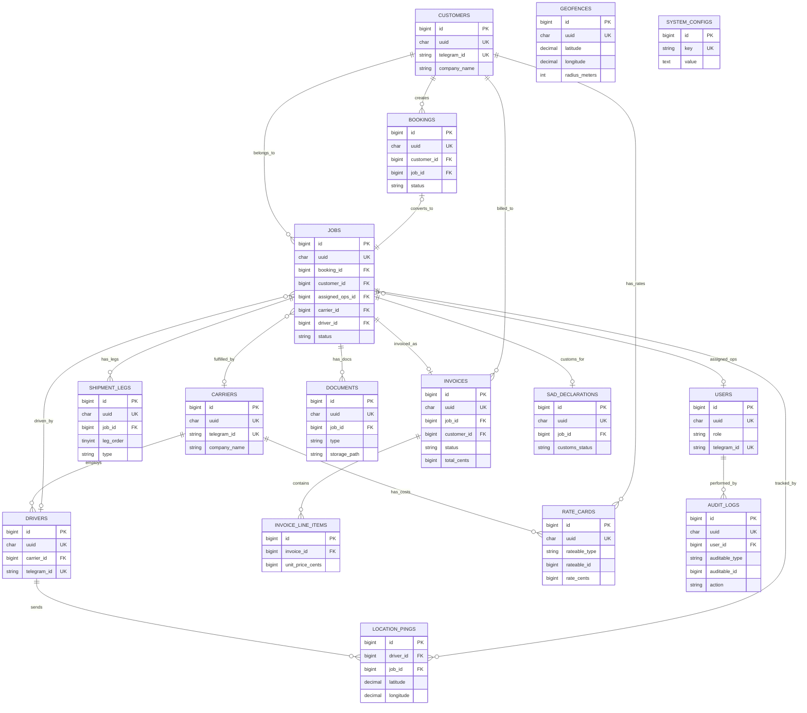

# Architecture Decision Document — PJL Connect

_This document builds collaboratively through step-by-step discovery. Sections are appended as we work through each architectural decision together._

---

## Project Context Analysis

### Requirements Overview

**52 Functional Requirements** organized into 8 categories:

| Category | FRs | Core Scope |
|----------|-----|-----------|
| Customer Management | FR1–FR3 | Telegram registration, profile binding, OPS management |
| Booking & Shipment | FR4–FR12 | Bot booking, OCR extraction, document upload, Visual Receipt |
| Job Management | FR13–FR24 | Kanban, carrier assignment, status management, document annotation |
| Carrier & Driver | FR25–FR31 | Telegram notifications, Nag-Bot, live location, map tracking |
| Tracking & Monitoring | FR32–FR37 | `/track` command, silence escalation, geofencing, ETA |
| Document & Compliance | FR38–FR42 | ASYCUDA Copy-Paste Magic, SAD review, deadline tracking |
| Financial & Reporting | FR43–FR47 | Invoice generation, QuickBooks export, profit analysis |
| Administration | FR48–FR52 | RBAC, rate cards, carrier DB, system config |

**14 Non-Functional Requirements** driving architecture:

| NFR Domain | Key Constraints |
|------------|----------------|
| **Performance** | Dashboard < 3s, Bot < 2s, Location updates < 10s, OCR < 30s |
| **Reliability** | 99% uptime, 24/7 bot availability, zero data loss |
| **Security** | HTTPS/TLS, RBAC, audit trails, passwordless auth (Telegram ID) |
| **Integration** | Telegram rate limit handling, QuickBooks export format, OCR fallback |

---

### System Module Registry

#### Web Application

| Code | Module Name | Description |
|------|------------|-------------|
| **PJL-BO** | **PJL Connect Back-Office** | Central web dashboard for OPS, Brokers, Accounting, and Management |

#### Telegram Bots

| Code | Module Name | Bot Username (Proposed) | Description |
|------|------------|------------------------|-------------|
| **PJL-CB** | **PJL Customer Bot** | `@PJLConnectBot` | Customer-facing: booking, tracking, documents |
| **PJL-CRB** | **PJL Carrier Bot** | `@PJLCarrierBot` | Carrier dispatch: job acceptance, nag-loop, driver QR |
| **PJL-DB** | **PJL Driver Bot** | `@PJLDriverBot` | Driver execution: location sharing, status updates |
| **PJL-OB** | **PJL OPS Bot** | Group bot in OPS chat | Internal OPS: real-time alerts, exception pings, deep-links |

#### Core Engine

| Code | Module Name | Description |
|------|------------|-------------|
| **PJL-IH** | **PJL Intelligence Hub** | Core engine: OCR pipeline, rule engine, tracking aggregator, SAD mapper, geofencing |

> **Decision:** All Telegram modules are **pure Telegram Bots** (no Mini Apps). Mini App evaluation deferred to Growth/SaaS phase. This aligns with the "Invisible App" philosophy, ensures native file upload for OCR, and keeps architecture simple.

---

### RBAC — Role Model

| # | Role | Code | Permissions | Auth Method |
|---|------|------|-------------|-------------|
| 1 | **System Admin** | `SADM` | 🔑 ALL — full system control, env config, log access, user management | **Email + Password + 2FA** (dedicated Laravel auth) |
| 2 | Admin | `ADM` | All operational modules, no server/env access | Telegram Passwordless |
| 3 | OPS Manager | `OPSM` | Jobs, Booking, Reports, Financial (read-only) | Telegram Passwordless |
| 4 | OPS Staff | `OPS` | Jobs, Booking | Telegram Passwordless |
| 5 | Broker | `BRK` | Jobs (read-only), Compliance | Telegram Passwordless |
| 6 | Accounting | `ACCT` | Financial, Reports | Telegram Passwordless |
| 7 | Viewer | `VIEW` | Dashboard (read-only) | Telegram Passwordless |

---

### Authentication & Login

| Auth Method | Target Roles | Flow |
|-------------|-------------|------|
| **Telegram Passwordless** | ADM, OPSM, OPS, BRK, ACCT, VIEW | User clicks login → Telegram Login Widget confirms identity → Telegram ID matched to user profile → session created |
| **Email + Password + 2FA** | SADM (System Admin) | Traditional Laravel login form with TOTP-based 2FA (e.g., Google Authenticator) |

**Architecture implications:**
- Dual auth guard in Laravel: `telegram` guard (default) + `web` guard (System Admin)
- Session-based auth for both, with CSRF protection
- No password storage for 99% of users
- System Admin has a separate login door — traditional auth ensures highest-privilege account doesn't depend on Telegram

---

### Technology Stack

> [!IMPORTANT]
> **Laravel Boost** and **Pencil.dev** are **MANDATORY** tools for this project.
> - **Laravel Boost**: Must be installed via `php artisan boost:install`. All AI coding agents must connect via the Boost MCP server. Code generation must follow Boost guidelines and skills.
> - **Pencil.dev**: Must be used for all UI design work. `.pen` design files must be committed to Git alongside Blade components. Sequence diagrams must be generated through Pencil.dev.

| Layer | Technology | Version | Purpose |
|-------|-----------|---------|---------|
| **Framework** | Laravel | 12.x | Core backend + web application |
| **PHP** | PHP | 8.2+ | Server runtime |
| **Frontend Rendering** | Livewire | 3.x | Real-time components (Kanban, maps, tables) |
| **CSS Framework** | Tailwind CSS | 4.x | Utility-first styling |
| **Micro-Interactions** | Alpine.js | 3.x | Client-side reactivity (dropdowns, modals, toasts) |
| **UI Kit** | TailAdmin Laravel | Free Edition | Dashboard template, tables, forms, 27 base components |
| **Kanban** | Filament Kanban | Latest | Drag-drop job management boards |
| **Maps** | Leaflet.js | 1.9+ | GPS tracking maps with geofence visualization |
| **PDF Viewer** | PDF.js | Latest | In-browser document preview & annotation |
| **Charts** | ApexCharts | 3.x | Dashboard analytics & trend charts |
| **Database** | MySQL / MariaDB | 8.0+ / 10.6+ | Primary data store |
| **Cache / Queue** | Redis | 7.x | Job queues, real-time pub/sub, session cache |
| **Queue Worker** | Laravel Horizon | Latest | Queue monitoring & management |
| **OCR** | Google Cloud Vision API | v1 | Document text extraction |
| **Telegram** | Telegram Bot API | Latest | Bot communication layer |
| **Telegram Library** | irazasyed/telegram-bot-sdk | 3.x | Laravel Telegram bot integration |
| **Auth (Passwordless)** | Telegram Login Widget | — | Passwordless auth for most roles |
| **Auth (System Admin)** | Laravel Fortify + 2FA | — | Email/password + TOTP for System Admin |
| **AI Dev Tooling** | **Laravel Boost** | **2.1+** | 🔴 MANDATORY — MCP server, AI guidelines, skills |
| **Design Tooling** | **Pencil.dev** | Latest | 🔴 MANDATORY — AI-native design-to-code, `.pen` files |
| **Web Server** | Nginx | Latest | Reverse proxy + static asset serving |
| **Deployment** | Docker / VPS | — | Containerized deployment |

---

### Key Architectural Aspects

1. **Hybrid Architecture (Web + Bots):** The system straddles two paradigms — a Laravel web Back-Office (PJL-BO) AND 4 pure Telegram Bots. The bots have rich command hierarchies, OCR flows, nag-loops, and location streaming.

2. **Real-Time Requirements:** Kanban auto-updates, GPS map tracking, geofence triggers, silence escalation, nag-bot timers — demand event-driven architecture alongside standard request-response.

3. **AI/OCR Pipeline:** Document ingestion → Google Cloud Vision API → Confidence routing → Human verification loop. Async pipeline requiring job queue architecture.

4. **Exception-First Design:** "99% happy path / 1% human exception" pattern. Architecture must support escalation chains, manual overrides with audit trails, and graceful degradation.

5. **UX State Contract:** Every screen defines 4 states (Empty/Loading/Error/Success). API layer must support all 4 states — consistent error formats, pagination metadata for empty detection, loading-optimized endpoints.

6. **45 UI Components:** 27 from TailAdmin, 11 custom, 7 Livewire-driven. Kanban and GPS map require Livewire/Alpine.js real-time patterns.

---

### Scale & Complexity Assessment

| Indicator | Rating | Rationale |
|-----------|--------|-----------|
| **Overall Complexity** | **High** | Multi-channel (web + 4 bots), real-time tracking, OCR pipeline, RBAC |
| **Primary Domain** | **Full-Stack + Bot Integration** | Laravel web + Telegram Bot API + Cloud AI |
| **Real-Time Features** | **Medium-High** | GPS tracking, Kanban updates, geofencing, nag timers |
| **Multi-Tenancy** | **Low (MVP)** | Single-tenant for PJL; SaaS deferred to Year 2 |
| **Regulatory/Compliance** | **Medium** | ASYCUDA format compliance, audit trails, RBAC |
| **Integration Complexity** | **Medium** | Telegram API, Google Cloud Vision, QuickBooks export |
| **Data Complexity** | **High** | Multi-leg shipments, document versioning, GPS streams, financial ledger |

---

### Technical Constraints & Dependencies

| Constraint | Decision | Arch Impact |
|------------|----------|-------------|
| **Laravel 12** | Latest version, supported by Laravel Boost 2.1+ | Monolithic with service layers |
| **Telegram-First** | No app installations, pure bots | Bot architecture as first-class citizen |
| **8-Hour Location Limit** | Telegram API constraint | Re-prompt logic and state management |
| **Single-Tenant MVP** | PJL only | No multi-tenant abstractions needed |
| **USD-Only MVP** | No multi-currency | Simplified financial model |
| **Manual Vessel/Flight** | No external tracking APIs | OPS manual entry patterns |
| **ASYCUDA Copy-Paste** | No direct API integration | Formatted data block generation |

---

### Cross-Cutting Concerns

1. **Audit Trail** — All jobs, financials, config changes, manual overrides
2. **Notification System** — Web toasts + Telegram bot messages + OPS group alerts
3. **RBAC** — 7 roles (System Admin, Admin, OPS Manager, OPS Staff, Broker, Accounting, Viewer)
4. **Authentication** — Dual auth guards: Telegram Passwordless (default) + Email/Password/2FA (System Admin only)
5. **Job Status State Machine** — Central lifecycle shared across Kanban, bots, tracking, compliance
6. **Document Management** — Upload, OCR, preview, annotation, ASYCUDA mapping
7. **Error Handling** — Consistent patterns supporting all 4 UI states across web + bots

---

### Planned Architecture Deliverables

**Phase 0: Environment Setup** — will be defined as the first implementation milestone:
- Laravel 12 scaffolding + `php artisan boost:install`
- Laravel Boost MCP server configuration
- Pencil.dev workspace setup + `.pen` file structure
- TailAdmin template integration
- Tailwind CSS + Alpine.js + Livewire configuration
- Database + Redis setup
- Telegram Bot API tokens + webhook configuration
- RBAC seeding (7 roles) + dual auth guard configuration
- CI/CD pipeline baseline

**Component-Data Map** — will trace every UX component to its data source:
- All 45 components from UX spec mapped to Controller → Service → Model(s)
- Ensures no component is orphaned from its data pipeline

**Pencil.dev Sequence Diagrams** — all architectural flows will be authored in Pencil.dev:
- J1–J7 journey sequence diagrams
- API interaction diagrams (Bot ↔ Intelligence Hub ↔ Back-Office)
- Auth flow diagrams (Telegram Passwordless + System Admin 2FA)
- OCR pipeline flow diagram

---

## Starter Template Evaluation

### Primary Technology Domain

**Full-Stack Web + Bot Integration** — Laravel 12 monolith serving both the Back-Office web application and Telegram Bot webhook handlers, with shared service layer and database.

### Starter Options Considered

| # | Starter | Init Method | Verdict |
|---|---------|-------------|---------||
| 1 | Laravel 12 Official Livewire Starter Kit | `laravel new` → select Livewire | ❌ Uses Flux UI (conflicts with TailAdmin) |
| 2 | TailAdmin Laravel (Free) | `git clone` | ❌ No auth, no Livewire, incomplete foundation |
| 3 | Filament v4 | `composer require filament/filament` | ❌ Opinionated admin panel, conflicts with TailAdmin |
| 4 | Community Starters (`--using` flag) | `laravel new --using=...` | ❌ None match exact stack requirements |
| 5 | **Bare Laravel 12 + Manual Assembly** | `composer create-project` | ✅ **Selected** — total control, no conflicts |

### Selected Starter: Bare Laravel 12 + Manual Assembly

**Rationale:**
- No UI kit conflicts — TailAdmin is clone-based, not a Composer package
- Laravel Boost `php artisan boost:install` works cleanest on fresh install
- Dual auth guards (Telegram + System Admin 2FA) don't match any starter's auth
- Phase 0 defines the exact assembly sequence
- Total control over every architectural decision

**Initialization Command:**

```bash
composer create-project laravel/laravel pjl-connect
```

**Architectural Decisions Provided by Starter:**

| Decision | Choice | Source |
|----------|--------|--------|
| Language & Runtime | PHP 8.2+ | Laravel 12 minimum |
| Styling | Tailwind CSS 4.x | Added via TailAdmin integration |
| Build Tooling | Vite | Laravel 12 default |
| Testing | PHPUnit + Pest | Laravel 12 default |
| Linting | Pint (PSR-12) | Laravel 12 default |
| Code Organization | Laravel conventions + service layer | Controllers → Services → Models |
| Auth | Laravel Fortify + custom guards | Dual auth (Telegram + traditional) |
| Queue | Redis + Laravel Horizon | Async jobs, OCR pipeline, nag-bot |

> **Note:** Project initialization using this command will be the first task in Phase 0: Environment Setup.

---

## Core Architectural Decisions

### Decision Priority Analysis

**Critical Decisions (Block Implementation):**
- D1–D5: Data architecture (Eloquent + Service Layer, migrations, soft deletes, UUID strategy, Redis caching)
- D6–D7, D9–D10: Security (webhook verification, CSRF, rate limiting, sessions)
- D11–D13: Communication (no separate API, standardized error envelope, Laravel Events)

**Important Decisions (Shape Architecture):**
- D14–D15: File storage (local disk) and logging (channel-based)
- D16–D19: Frontend architecture (Livewire full-page, Alpine state, polling + WebSocket, toast system)
- D20–D23: Infrastructure (Hostinger VPS, GitHub Actions, env config, Pulse monitoring)

**Removed Decisions:**
- ~~D8: Encryption at rest~~ — Removed for MVP. Rely on HTTPS + MySQL permissions + RBAC.
- ~~D24: Spatie Backup~~ — Removed. Hostinger provides built-in DB backup.

**Deferred Decisions (Post-MVP):**
- Multi-tenancy architecture (SaaS Year 2)
- API versioning (no external consumers in MVP)
- S3/cloud file storage (local sufficient for single-tenant)
- Multi-currency support (USD-only MVP)
- Kubernetes/scaling (single VPS sufficient)
- Telegram Mini App (Bot-only for MVP)
- External tracking APIs (manual vessel/flight entry)

---

### Data Architecture

| # | Decision | Choice | Rationale |
|---|----------|--------|----------|
| D1 | Data Modeling | Eloquent Models + Service Layer | Controllers → Services → Models. No Repository pattern for monolith. |
| D2 | Migration Strategy | Incremental migrations + seeders | `php artisan migrate`. Feature-flag for zero-downtime schema changes. |
| D3 | Soft Deletes | Yes, on all business entities | Jobs, Bookings, Customers, Documents, Invoices. Audit trail requirement. |
| D4 | ID Strategy | UUIDs for external-facing IDs, auto-increment for internal PKs | Performance of integer PKs + security of UUIDs for public URLs/bot deep-links. |
| D5 | Caching | Redis + Laravel Cache facade | Model cache tags per entity, 15-min TTL for dashboard stats, real-time invalidation for Kanban. |

### Authentication & Security

| # | Decision | Choice | Rationale |
|---|----------|--------|----------|
| D6 | Bot Webhook Security | Telegram SHA-256 HMAC signature verification + IP whitelist | Verify on every webhook. Whitelist Telegram IP ranges. |
| D7 | CSRF | Standard Laravel CSRF for web, disabled for bot webhook routes | Bots use signature verification instead. |
| D9 | Rate Limiting | Laravel built-in rate limiter | 60 req/min web, 120 req/min API, respect Telegram 30 msg/sec limit. |
| D10 | Sessions | Redis-backed, 8-hour expiry for web, stateless for bots | Fast session lookups. Bots don't need sessions. |

### API & Communication Patterns

| # | Decision | Choice | Rationale |
|---|----------|--------|----------|
| D11 | Internal API | No separate API layer for MVP | Livewire + Bot controllers both call shared Service layer directly. |
| D12 | Error Response Format | Standardized JSON envelope | `{success, data, error: {code, message, field_errors}, meta: {pagination, empty_reason}}` — supports all 4 UI states. |
| D13 | Event System | Laravel Events + Listeners + Redis pub/sub | Job status → fires event → bot notifier + audit logger + Kanban updater. Decoupled modules. |
| D14 | File Storage | Laravel Filesystem (local disk MVP) | `storage/app/documents/{job_id}/`. Migrate to S3 in Growth phase. |
| D15 | Logging | Laravel Log + daily rotation, channel-based | Channels: `web`, `bot`, `ocr`, `queue`. Structured JSON in production. |

### Frontend Architecture

| # | Decision | Choice | Rationale |
|---|----------|--------|----------|
| D16 | Component Architecture | Full-page Livewire for screens, Blade for reusable UI, Alpine for micro-interactions | Real-time updates without page reload. TailAdmin integration via Blade. |
| D17 | State Management | Livewire properties (server), Alpine x-data (UI-only), Session/Cache (cross-request) | No Vuex/Pinia needed. Livewire handles server state natively. |
| D18 | Real-Time Updates | Livewire polling (3s) for Kanban/Dashboard, Laravel Echo + Soketi for GPS map | Polling for most screens. True WebSocket only where < 10s latency required. |
| D19 | Notifications | Alpine.js toast system + Livewire dispatch | Auto-dismiss success. Errors persist until acknowledged. |

### Infrastructure & Deployment

| # | Decision | Choice | Rationale |
|---|----------|--------|----------|
| D20 | Hosting | **Hostinger VPS KVM 2** (2 vCPU, 8GB RAM, 100GB NVMe) | ~$8-14/mo. Laravel template available. Redis via SSH. |
| D21 | CI/CD | GitHub Actions | Lint → Test → Build → Deploy via SSH. Script provided below. |
| D22 | Environment Config | `.env` + `php artisan config:cache` | Secrets in `.env`, never in code. |
| D23 | Monitoring | Laravel Pulse (free, `/pulse` route) + UptimeRobot (external) | Pulse for app metrics. UptimeRobot for uptime alerts. Restricted to SADM/ADM. |

### GitHub Actions Deploy Script

```yaml
# .github/workflows/deploy.yml
name: Deploy PJL Connect

on:
  push:
    branches: [main]
  pull_request:
    branches: [main]

jobs:
  lint:
    runs-on: ubuntu-latest
    steps:
      - uses: actions/checkout@v4
      - uses: shivammathur/setup-php@v2
        with:
          php-version: '8.2'
      - run: composer install --no-interaction
      - run: ./vendor/bin/pint --test

  test:
    needs: lint
    runs-on: ubuntu-latest
    services:
      mysql:
        image: mysql:8.0
        env:
          MYSQL_ROOT_PASSWORD: password
          MYSQL_DATABASE: pjl_connect_test
        ports: ['3306:3306']
        options: --health-cmd="mysqladmin ping" --health-interval=10s --health-timeout=5s --health-retries=3
      redis:
        image: redis:7
        ports: ['6379:6379']
        options: --health-cmd="redis-cli ping" --health-interval=10s --health-timeout=5s --health-retries=3
    steps:
      - uses: actions/checkout@v4
      - uses: shivammathur/setup-php@v2
        with:
          php-version: '8.2'
          extensions: pdo_mysql, redis
      - run: composer install --no-interaction
      - run: cp .env.testing .env
      - run: php artisan key:generate
      - run: php artisan migrate --force
      - run: ./vendor/bin/pest

  build:
    needs: test
    runs-on: ubuntu-latest
    steps:
      - uses: actions/checkout@v4
      - uses: actions/setup-node@v4
        with:
          node-version: '20'
      - run: npm ci
      - run: npm run build
      - uses: actions/upload-artifact@v4
        with:
          name: build-assets
          path: public/build/

  deploy:
    needs: build
    if: github.ref == 'refs/heads/main' && github.event_name == 'push'
    runs-on: ubuntu-latest
    steps:
      - uses: actions/checkout@v4
      - uses: actions/download-artifact@v4
        with:
          name: build-assets
          path: public/build/
      - name: Deploy to Hostinger VPS
        uses: appleboy/ssh-action@v1
        with:
          host: ${{ secrets.VPS_HOST }}
          username: ${{ secrets.VPS_USER }}
          key: ${{ secrets.VPS_SSH_KEY }}
          script: |
            cd /var/www/pjl-connect
            git pull origin main
            composer install --no-dev --optimize-autoloader
            php artisan migrate --force
            php artisan config:cache
            php artisan route:cache
            php artisan view:cache
            php artisan queue:restart
            sudo systemctl reload nginx
```

### Decision Impact — Implementation Sequence

1. **Phase 0:** Laravel 12 + Boost install + TailAdmin + Redis + auth guards + RBAC seed
2. **Data Layer:** Eloquent models + migrations + soft deletes + UUID traits
3. **Service Layer:** Services for each module (JobService, BookingService, etc.)
4. **Event System:** Laravel Events + Listeners for job lifecycle
5. **Bot Layer:** Telegram webhook controllers + signature verification
6. **Frontend:** Livewire full-page components + TailAdmin Blade components
7. **Real-Time:** Polling for Kanban/Dashboard, Echo + Soketi for GPS map
8. **CI/CD:** GitHub Actions pipeline + Hostinger VPS deployment

---

## Implementation Patterns & Consistency Rules

> These patterns are the "constitution" for all AI agents working on PJL Connect. Every agent MUST follow these conventions to ensure compatible, conflict-free code.

### Naming Patterns

#### Database Naming Conventions

| Area | Convention | Examples |
|------|-----------|----------|
| Tables | `snake_case` plural | `jobs`, `shipment_legs`, `carrier_assignments` |
| Columns | `snake_case` | `created_at`, `carrier_id`, `tracking_number` |
| Foreign Keys | `{model}_id` | `customer_id`, `job_id`, `driver_id` |
| Indexes | `{table}_{columns}_index` | `jobs_status_index`, `bookings_customer_id_index` |
| Pivot Tables | Alphabetical `snake_case` | `carrier_job`, `document_job` |
| Morph Columns | `{name}_type`, `{name}_id` | `auditable_type`, `auditable_id` |

#### Code Naming Conventions (PHP/Laravel)

| Area | Convention | Examples |
|------|-----------|----------|
| Classes | `PascalCase` | `JobService`, `BookingController`, `CarrierAssignment` |
| Methods | `camelCase` | `getActiveJobs()`, `assignCarrier()`, `calculateProfit()` |
| Variables | `camelCase` | `$jobId`, `$carrierName`, `$trackingNumber` |
| Constants | `UPPER_SNAKE_CASE` | `MAX_RETRY_COUNT`, `OCR_CONFIDENCE_THRESHOLD` |
| Config keys | `snake_case` | `telegram.bot_token`, `ocr.confidence_threshold` |
| Route names | `dot.notation` | `jobs.show`, `bookings.store`, `admin.users.index` |
| Blade views | `kebab-case` dirs, `snake_case` files | `jobs/show-details.blade.php`, `bookings/create_form.blade.php` |
| Livewire components | `PascalCase` class, `kebab-case` tag | `<livewire:job-kanban-board />` → `JobKanbanBoard.php` |
| Traits | `PascalCase` with adjective/verb | `HasUuid`, `Trackable`, `SoftDeletesWithAudit` |
| Enums | `PascalCase` class, `PascalCase` cases | `JobStatus::InTransit`, `UserRole::OpsManager` |
| Migrations | Laravel default timestamp prefix | `2026_02_15_141941_create_jobs_table.php` |

#### Telegram Bot Naming Conventions

| Area | Convention | Examples |
|------|-----------|----------|
| Bot commands | `/lowercase` | `/track`, `/book`, `/status`, `/help` |
| Callback data | `snake_case` with entity ID | `accept_job_123`, `confirm_booking_456` |
| Deep link params | `snake_case` | `?start=job_123`, `?start=track_ABC` |
| Inline keyboard keys | `snake_case` | `action_accept`, `action_reject`, `action_details` |

---

### Structure Patterns

#### Service Layer Organization — Feature-Grouped

> **Decision:** Feature-grouped services. Each FR category maps to its own service directory.

```
app/Services/
├── Booking/
│   ├── BookingService.php
│   ├── BookingValidationService.php
│   └── OcrExtractionService.php
├── Job/
│   ├── JobService.php
│   ├── JobStatusService.php
│   ├── JobAssignmentService.php
│   └── JobDocumentService.php
├── Carrier/
│   ├── CarrierService.php
│   ├── DriverService.php
│   └── NagBotService.php
├── Tracking/
│   ├── TrackingService.php
│   ├── GeofenceService.php
│   └── EtaCalculationService.php
├── Compliance/
│   ├── AsycudaService.php
│   ├── SadReviewService.php
│   └── DeadlineService.php
├── Financial/
│   ├── InvoiceService.php
│   ├── QuickBooksExportService.php
│   └── ProfitAnalysisService.php
├── Customer/
│   ├── CustomerService.php
│   └── CustomerProfileService.php
├── Admin/
│   ├── RbacService.php
│   ├── RateCardService.php
│   └── SystemConfigService.php
└── Shared/
    ├── NotificationService.php
    ├── AuditService.php
    └── FileStorageService.php
```

#### Telegram Bot Organization — Per-Bot Directories

> **Decision:** Per-bot directories. Each bot (PJL-CB, PJL-CRB, PJL-DB, PJL-OB) gets its own directory with a `Shared/` for common handlers.

```
app/Telegram/
├── CustomerBot/          # PJL-CB (@PJLConnectBot)
│   ├── CustomerBotController.php
│   ├── Commands/
│   │   ├── StartCommand.php
│   │   ├── BookCommand.php
│   │   ├── TrackCommand.php
│   │   └── HelpCommand.php
│   ├── Handlers/
│   │   ├── BookingFlowHandler.php
│   │   ├── DocumentUploadHandler.php
│   │   └── TrackingHandler.php
│   └── Keyboards/
│       └── CustomerKeyboards.php
├── CarrierBot/           # PJL-CRB (@PJLCarrierBot)
│   ├── CarrierBotController.php
│   ├── Commands/
│   ├── Handlers/
│   │   ├── JobAcceptanceHandler.php
│   │   ├── NagLoopHandler.php
│   │   └── DriverQrHandler.php
│   └── Keyboards/
├── DriverBot/            # PJL-DB (@PJLDriverBot)
│   ├── DriverBotController.php
│   ├── Commands/
│   ├── Handlers/
│   │   ├── LocationSharingHandler.php
│   │   └── StatusUpdateHandler.php
│   └── Keyboards/
├── OpsBot/               # PJL-OB (Group bot)
│   ├── OpsBotController.php
│   ├── Commands/
│   ├── Handlers/
│   │   ├── AlertHandler.php
│   │   ├── ExceptionPingHandler.php
│   │   └── DeepLinkHandler.php
│   └── Keyboards/
└── Shared/
    ├── BaseBotController.php
    ├── Middleware/
    │   ├── VerifyTelegramSignature.php
    │   └── RateLimitBot.php
    ├── Traits/
    │   ├── SendsMessages.php
    │   └── HandlesCallbacks.php
    └── Helpers/
        ├── KeyboardBuilder.php
        └── MessageFormatter.php
```

#### Test Organization

```
tests/
├── Unit/
│   ├── Services/
│   │   ├── Job/
│   │   ├── Booking/
│   │   ├── Carrier/
│   │   └── ...                    # Mirrors app/Services/ structure
│   ├── Models/
│   └── Telegram/
├── Feature/
│   ├── Web/                       # HTTP tests for Back-Office
│   │   ├── JobControllerTest.php
│   │   └── BookingControllerTest.php
│   ├── Telegram/                  # Webhook integration tests
│   │   ├── CustomerBotTest.php
│   │   ├── CarrierBotTest.php
│   │   ├── DriverBotTest.php
│   │   └── OpsBotTest.php
│   └── Livewire/                  # Livewire component tests
├── Fixtures/
│   ├── telegram_payloads/
│   ├── ocr_responses/
│   └── sample_documents/
└── Pest.php
```

---

### Format Patterns

#### API & Data Exchange Formats

| Area | Convention | Example |
|------|-----------|----------|
| JSON field naming | `snake_case` | `{ "job_id": "...", "carrier_name": "..." }` |
| Date/time in JSON | ISO 8601 with timezone | `"2026-02-15T14:19:41+07:00"` |
| Booleans | Native JSON `true`/`false` | `"is_active": true` |
| Null handling | Include field with `null`, never omit | `"driver_id": null` |
| Empty collections | `[]`, never `null` | `"documents": []` |
| Money values | Integer cents (USD) | `"amount_cents": 15000` → $150.00 |
| UUIDs | Lowercase with hyphens | `"uuid": "a1b2c3d4-e5f6-7890-abcd-ef1234567890"` |

#### Standardized Response Envelope (D12 Enhancement)

```json
{
  "success": true,
  "data": { },
  "error": null,
  "meta": {
    "current_page": 1,
    "per_page": 25,
    "total": 142,
    "last_page": 6,
    "empty_reason": null
  }
}
```

```json
{
  "success": false,
  "data": null,
  "error": {
    "code": "JOB_NOT_FOUND",
    "message": "Job with the specified ID was not found.",
    "field_errors": null
  },
  "meta": null
}
```

#### Pagination Standard

| Field | Type | Description |
|-------|------|-------------|
| `current_page` | int | Current page number (1-indexed) |
| `per_page` | int | Items per page (default: 25) |
| `total` | int | Total number of items |
| `last_page` | int | Last available page |
| `empty_reason` | string\|null | Why the collection is empty (e.g., `"no_matching_filters"`, `"no_data_yet"`) |

---

### Communication Patterns

#### Laravel Events — PascalCase Event Classes

> **Decision:** Standard Laravel event classes with PascalCase naming. Type-safe, discoverable, IDE-friendly.

**Event Naming Convention:** `{Entity}{Action}` — e.g., `JobCreated`, `JobStatusUpdated`, `BookingConfirmed`

```
app/Events/
├── Job/
│   ├── JobCreated.php
│   ├── JobStatusUpdated.php
│   ├── JobAssigned.php
│   └── JobCompleted.php
├── Booking/
│   ├── BookingCreated.php
│   └── BookingConfirmed.php
├── Carrier/
│   ├── CarrierJobAccepted.php
│   └── DriverLocationUpdated.php
├── Document/
│   ├── DocumentUploaded.php
│   └── OcrCompleted.php
└── Financial/
    ├── InvoiceGenerated.php
    └── PaymentRecorded.php
```

**Mandatory Event Payload Contract:**

```php
// Every event class MUST carry these properties:
public string $entityId;       // UUID of the entity
public string $entityType;     // e.g., 'job', 'booking', 'carrier'
public string $action;         // 'created', 'updated', 'deleted', 'status_changed'
public ?array $changes;        // Changed fields with old/new values (for updates)
public string $triggeredBy;    // User ID or 'system' for automated actions
public Carbon $occurredAt;     // Timestamp of the event
```

**Event → Listener Mapping Pattern:**

```
app/Listeners/
├── Job/
│   ├── NotifyCarrierOnAssignment.php
│   ├── UpdateKanbanOnStatusChange.php
│   ├── LogJobAuditTrail.php
│   └── AlertOpsOnException.php
├── Booking/
│   └── SendBookingConfirmation.php
└── Document/
    └── TriggerOcrPipeline.php
```

**Multi-Listener Rule:** A single event may trigger multiple listeners. Listeners are decoupled — each handles one responsibility (notify, log, update, alert).

---

### Process Patterns

#### Error Handling Strategy

| Layer | Pattern | Responsibility |
|-------|---------|---------------|
| **Controller** | Catch domain exceptions → return standardized JSON envelope (D12) | Format for HTTP response |
| **Service** | Throw domain-specific exceptions | Business logic validation |
| **Bot Handler** | Catch → send user-friendly Telegram message + log technical details | User communication |
| **Global Handler** | `app/Exceptions/Handler.php` catches all unhandled → format per channel | Last-resort safety net |

**Domain Exception Hierarchy:**

```
app/Exceptions/
├── Handler.php                      # Global exception handler
├── DomainException.php              # Base class for all domain exceptions
├── Job/
│   ├── JobNotFoundException.php
│   ├── InvalidJobStatusTransitionException.php
│   └── JobAlreadyAssignedException.php
├── Carrier/
│   ├── CarrierUnavailableException.php
│   └── DriverLocationExpiredException.php
├── Booking/
│   └── DuplicateBookingException.php
├── Document/
│   ├── OcrProcessingException.php
│   └── UnsupportedDocumentTypeException.php
└── Auth/
    ├── InvalidTelegramSignatureException.php
    └── InsufficientPermissionException.php
```

#### Loading & UI State Patterns (Livewire/Blade)

| State | Component | Behavior |
|-------|-----------|----------|
| **Loading** | `wire:loading` on action elements | Show spinner/skeleton during server round-trip |
| **Skeleton** | `<x-skeleton type="table\|card\|kanban" />` | Entity-specific skeleton screens |
| **Empty** | `<x-empty-state icon="..." message="..." :action="..." />` | Icon + message + optional CTA button |
| **Error** | `<x-error-state message="..." :retryable="true" />` | Error message + retry action when applicable |
| **Success** | Alpine toast: `$dispatch('toast', {...})` | Auto-dismiss after 5s for success, persist for errors |

#### Logging Convention

| Channel | Use Case | Level Guidance |
|---------|----------|----------------|
| `web` | Back-Office HTTP requests | `info` for actions, `warning` for validation failures |
| `bot` | Telegram webhook processing | `info` for commands, `error` for failed deliveries |
| `ocr` | OCR pipeline processing | `info` for results, `warning` for low confidence |
| `queue` | Background job processing | `info` for completion, `error` for failures |
| `audit` | Security & compliance events | `info` for all audit entries (never filtered) |

**Log Format:** Structured JSON in production, human-readable in local development.

```php
// Standard log call pattern:
Log::channel('bot')->info('Command processed', [
    'bot' => 'customer',
    'command' => '/track',
    'user_id' => $telegramUserId,
    'job_id' => $jobUuid,
    'duration_ms' => $elapsed,
]);
```

---

### Enforcement Guidelines

**All AI Agents MUST:**

1. Follow Laravel naming conventions exactly as documented above — no exceptions
2. Place service classes in feature-grouped directories under `app/Services/{Feature}/`
3. Place bot code in per-bot directories under `app/Telegram/{BotName}/`
4. Use PascalCase event classes with the mandatory payload contract
5. Return the standardized JSON envelope for ALL HTTP responses
6. Throw domain-specific exceptions from services, never generic `\Exception`
7. Include all 4 UI states (Loading/Empty/Error/Success) for every screen
8. Use structured logging with the correct channel for every log statement
9. Mirror the `app/Services/` structure in `tests/Unit/Services/`
10. Never use `camelCase` for database columns or JSON fields — always `snake_case`

**Pattern Verification:**

- Laravel Pint (PSR-12) enforces code style on every CI run
- Naming convention violations caught during code review
- Event payload contract enforced via base class inheritance
- Response envelope enforced via response macro or middleware

---

## Project Structure & Boundaries

### Complete Project Directory Structure

```
pjl-connect/
├── .env
├── .env.example
├── .env.testing
├── .gitignore
├── .pen/                              # Pencil.dev design files
│   ├── components/
│   └── sequences/
├── .github/
│   └── workflows/
│       └── deploy.yml                 # CI/CD pipeline (D21)
├── composer.json
├── composer.lock
├── package.json
├── vite.config.js
├── tailwind.config.js
├── phpunit.xml
├── README.md
│
├── app/
│   ├── Console/
│   │   └── Kernel.php
│   │
│   ├── Enums/
│   │   ├── JobStatus.php              # InTransit, Pending, Completed, etc.
│   │   ├── UserRole.php               # SADM, ADM, OPSM, OPS, BRK, ACCT, VIEW
│   │   ├── BookingStatus.php
│   │   ├── DocumentType.php
│   │   └── ShipmentLegType.php
│   │
│   ├── Events/                        # PascalCase event classes (Step 5)
│   │   ├── Job/
│   │   │   ├── JobCreated.php
│   │   │   ├── JobStatusUpdated.php
│   │   │   ├── JobAssigned.php
│   │   │   └── JobCompleted.php
│   │   ├── Booking/
│   │   │   ├── BookingCreated.php
│   │   │   └── BookingConfirmed.php
│   │   ├── Carrier/
│   │   │   ├── CarrierJobAccepted.php
│   │   │   └── DriverLocationUpdated.php
│   │   ├── Document/
│   │   │   ├── DocumentUploaded.php
│   │   │   └── OcrCompleted.php
│   │   └── Financial/
│   │       ├── InvoiceGenerated.php
│   │       └── PaymentRecorded.php
│   │
│   ├── Exceptions/                    # Domain exception hierarchy (Step 5)
│   │   ├── Handler.php
│   │   ├── DomainException.php
│   │   ├── Job/
│   │   ├── Carrier/
│   │   ├── Booking/
│   │   ├── Document/
│   │   └── Auth/
│   │
│   ├── Http/
│   │   ├── Controllers/
│   │   │   ├── Auth/
│   │   │   │   ├── TelegramLoginController.php
│   │   │   │   └── SystemAdminLoginController.php
│   │   │   ├── Web/
│   │   │   │   ├── DashboardController.php
│   │   │   │   ├── JobController.php
│   │   │   │   ├── BookingController.php
│   │   │   │   ├── CustomerController.php
│   │   │   │   ├── CarrierController.php
│   │   │   │   ├── ComplianceController.php
│   │   │   │   ├── FinancialController.php
│   │   │   │   └── AdminController.php
│   │   │   └── Webhook/
│   │   │       └── TelegramWebhookController.php
│   │   │   └── HealthController.php        # D24: /up health check (Day 2)
│   │   ├── Middleware/
│   │   │   ├── CheckRole.php
│   │   │   ├── InjectLogContext.php        # D24: Request ID + user context (Day 2)
│   │   │   ├── VerifyTelegramWebhook.php
│   │   │   └── ForceJsonResponse.php
│   │   └── Requests/
│   │       ├── Job/
│   │       ├── Booking/
│   │       ├── Customer/
│   │       └── Admin/
│   │
│   ├── Listeners/                     # Event listeners (Step 5)
│   │   ├── Job/
│   │   ├── Booking/
│   │   └── Document/
│   │
│   ├── Livewire/                      # Full-page Livewire components (D16)
│   │   ├── Dashboard/
│   │   │   ├── MainDashboard.php
│   │   │   └── StatsWidget.php
│   │   ├── Job/
│   │   │   ├── KanbanBoard.php
│   │   │   ├── JobDetail.php
│   │   │   └── JobTimeline.php
│   │   ├── Booking/
│   │   │   ├── BookingList.php
│   │   │   └── BookingWizard.php
│   │   ├── Tracking/
│   │   │   ├── LiveMap.php
│   │   │   └── TrackingDetail.php
│   │   ├── Compliance/
│   │   │   ├── AsycudaWorkbench.php
│   │   │   └── DeadlineTracker.php
│   │   ├── Financial/
│   │   │   ├── InvoiceManager.php
│   │   │   └── ProfitDashboard.php
│   │   └── Admin/
│   │       ├── UserManager.php
│   │       ├── RateCardEditor.php
│   │       └── SystemConfig.php
│   │
│   ├── Models/
│   │   ├── User.php
│   │   ├── Job.php
│   │   ├── ShipmentLeg.php
│   │   ├── Booking.php
│   │   ├── Customer.php
│   │   ├── Carrier.php
│   │   ├── Driver.php
│   │   ├── Document.php
│   │   ├── Invoice.php
│   │   ├── InvoiceLineItem.php
│   │   ├── RateCard.php
│   │   ├── AuditLog.php
│   │   ├── Geofence.php
│   │   ├── LocationPing.php
│   │   ├── SadDeclaration.php
│   │   └── SystemConfig.php
│   │
│   ├── Notifications/
│   │   ├── Telegram/
│   │   │   ├── JobAssignedNotification.php
│   │   │   ├── NagReminderNotification.php
│   │   │   └── TrackingAlertNotification.php
│   │   └── Web/
│   │       └── ToastNotification.php
│   │
│   ├── Providers/
│   │   ├── AppServiceProvider.php
│   │   ├── EventServiceProvider.php
│   │   └── AuthServiceProvider.php
│   │
│   ├── Services/                      # Feature-grouped (Step 5)
│   │   ├── Booking/
│   │   ├── Job/
│   │   ├── Carrier/
│   │   ├── Tracking/
│   │   ├── Compliance/
│   │   ├── Financial/
│   │   ├── Customer/
│   │   ├── Admin/
│   │   └── Shared/
│   │
│   ├── Telegram/                      # Per-bot directories (Step 5)
│   │   ├── CustomerBot/
│   │   ├── CarrierBot/
│   │   ├── DriverBot/
│   │   ├── OpsBot/
│   │   └── Shared/
│   │
│   └── Traits/
│       ├── HasUuid.php
│       ├── Auditable.php
│       └── SoftDeletesWithAudit.php
│
├── config/
│   ├── telegram.php                   # Bot tokens, webhook URLs, rate limits
│   ├── ocr.php                        # Google Cloud Vision config
│   ├── pjl.php                        # App-specific settings
│   └── horizon.php                    # Queue worker config
│
├── database/
│   ├── migrations/
│   │   ├── 2026_xx_xx_create_users_table.php
│   │   ├── 2026_xx_xx_create_customers_table.php
│   │   ├── 2026_xx_xx_create_jobs_table.php
│   │   ├── 2026_xx_xx_create_shipment_legs_table.php
│   │   ├── 2026_xx_xx_create_bookings_table.php
│   │   ├── 2026_xx_xx_create_carriers_table.php
│   │   ├── 2026_xx_xx_create_drivers_table.php
│   │   ├── 2026_xx_xx_create_documents_table.php
│   │   ├── 2026_xx_xx_create_invoices_table.php
│   │   ├── 2026_xx_xx_create_invoice_line_items_table.php
│   │   ├── 2026_xx_xx_create_rate_cards_table.php
│   │   ├── 2026_xx_xx_create_audit_logs_table.php
│   │   ├── 2026_xx_xx_create_geofences_table.php
│   │   ├── 2026_xx_xx_create_location_pings_table.php
│   │   ├── 2026_xx_xx_create_sad_declarations_table.php
│   │   └── 2026_xx_xx_create_system_configs_table.php
│   ├── seeders/
│   │   ├── DatabaseSeeder.php
│   │   ├── RoleSeeder.php             # 7 RBAC roles
│   │   ├── SystemConfigSeeder.php
│   │   └── DemoDataSeeder.php
│   └── factories/
│       ├── UserFactory.php
│       ├── JobFactory.php
│       ├── BookingFactory.php
│       └── CustomerFactory.php
│
├── public/
│   ├── build/                         # Vite output
│   └── assets/
│       └── images/
│
├── resources/
│   ├── views/
│   │   ├── layouts/
│   │   │   ├── app.blade.php          # Main layout (TailAdmin shell)
│   │   │   ├── auth.blade.php         # Login layout
│   │   │   └── guest.blade.php
│   │   ├── components/                # Reusable Blade components
│   │   │   ├── skeleton.blade.php
│   │   │   ├── empty-state.blade.php
│   │   │   ├── error-state.blade.php
│   │   │   ├── toast.blade.php
│   │   │   └── modals/
│   │   ├── livewire/                  # Livewire component views
│   │   │   ├── dashboard/
│   │   │   ├── job/
│   │   │   ├── booking/
│   │   │   ├── tracking/
│   │   │   ├── compliance/
│   │   │   ├── financial/
│   │   │   └── admin/
│   │   ├── auth/
│   │   │   ├── telegram-login.blade.php
│   │   │   └── system-admin-login.blade.php
│   │   └── partials/
│   │       ├── sidebar.blade.php
│   │       ├── header.blade.php
│   │       └── footer.blade.php
│   ├── css/
│   │   └── app.css
│   └── js/
│       ├── app.js
│       ├── leaflet-map.js             # GPS tracking map init
│       └── echo.js                    # Laravel Echo config (Soketi)
│
├── routes/
│   ├── web.php                        # Back-Office web routes
│   ├── api.php                        # Minimal — no external API in MVP
│   ├── console.php
│   └── channels.php                   # Broadcasting channels
│
├── storage/
│   └── app/
│       └── documents/                 # File storage (D14): {job_id}/
│
├── tests/                             # Test organization (Step 5)
│   ├── Unit/
│   │   ├── Services/                  # Mirrors app/Services/
│   │   ├── Models/
│   │   └── Telegram/
│   ├── Feature/
│   │   ├── Web/
│   │   ├── Telegram/
│   │   └── Livewire/
│   ├── Fixtures/
│   │   ├── telegram_payloads/
│   │   ├── ocr_responses/
│   │   └── sample_documents/
│   └── Pest.php
│
└── docs/
    └── project-knowledge/
```

---

### Architectural Boundaries

#### API Boundaries

| Boundary | Entry Point | Auth | Pattern |
|----------|------------|------|---------|
| **Web (Back-Office)** | `routes/web.php` → `Http/Controllers/Web/*` | Session + CSRF (Telegram or SysAdmin guard) | Standard Laravel request-response |
| **Telegram Webhooks** | `routes/web.php` → `Webhook/TelegramWebhookController` → Per-bot controller | SHA-256 HMAC signature + IP whitelist | Webhook POST, stateless |
| **Broadcasting** | `routes/channels.php` | Session-based authorization | Laravel Echo + Soketi for GPS map |

#### Service Boundaries

| Rule | Description |
|------|-------------|
| **Controllers → Services ONLY** | Controllers never call Models directly. All business logic lives in Services. |
| **Services → Models + Events** | Services query/mutate via Eloquent and dispatch Events. |
| **Listeners → Services** | Listeners may call other Services for cross-module actions (e.g., notification). |
| **Telegram Handlers → Services** | Bot handlers call the same Services as web controllers — shared business logic. |
| **No cross-feature Service calls** | `JobService` must not directly call `InvoiceService`. Use Events for decoupling. |

#### Data Boundaries

| Boundary | Pattern |
|----------|---------|
| **Eloquent Models** | Single source of truth for DB access. No raw SQL except in migrations. |
| **Redis Cache** | Cache facade with model-specific tags. Never cache across entity boundaries. |
| **File Storage** | `storage/app/documents/{job_id}/` — scoped by job, never shared across jobs. |
| **Session** | Redis-backed, 8h expiry for web. Bots are stateless (no sessions). |

---

### Requirements to Structure Mapping

#### FR Category → Code Location

| FR Category | Controller | Service Directory | Livewire Component | Telegram Bot |
|---|---|---|---|---|
| **Customer Mgmt** (FR1-FR3) | `CustomerController` | `Services/Customer/` | — | `CustomerBot/` |
| **Booking & Shipment** (FR4-FR12) | `BookingController` | `Services/Booking/` | `Booking/BookingWizard` | `CustomerBot/Handlers/BookingFlowHandler` |
| **Job Management** (FR13-FR24) | `JobController` | `Services/Job/` | `Job/KanbanBoard`, `Job/JobDetail` | — |
| **Carrier & Driver** (FR25-FR31) | `CarrierController` | `Services/Carrier/` | — | `CarrierBot/`, `DriverBot/` |
| **Tracking** (FR32-FR37) | — | `Services/Tracking/` | `Tracking/LiveMap` | `CustomerBot/Commands/TrackCommand` |
| **Document & Compliance** (FR38-FR42) | `ComplianceController` | `Services/Compliance/` | `Compliance/AsycudaWorkbench` | — |
| **Financial** (FR43-FR47) | `FinancialController` | `Services/Financial/` | `Financial/InvoiceManager` | — |
| **Administration** (FR48-FR52) | `AdminController` | `Services/Admin/` | `Admin/UserManager` | — |

#### Cross-Cutting Concerns → Location

| Concern | Primary Location | Supporting Files |
|---------|-----------------|------------------|
| Audit Trail | `Services/Shared/AuditService` | `Listeners/*/Log*AuditTrail`, `Models/AuditLog` |
| RBAC | `Services/Admin/RbacService` | `Http/Middleware/CheckRole`, `Enums/UserRole` |
| Dual Auth | `Http/Controllers/Auth/*` | `AuthServiceProvider`, `config/auth.php` |
| Notifications | `Services/Shared/NotificationService` | `Notifications/Telegram/*`, `Notifications/Web/*` |
| File Storage | `Services/Shared/FileStorageService` | `config/filesystems.php`, `storage/app/documents/` |
| Job State Machine | `Services/Job/JobStatusService` | `Enums/JobStatus`, `Events/Job/JobStatusUpdated` |

---

### Integration Points

| Integration | From → To | Pattern |
|---|---|---|
| **Telegram → Laravel** | Webhook POST → `TelegramWebhookController` → Per-bot controller | Signature-verified webhook |
| **Livewire → Service** | Livewire component → Service class via constructor injection | Direct injection |
| **Service → Event** | Service dispatches → Event → Listener(s) | Laravel Event system (D13) |
| **Event → Bot** | Listener → `Telegram/Shared/SendsMessages` trait → Bot API | Async via queue |
| **Event → Real-time** | Listener → Laravel Echo broadcast → Soketi → Browser | WebSocket for GPS map |
| **OCR Pipeline** | `DocumentUploadHandler` → Queue job → `OcrExtractionService` → Google Cloud Vision | Async Redis queue |
| **QuickBooks Export** | `QuickBooksExportService` → CSV/IIF file generation → Download | On-demand file generation |
| **ASYCUDA Copy-Paste** | `AsycudaService` → Formatted text block → Clipboard | Server-rendered text block |

#### Data Flow Diagram

```
┌─────────────────┐     ┌──────────────────────┐     ┌─────────────────┐
│  Telegram Bots  │────▶│  Webhook Controller  │────▶│  Bot Handlers   │
│  (CB/CRB/DB/OB) │     │  (signature verify)  │     │  (per-bot dirs) │
└─────────────────┘     └──────────────────────┘     └────────┬────────┘
                                                              │
                                                              ▼
┌─────────────────┐     ┌──────────────────────┐     ┌─────────────────┐
│  Back-Office    │────▶│  Web Controllers     │────▶│  Services       │
│  (Livewire)     │     │  (session auth+RBAC) │     │  (feature-grp)  │
└─────────────────┘     └──────────────────────┘     └────────┬────────┘
                                                              │
                                                    ┌─────────┴─────────┐
                                                    ▼                   ▼
                                             ┌────────────┐     ┌────────────┐
                                             │  Eloquent   │     │  Events    │
                                             │  Models     │     │  + Queue   │
                                             └─────┬──────┘     └─────┬──────┘
                                                   ▼                   ▼
                                             ┌────────────┐     ┌────────────┐
                                             │  MySQL/     │     │  Listeners │
                                             │  Redis      │     │  (notify,  │
                                             └────────────┘     │  audit,    │
                                                                │  broadcast)│
                                                                └────────────┘
```

---

### Laravel Boost Skills Activation Guide

> **Purpose:** Prevent context bloat. Each module specifies which Laravel Boost 2.0 skills the Developer agent should load. Agents must ONLY load listed skills — never bulk-load all skills.

#### Phase 0: Environment Setup

| Task | Boost Skills to Load |
|------|---------------------|
| Laravel scaffolding + config | `MCP` |
| Tailwind CSS + TailAdmin integration | `Tailwind 4` |
| Livewire installation + config | `Livewire` |
| Database migrations + seeders | `MCP` |
| Auth guards setup | `MCP` |
| CI/CD pipeline | None (GitHub Actions — no Boost skill) |

#### Module-Level Skill Mapping

| Module / Work Area | Required Boost Skills | Rationale |
|---|---|---|
| **Models + Migrations** | `MCP` | Schema inspection, Artisan commands, DB access |
| **Services** (all feature dirs) | `MCP` | Code generation, app introspection |
| **Livewire Components** | `Livewire`, `Tailwind 4` | Livewire lifecycle, reactive properties, TW styling |
| **Blade Components** (UI kit) | `Tailwind 4` | Utility-first CSS, TailAdmin class conventions |
| **Alpine.js Interactions** | `Livewire` | Alpine is tightly coupled with Livewire in this stack |
| **Telegram Bot Handlers** | `MCP` | App introspection, route analysis, Tinker testing |
| **Events + Listeners** | `MCP` | Event registration, Artisan `event:list` |
| **Queue Jobs** (OCR, Nag-Bot) | `MCP` | Horizon config, queue inspection |
| **Testing** (all tests) | `Pest` | Pest assertions, dataset syntax, architectural tests |
| **Routing** | `MCP` | Route listing, middleware verification |
| **Configuration** | `MCP` | Config access, env variable resolution |

#### Skills NOT Used in This Project

| Boost Skill | Reason Not Used |
|---|---|
| `Inertia` (Vue/React/Svelte) | Using Livewire, not SPA |
| `Volt` | Not using single-file Livewire components |
| `Flux UI` | Using TailAdmin, not Flux |
| `Folio` | Using standard Laravel routing, not file-based |
| `Pennant` | No feature flags in MVP |
| `Wayfinder` | No TypeScript route generation needed |

#### Agent Instruction Template

```
Before starting work on a story:
1. Read architecture.md for decisions and patterns
2. Identify which module(s) the story touches
3. Load ONLY the Boost skills listed for those modules
4. Verify skill loading via `php artisan boost:skills`
5. Never load skills marked as "NOT USED" above
```

---

## Day 2 Operations: Monitoring, Debugging & Observability

> **Decision D24 — Observability Strategy:** The system must be observable from Day 1. Logging, exception handling, debugging tools, and health checks are **core infrastructure**, not afterthoughts. Every agent implementing features MUST follow these patterns.

### 1. Contextual Logging Standard

#### Log Context Contract

Every log statement in PJL Connect MUST include structured context. A global middleware injects baseline context automatically; service/handler code adds domain-specific metadata.

**Automatic Context (injected via middleware):**

```php
// app/Http/Middleware/InjectLogContext.php
// Automatically applied to ALL web requests

public function handle(Request $request, Closure $next)
{
    $requestId = (string) Str::uuid();

    Log::shareContext([
        'request_id'  => $requestId,
        'user_id'     => $request->user()?->id,
        'user_role'   => $request->user()?->role?->value,
        'session_id'  => $request->session()?->getId(),
        'ip'          => $request->ip(),
        'url'         => $request->fullUrl(),
        'method'      => $request->method(),
    ]);

    // Pass request_id to response header for debugging
    $response = $next($request);
    $response->headers->set('X-Request-Id', $requestId);

    return $response;
}
```

**Telegram Bot Context (injected via bot base controller):**

```php
// app/Telegram/Shared/BaseBotController.php

protected function setLogContext(array $update): void
{
    Log::shareContext([
        'request_id'     => (string) Str::uuid(),
        'bot'            => $this->botName,          // 'customer', 'carrier', 'driver', 'ops'
        'telegram_user'  => $update['from']['id'] ?? null,
        'chat_id'        => $update['chat']['id'] ?? null,
        'update_type'    => $this->detectUpdateType($update),
    ]);
}
```

**Domain-Specific Context (added by service layer):**

| Service Area | Required Context Fields |
|---|---|
| Job operations | `job_id`, `job_status`, `carrier_id` |
| Booking operations | `booking_id`, `customer_id`, `document_count` |
| OCR processing | `document_id`, `file_type`, `confidence_score`, `duration_ms` |
| Carrier/Driver | `carrier_id`, `driver_id`, `vehicle_plate` |
| Financial | `invoice_id`, `amount_cents`, `currency` |
| Tracking | `location_ping_id`, `lat`, `lng`, `accuracy_m` |
| Auth | `auth_guard`, `login_method`, `telegram_user_id` |

**Standard Log Call Pattern:**

```php
// ✅ CORRECT — structured context with domain metadata
Log::channel('bot')->info('Booking created via Telegram', [
    'booking_id'     => $booking->uuid,
    'customer_id'    => $customer->uuid,
    'document_count' => count($documents),
    'origin'         => 'customer_bot',
    'epic'           => 'FR4-FR12',  // BMAD Epic reference
]);

// ❌ WRONG — no context, unstructured message
Log::info("Booking created for customer " . $customer->name);
```

#### Log Level Guidelines

| Level | When to Use | Example |
|---|---|---|
| `emergency` | System is unusable | Database connection completely lost |
| `critical` | Action required immediately | Telegram webhook signature verification failing |
| `error` | Runtime error, operation failed | OCR API returned HTTP 500, invoice generation failed |
| `warning` | Abnormal but recoverable | OCR confidence below threshold, rate limit approaching |
| `info` | Significant business events | Job created, booking confirmed, driver location updated |
| `debug` | Detailed diagnostic (local only) | Eloquent queries, event dispatches, cache hits/misses |

#### Log Channel Configuration

```php
// config/logging.php — Add custom channels
'channels' => [
    // ... standard Laravel channels

    'bot' => [
        'driver' => 'daily',
        'path'   => storage_path('logs/bot.log'),
        'days'   => 14,
        'level'  => 'info',
    ],

    'ocr' => [
        'driver' => 'daily',
        'path'   => storage_path('logs/ocr.log'),
        'days'   => 30,       // Longer retention for compliance audit
        'level'  => 'info',
    ],

    'audit' => [
        'driver' => 'daily',
        'path'   => storage_path('logs/audit.log'),
        'days'   => 365,      // 1-year retention for audit compliance
        'level'  => 'info',
    ],

    'queue' => [
        'driver' => 'daily',
        'path'   => storage_path('logs/queue.log'),
        'days'   => 14,
        'level'  => 'info',
    ],
],
```

---

### 2. Custom Exception Handler & Error Mapping

#### Global Exception Mapping Strategy

All exceptions are caught by `app/Exceptions/Handler.php` and mapped to the appropriate response format based on the **request channel** (Web, Bot, or JSON).

**Exception → HTTP Status Code Mapping:**

| Exception Class | HTTP Code | Error Code | User-Facing Message |
|---|---|---|---|
| `JobNotFoundException` | 404 | `JOB_NOT_FOUND` | "We couldn't find that job. It may have been removed." |
| `InvalidJobStatusTransitionException` | 422 | `INVALID_STATUS_TRANSITION` | "This job can't be moved to that status right now." |
| `JobAlreadyAssignedException` | 409 | `JOB_ALREADY_ASSIGNED` | "This job has already been assigned to a carrier." |
| `CarrierUnavailableException` | 422 | `CARRIER_UNAVAILABLE` | "This carrier isn't available for assignment." |
| `DriverLocationExpiredException` | 410 | `LOCATION_EXPIRED` | "Driver's last location is too old. Requesting fresh update." |
| `DuplicateBookingException` | 409 | `DUPLICATE_BOOKING` | "A booking with these details already exists." |
| `OcrProcessingException` | 502 | `OCR_FAILED` | "We couldn't read this document. Please try a clearer photo." |
| `UnsupportedDocumentTypeException` | 415 | `UNSUPPORTED_DOCUMENT` | "This file type isn't supported. Please upload a PDF or image." |
| `InvalidTelegramSignatureException` | 403 | `INVALID_SIGNATURE` | *(silent — no response, log only)* |
| `InsufficientPermissionException` | 403 | `ACCESS_DENIED` | "You don't have permission to do this." |
| `ValidationException` (Laravel) | 422 | `VALIDATION_ERROR` | Per-field error messages |
| `ModelNotFoundException` (Laravel) | 404 | `NOT_FOUND` | "The requested resource was not found." |
| `ThrottleRequestsException` (Laravel) | 429 | `RATE_LIMITED` | "Too many requests. Please wait a moment." |
| `\Exception` (unhandled) | 500 | `INTERNAL_ERROR` | "Something went wrong. We've been notified." |

**Handler Implementation Pattern:**

```php
// app/Exceptions/Handler.php

public function register(): void
{
    // Domain exceptions → JSON envelope
    $this->renderable(function (DomainException $e, Request $request) {
        if ($request->expectsJson() || $request->is('webhook/*')) {
            return response()->json([
                'success' => false,
                'data'    => null,
                'error'   => [
                    'code'         => $e->getErrorCode(),
                    'message'      => $e->getUserMessage(),
                    'field_errors' => $e->getFieldErrors(),
                ],
                'meta' => null,
            ], $e->getHttpStatusCode());
        }

        // Livewire/web requests → flash + UX error state component
        session()->flash('error', $e->getUserMessage());
        return back();
    });

    // Unhandled exceptions → log + OpsBot alert + safe response
    $this->renderable(function (\Throwable $e, Request $request) {
        Log::channel('web')->error('Unhandled exception', [
            'exception' => get_class($e),
            'message'   => $e->getMessage(),
            'file'      => $e->getFile() . ':' . $e->getLine(),
            'trace'     => $e->getTraceAsString(),
        ]);

        // Alert OpsBot for production errors
        if (app()->isProduction()) {
            event(new SystemExceptionOccurred($e));
        }
    });
}
```

**DomainException Base Class:**

```php
// app/Exceptions/DomainException.php

abstract class DomainException extends \RuntimeException
{
    abstract public function getErrorCode(): string;
    abstract public function getUserMessage(): string;
    abstract public function getHttpStatusCode(): int;

    public function getFieldErrors(): ?array
    {
        return null; // Override in validation-specific exceptions
    }

    public function context(): array
    {
        return []; // Override for log context enrichment
    }
}
```

#### UX Error State Integration

Per the UX Specification's state matrix, every screen renders errors using branded components:

| Channel | Error Rendering | UX Spec Reference |
|---|---|---|
| **Livewire/Web** | `<x-error-state message="..." :retryable="true" />` | Component #21, `red-500` border |
| **Toast (action errors)** | `$dispatch('toast', {type: 'error', message: '...', persist: true})` | Persistent (manual dismiss), top-right |
| **Form validation** | `@error('field')` directive + inline red border | `red-500` border, error icon, message below field |
| **Telegram Bot** | User-friendly emoji message: `"⚠️ {message}\n\nTap /help for assistance"` | Bot state matrix |
| **OpsBot (internal)** | Full technical details: exception class, stack trace, request context | Not user-facing |

**The UX principle: Errors feel like guidance, not punishment. Always show "what to do next."**

---

### 3. Local Debugging Workflow

#### Laravel Telescope (Development Only)

> **Decision D25 — Local Debugging:** Laravel Telescope for development, Laravel Pulse for production-lite monitoring.

**Setup:**

```bash
composer require laravel/telescope --dev
php artisan telescope:install
php artisan migrate
```

**Configuration (`config/telescope.php`):**

```php
'enabled' => env('TELESCOPE_ENABLED', false),  // Only via .env in local

// Watchers to enable for PJL Connect debugging:
'watchers' => [
    Watchers\QueryWatcher::class => [
        'enabled' => true,
        'slow' => 100,          // Flag queries > 100ms
    ],
    Watchers\ModelWatcher::class => [
        'enabled' => true,
        'hydrations' => true,   // Detect N+1 queries
    ],
    Watchers\EventWatcher::class => [
        'enabled' => true,      // Verify event → listener chains
    ],
    Watchers\JobWatcher::class => [
        'enabled' => true,      // Monitor OCR queue jobs
    ],
    Watchers\LogWatcher::class => [
        'enabled' => true,      // Correlate logs with requests
    ],
    Watchers\RequestWatcher::class => [
        'enabled' => true,      // Full request/response inspection
    ],
    Watchers\CacheWatcher::class => [
        'enabled' => true,      // Verify Redis cache patterns
    ],
    Watchers\GateWatcher::class => [
        'enabled' => true,      // Debug RBAC authorization
    ],
],
```

**`.env.local` settings:**

```env
TELESCOPE_ENABLED=true
LOG_LEVEL=debug
```

**Agent N+1 Detection Workflow:**

```
When implementing a Livewire component or Service method:
1. Open Telescope at localhost/telescope
2. Navigate to the "Queries" tab
3. Trigger the feature being developed
4. Check for:
   - ❌ Repeated identical queries (N+1) → Add eager loading with ::with()
   - ❌ Queries > 100ms (slow) → Add index or optimize
   - ❌ > 20 queries per page load → Refactor to batch/aggregate
5. Check "Models" tab for hydration count per request
6. Fix ALL N+1 issues BEFORE marking story as complete
```

#### Laravel Pulse (Production Monitoring Dashboard)

**Setup:**

```bash
composer require laravel/pulse
php artisan pulse:install
php artisan migrate
```

**Configuration (`config/pulse.php`):**

```php
'recorders' => [
    // Application performance
    Recorders\SlowRequests::class => [
        'enabled'   => true,
        'threshold' => 1000,       // 1s threshold
    ],
    Recorders\SlowJobs::class => [
        'enabled'   => true,
        'threshold' => 5000,       // 5s for queue jobs (OCR can be slow)
    ],
    Recorders\SlowQueries::class => [
        'enabled'   => true,
        'threshold' => 500,        // 500ms query threshold
    ],
    Recorders\Exceptions::class => [
        'enabled' => true,
    ],

    // Infrastructure
    Recorders\CacheInteractions::class => [
        'enabled' => true,
    ],
    Recorders\Queues::class => [
        'enabled' => true,         // Monitor Horizon queue depth
    ],
    Recorders\Servers::class => [
        'enabled' => true,         // CPU/memory on Hostinger VPS
    ],
],
```

**Pulse Dashboard Route (admin only):**

```php
// routes/web.php
Route::middleware(['auth', 'role:SADM'])->group(function () {
    Route::get('/pulse', function () {
        return view('vendor.pulse.dashboard');
    })->name('pulse');
});
```

---

### 4. Health Checks

#### Health Check Endpoint

```php
// routes/web.php
Route::get('/up', [\App\Http\Controllers\HealthController::class, 'check'])
    ->name('health.check');
```

**Health Check Implementation:**

```php
// app/Http/Controllers/HealthController.php

class HealthController extends Controller
{
    public function check(): JsonResponse
    {
        $checks = [
            'database' => $this->checkDatabase(),
            'redis'    => $this->checkRedis(),
            'storage'  => $this->checkStorage(),
            'queue'    => $this->checkQueue(),
        ];

        $allHealthy = !in_array(false, array_column($checks, 'healthy'));

        return response()->json([
            'status'  => $allHealthy ? 'healthy' : 'degraded',
            'checks'  => $checks,
            'version' => config('app.version', '1.0.0'),
            'time'    => now()->toIso8601String(),
        ], $allHealthy ? 200 : 503);
    }

    private function checkDatabase(): array
    {
        try {
            DB::select('SELECT 1');
            return ['healthy' => true, 'latency_ms' => $this->measure(fn() => DB::select('SELECT 1'))];
        } catch (\Throwable $e) {
            return ['healthy' => false, 'error' => 'Connection failed'];
        }
    }

    private function checkRedis(): array
    {
        try {
            Redis::ping();
            return ['healthy' => true, 'latency_ms' => $this->measure(fn() => Redis::ping())];
        } catch (\Throwable $e) {
            return ['healthy' => false, 'error' => 'Connection failed'];
        }
    }

    private function checkStorage(): array
    {
        try {
            $testFile = 'health-check-' . time() . '.tmp';
            Storage::disk('local')->put($testFile, 'ok');
            Storage::disk('local')->delete($testFile);
            return ['healthy' => true];
        } catch (\Throwable $e) {
            return ['healthy' => false, 'error' => 'Write failed'];
        }
    }

    private function checkQueue(): array
    {
        try {
            $size = Queue::size('default');
            return [
                'healthy'    => true,
                'queue_size' => $size,
                'warning'    => $size > 100 ? 'Queue backlog detected' : null,
            ];
        } catch (\Throwable $e) {
            return ['healthy' => false, 'error' => 'Queue unreachable'];
        }
    }

    private function measure(Closure $fn): float
    {
        $start = microtime(true);
        $fn();
        return round((microtime(true) - $start) * 1000, 2);
    }
}
```

**Monitored Services:**

| Service | Check | Critical? | UptimeRobot Config |
|---|---|---|---|
| **MySQL** | `SELECT 1` + latency | ✅ Critical | N/A (checked via `/up`) |
| **Redis** | `PING` + latency | ✅ Critical | N/A (checked via `/up`) |
| **Local Storage** | Write + delete test file | ✅ Critical | N/A (checked via `/up`) |
| **Queue Worker** | Queue size check + warning threshold | ⚠️ Warning at 100+ | N/A (checked via `/up`) |
| **`/up` Endpoint** | Full composite health | ✅ Critical | HTTP monitor, 60s interval |
| **Web App** | HTTPS homepage responds | ✅ Critical | HTTP monitor, 60s interval |
| **Telescope** (local only) | Dashboard accessible | ❌ Dev only | Not monitored |

**UptimeRobot Integration (D23):**

- Monitor `https://pjl-connect.com/up` — expects HTTP 200
- Alert on HTTP 503 (degraded) or timeout
- Notification channel: OpsBot Telegram group + email

---

### 5. Agent Feedback Loop

#### Automated Log Analysis on Test Failure

**Mandatory Agent Behavior:**

When a test fails during development, the Developer agent MUST follow this diagnostic workflow before attempting a fix:

```
Agent Test Failure Protocol:
━━━━━━━━━━━━━━━━━━━━━━━━━━━━━

1. READ the test failure output completely
   └── Identify: assertion failure vs. runtime exception vs. timeout

2. ANALYZE logs using Laravel Boost MCP:
   └── Run: `php artisan boost:tinker "File::get(storage_path('logs/laravel.log'))"`
   └── Or use Boost's error tracking tool to retrieve last N errors
   └── Search for the failed request's Request-ID in logs

3. CHECK Telescope (if running locally):
   └── Navigate to /telescope/requests — find the failed request
   └── Inspect: queries (N+1?), events (dispatched?), exceptions (unhandled?)
   └── Check: /telescope/jobs — did queue jobs fail?

4. CORRELATE log context:
   └── Match request_id across web + bot + queue channels
   └── Check if domain exceptions have enriched context() data
   └── Look for WARNING-level entries preceding the ERROR

5. FIX with context:
   └── Apply fix based on root cause, not symptoms
   └── Re-run ONLY the failing test first: `php artisan test --filter=TestName`
   └── Then run full suite: `php artisan test`

6. VERIFY no regressions:
   └── Run `php artisan test` (full Pest suite)
   └── Check Telescope for new N+1 queries introduced by the fix
   └── Confirm no new WARNING/ERROR in logs after fix
```

**Boost MCP Tools for Debugging:**

| Boost Tool | When to Use |
|---|---|
| `boost:errors` | Get last recorded Laravel errors with stack traces |
| `boost:tinker` | Execute PHP in app context to inspect state |
| `boost:routes` | Verify route registration after changes |
| `boost:models` | Inspect model relationships and schema |
| `boost:schema` | Check database schema for migration issues |
| `boost:config` | Verify config values including `.env` resolution |

**Agent Self-Check Before Story Completion:**

```
Before marking any story as COMPLETE, the Developer agent MUST verify:

□ All tests pass: `php artisan test`
□ No N+1 queries: check Telescope Queries tab
□ No slow queries (>100ms): check Telescope Queries tab
□ No unhandled exceptions in logs: review storage/logs/laravel.log
□ Domain exceptions return correct HTTP status + error code
□ Error states render branded UX components (not raw traces)
□ Log entries include structured context (request_id, user_id, domain fields)
□ Laravel Pint passes: `./vendor/bin/pint --test`
```

---

### Observability Architecture Summary

```
┌──────────────────────────────────────────────────────────────────────────┐
│                        PJL Connect Observability                        │
├──────────────┬───────────────────┬───────────────────┬──────────────────┤
│   Layer      │   Local (Dev)     │   Production      │   Alerting       │
├──────────────┼───────────────────┼───────────────────┼──────────────────┤
│ Debugging    │ Laravel Telescope │ N/A               │ N/A              │
│ Performance  │ Telescope Queries │ Laravel Pulse     │ Pulse Dashboard  │
│ Log Analysis │ Boost MCP + logs  │ Structured JSON   │ OpsBot alerts    │
│ Health       │ /up endpoint      │ /up + UptimeRobot │ Telegram + Email │
│ Exceptions   │ Handler + logs    │ Handler + Pulse   │ SystemException  │
│ Code Quality │ Pint + Pest       │ GitHub Actions CI │ PR check status  │
└──────────────┴───────────────────┴───────────────────┴──────────────────┘
```

---

## Database Design

> **Decision D26 — Database Schema:** Complete schema definitions for all 16 entities. Follows D1–D4 conventions: `snake_case` columns, auto‑increment `BIGINT` primary keys, `CHAR(36)` UUID columns for external‑facing IDs, soft deletes on business entities, and timestamps on all tables.
>
> **Decision D27 — Character Set (Khmer Support):** Database charset is `utf8mb4` with collation `utf8mb4_unicode_ci`. All name, description, address, and remark/comment columns use `NVARCHAR` (MySQL alias for `VARCHAR CHARACTER SET utf8`) to explicitly guarantee Khmer script (អក្សរខ្មែរ) and full Unicode support. Set in `config/database.php`: `'charset' => 'utf8mb4', 'collation' => 'utf8mb4_unicode_ci'`.

### Entity‑Relationship Diagram



### Entity‑Relationship Diagram (DBML — dbdiagram.io)

> **Usage:** Copy the code block below and paste directly into [dbdiagram.io](https://dbdiagram.io) to render the interactive ERD.

```dbml
Project pjl_connect {
  database_type: 'MySQL'
  Note: 'PJL Connect — Automated Logistics Platform'
}

// ─────────────────────────────────────────────
// Enums
// ─────────────────────────────────────────────

enum user_role {
  SADM [note: 'System Admin']
  ADM  [note: 'Admin']
  OPSM [note: 'OPS Manager']
  OPS  [note: 'OPS Staff']
  BRK  [note: 'Broker']
  ACCT [note: 'Accounting']
  VIEW [note: 'Viewer']
}

enum service_type {
  truck
  sea
  air
  multi_leg
}

enum booking_status {
  draft
  pending_review
  confirmed
  converted
  cancelled
}

enum job_status {
  new           [note: 'Initial state']
  pending_assignment
  carrier_notified
  carrier_accepted
  driver_assigned
  in_transit
  at_pickup
  at_destination
  delivered
  completed
  cancelled     [note: 'Manual override FR16']
  on_hold       [note: 'Manual override FR16']
}

enum job_priority {
  normal
  high
  urgent
}

enum shipment_leg_type {
  truck
  sea
  air
}

enum shipment_leg_status {
  pending
  in_transit
  arrived
  completed
}

enum document_type {
  invoice
  packing_list
  bill_of_lading
  awb
  customs_declaration
  certificate_of_origin
  insurance
  photo
  other
}

enum ocr_status {
  pending
  processing
  completed
  failed
  not_applicable
}

enum invoice_status {
  draft
  sent
  paid
  overdue
  cancelled
}

enum customs_status {
  pending
  submitted
  green_lane
  yellow_lane
  red_lane
}

enum geofence_trigger {
  arrived
  departed
}

enum ping_source {
  telegram_live
  manual_pin
}

enum submission_channel {
  telegram
  web
}

// ─────────────────────────────────────────────
// Identity & Access
// ─────────────────────────────────────────────

Table users {
  id bigint [pk, increment]
  uuid char(36) [unique, not null, note: 'External ID (D4)']
  name nvarchar(255) [not null, note: 'Khmer script (D27)']
  email varchar(255) [unique, note: 'Only SysAdmin uses email login']
  password varchar(255) [note: 'Only for SADM role (D11)']
  telegram_id varchar(64) [unique, note: 'Passwordless auth binding (FR2)']
  telegram_username varchar(255)
  role user_role [not null]
  is_active boolean [not null, default: true]
  two_factor_secret text [note: 'SysAdmin 2FA only (D11)']
  two_factor_confirmed_at timestamp
  last_login_at timestamp
  remember_token varchar(100)
  created_at timestamp
  updated_at timestamp
  deleted_at timestamp [note: 'Soft delete (D3)']

  indexes {
    telegram_id [unique, name: 'idx_users_telegram']
    role [name: 'idx_users_role']
  }
}

Table customers {
  id bigint [pk, increment]
  uuid char(36) [unique, not null, note: 'External ID (D4)']
  company_name nvarchar(255) [not null, note: 'FR3 customer profile — Khmer (D27)']
  contact_name nvarchar(255) [not null, note: 'Khmer script (D27)']
  telegram_id varchar(64) [unique, note: 'Bot binding (FR1)']
  telegram_username varchar(255)
  phone varchar(32)
  email varchar(255)
  address text [note: 'Khmer addresses (D27)']
  notes text [note: 'OPS internal notes — Khmer (D27)']
  is_active boolean [not null, default: true]
  created_at timestamp
  updated_at timestamp
  deleted_at timestamp [note: 'Soft delete (D3)']

  indexes {
    telegram_id [unique, name: 'idx_customers_telegram']
  }
}

// ─────────────────────────────────────────────
// Operations Core
// ─────────────────────────────────────────────

Table bookings {
  id bigint [pk, increment]
  uuid char(36) [unique, not null, note: 'External ID (D4)']
  reference_number varchar(32) [unique, not null, note: 'BK-YYYY-NNNN format (FR18)']
  customer_id bigint [not null, ref: > customers.id]
  job_id bigint [ref: > jobs.id, note: 'Linked after conversion (FR13)']
  service_type service_type [not null, note: 'FR5 service selection']
  status booking_status [not null, default: 'draft']
  origin nvarchar(255) [note: 'Khmer location names (D27)']
  destination nvarchar(255) [note: 'Khmer location names (D27)']
  cargo_description text [note: 'Khmer cargo descriptions (D27)']
  container_count int [note: 'Truck/sea shipments']
  weight_kg "decimal(12,2)"
  cbm "decimal(10,2)" [note: 'Cubic meters']
  special_instructions text [note: 'Khmer instructions (D27)']
  ocr_confidence_score "decimal(5,2)" [note: '0-100 scale (FR7)']
  ocr_raw_data json [note: 'Full OCR extraction output']
  submitted_via submission_channel [not null, default: 'telegram']
  submitted_by_user_id bigint [ref: > users.id, note: 'OPS-created bookings (FR11)']
  created_at timestamp
  updated_at timestamp
  deleted_at timestamp [note: 'Soft delete (D3)']

  indexes {
    status [name: 'idx_bookings_status']
    (customer_id, status) [name: 'idx_bookings_customer_status']
  }
}

Table jobs {
  id bigint [pk, increment]
  uuid char(36) [unique, not null, note: 'External ID (D4)']
  reference_number varchar(32) [unique, not null, note: 'PJL-YYYY-NNNN format (FR18)']
  booking_id bigint [not null, ref: > bookings.id]
  customer_id bigint [not null, ref: > customers.id, note: 'Denormalized for query perf']
  assigned_ops_id bigint [ref: > users.id, note: 'FR19/FR20 assignment']
  carrier_id bigint [ref: > carriers.id, note: 'FR15 carrier assignment']
  driver_id bigint [ref: > drivers.id, note: 'Driver bound to job']
  status job_status [not null, default: 'new']
  priority job_priority [not null, default: 'normal']
  pickup_address nvarchar(512) [note: 'Khmer addresses (D27)']
  pickup_lat "decimal(10,7)" [note: 'Geofence matching (FR37)']
  pickup_lng "decimal(10,7)"
  pickup_scheduled_at timestamp
  pickup_actual_at timestamp [note: 'Auto-set by geofence']
  delivery_address nvarchar(512) [note: 'Khmer addresses (D27)']
  delivery_lat "decimal(10,7)" [note: 'Geofence matching (FR37)']
  delivery_lng "decimal(10,7)"
  delivery_scheduled_at timestamp
  delivery_actual_at timestamp [note: 'Auto-set by geofence']
  eta timestamp [note: 'Calculated (FR36)']
  customer_rate_cents bigint [note: 'Revenue in cents (USD)']
  carrier_cost_cents bigint [note: 'Cost in cents (USD)']
  currency char(3) [not null, default: 'USD']
  notes text [note: 'FR17 comments — Khmer (D27)']
  nag_count "tinyint unsigned" [not null, default: 0, note: 'Carrier nag attempts (FR27)']
  nag_last_sent_at timestamp
  silence_escalated_at timestamp [note: 'FR34 escalation timestamp']
  finalized_at timestamp [note: 'Job completion marker']
  created_at timestamp
  updated_at timestamp
  deleted_at timestamp [note: 'Soft delete (D3)']

  indexes {
    status [name: 'idx_jobs_status']
    (assigned_ops_id, status) [name: 'idx_jobs_assigned_ops']
    (carrier_id, status) [name: 'idx_jobs_carrier']
    created_at [name: 'idx_jobs_created']
  }
}

Table shipment_legs {
  id bigint [pk, increment]
  uuid char(36) [unique, not null, note: 'External ID (D4)']
  job_id bigint [not null, ref: > jobs.id]
  leg_order "tinyint unsigned" [not null, note: 'Sequence within multi-leg']
  type shipment_leg_type [not null]
  origin nvarchar(255) [not null, note: 'Khmer location names (D27)']
  destination nvarchar(255) [not null, note: 'Khmer location names (D27)']
  carrier_name nvarchar(255) [note: 'External carrier — Khmer (D27)']
  vessel_name nvarchar(255) [note: 'Sea freight — Khmer (D27)']
  voyage_number varchar(64) [note: 'Sea freight']
  flight_number varchar(32) [note: 'Air freight']
  bill_of_lading varchar(64) [note: 'B/L number']
  awb_number varchar(32) [note: 'Air waybill']
  etd timestamp [note: 'Estimated departure (FR41)']
  eta timestamp [note: 'Estimated arrival']
  atd timestamp [note: 'Actual departure']
  ata timestamp [note: 'Actual arrival']
  status shipment_leg_status [not null, default: 'pending']
  tracking_info text [note: 'Manual entry (FR35) — Khmer (D27)']
  created_at timestamp
  updated_at timestamp
}

// ─────────────────────────────────────────────
// Carrier & Tracking
// ─────────────────────────────────────────────

Table carriers {
  id bigint [pk, increment]
  uuid char(36) [unique, not null, note: 'External ID (D4)']
  company_name nvarchar(255) [not null, note: 'J4 onboarding — Khmer (D27)']
  contact_name nvarchar(255) [not null, note: 'Khmer script (D27)']
  telegram_id varchar(64) [unique, note: 'Bot binding']
  telegram_username varchar(255)
  phone varchar(32)
  email varchar(255)
  business_license_number varchar(128) [note: 'J4 compliance']
  insurance_expiry date [note: 'J4 compliance']
  enrollment_qr_token varchar(128) [unique, note: 'QR driver binding (J4)']
  is_approved boolean [not null, default: false, note: 'OPS approval gate']
  is_active boolean [not null, default: true]
  notes text [note: 'Khmer remarks (D27)']
  created_at timestamp
  updated_at timestamp
  deleted_at timestamp [note: 'Soft delete (D3)']

  indexes {
    telegram_id [unique, name: 'idx_carriers_telegram']
  }
}

Table drivers {
  id bigint [pk, increment]
  uuid char(36) [unique, not null, note: 'External ID (D4)']
  carrier_id bigint [not null, ref: > carriers.id]
  name nvarchar(255) [not null, note: 'Khmer script (D27)']
  telegram_id varchar(64) [unique, note: 'QR-scanned binding (J4)']
  telegram_username varchar(255)
  phone varchar(32) [note: 'OPS fallback contact']
  license_number varchar(128)
  vehicle_plate varchar(32) [note: 'D24 log context field']
  is_active boolean [not null, default: true]
  created_at timestamp
  updated_at timestamp
  deleted_at timestamp [note: 'Soft delete (D3)']

  indexes {
    telegram_id [unique, name: 'idx_drivers_telegram']
  }
}

Table location_pings {
  id bigint [pk, increment]
  driver_id bigint [not null, ref: > drivers.id]
  job_id bigint [ref: > jobs.id, note: 'Active job context']
  latitude "decimal(10,7)" [not null, note: 'GPS coordinate']
  longitude "decimal(10,7)" [not null, note: 'GPS coordinate']
  accuracy_meters "decimal(8,2)" [note: 'Telegram location accuracy']
  speed_kmh "decimal(6,2)"
  heading "decimal(5,2)" [note: 'Degrees 0-360']
  source ping_source [not null]
  pinged_at timestamp [not null, note: 'Actual ping time']
  created_at timestamp [note: 'Record insertion time']

  Note: 'Immutable append-only table. No updated_at or soft deletes.'

  indexes {
    (driver_id, pinged_at) [name: 'idx_pings_driver_time']
    (job_id, pinged_at) [name: 'idx_pings_job_time']
  }
}

Table geofences {
  id bigint [pk, increment]
  uuid char(36) [unique, not null, note: 'External ID (D4)']
  name nvarchar(255) [not null, note: 'J5 admin label — Khmer (D27)']
  latitude "decimal(10,7)" [not null, note: 'Center point']
  longitude "decimal(10,7)" [not null, note: 'Center point']
  radius_meters int [not null, note: 'Trigger radius (FR37)']
  trigger_type geofence_trigger [not null]
  is_active boolean [not null, default: true]
  created_at timestamp
  updated_at timestamp

  indexes {
    (latitude, longitude) [name: 'idx_geofences_coords']
  }
}

// ─────────────────────────────────────────────
// Documents & Compliance
// ─────────────────────────────────────────────

Table documents {
  id bigint [pk, increment]
  uuid char(36) [unique, not null, note: 'External ID (D4)']
  job_id bigint [not null, ref: > jobs.id, note: 'Scoped storage: {job_id}/ (D14)']
  booking_id bigint [ref: > bookings.id, note: 'Source booking if uploaded during booking']
  uploaded_by_user_id bigint [ref: > users.id, note: 'NULL = bot-uploaded']
  type document_type [not null]
  original_filename nvarchar(255) [not null, note: 'Khmer filenames (D27)']
  storage_path varchar(512) [not null, note: 'Relative to storage/app/documents/']
  mime_type varchar(128) [not null]
  file_size_bytes bigint [not null]
  ocr_status ocr_status [not null, default: 'not_applicable']
  ocr_extracted_data json [note: 'Structured OCR output']
  ocr_confidence_score "decimal(5,2)" [note: '0-100 scale']
  annotations json [note: 'FR23 PDF annotations']
  created_at timestamp
  updated_at timestamp
  deleted_at timestamp [note: 'Soft delete (D3)']

  indexes {
    (job_id, type) [name: 'idx_documents_job_type']
  }
}

Table sad_declarations {
  id bigint [pk, increment]
  uuid char(36) [unique, not null, note: 'External ID (D4)']
  job_id bigint [not null, ref: > jobs.id, note: 'One SAD per job']
  prepared_by_user_id bigint [ref: > users.id, note: 'Broker who prepared']
  declaration_number varchar(64) [note: 'ASYCUDA ref after submission']
  consignee_data json [note: 'Structured consignee fields']
  hs_codes json [note: 'Array of HS code objects']
  item_data json [note: 'Line items for declaration']
  copy_paste_blocks json [note: 'Generated ASYCUDA blocks (FR39)']
  customs_status customs_status [not null, default: 'pending', note: 'J6 customs result']
  submitted_at timestamp
  notes text [note: 'Khmer remarks (D27)']
  created_at timestamp
  updated_at timestamp
}

// ─────────────────────────────────────────────
// Financial
// ─────────────────────────────────────────────

Table invoices {
  id bigint [pk, increment]
  uuid char(36) [unique, not null, note: 'External ID (D4)']
  invoice_number varchar(32) [unique, not null, note: 'INV-YYYY-NNNN format']
  job_id bigint [not null, ref: > jobs.id]
  customer_id bigint [not null, ref: > customers.id, note: 'Bill-to customer']
  status invoice_status [not null, default: 'draft', note: 'FR43 invoice lifecycle']
  subtotal_cents bigint [not null, default: 0, note: 'All amounts in cents (USD)']
  tax_cents bigint [not null, default: 0]
  total_cents bigint [not null, default: 0]
  currency char(3) [not null, default: 'USD']
  issued_at timestamp
  due_at timestamp
  paid_at timestamp
  notes text [note: 'Khmer remarks (D27)']
  exported_at timestamp [note: 'QuickBooks export timestamp (FR44)']
  created_at timestamp
  updated_at timestamp
  deleted_at timestamp [note: 'Soft delete (D3)']

  indexes {
    status [name: 'idx_invoices_status']
    (customer_id, status) [name: 'idx_invoices_customer']
  }
}

Table invoice_line_items {
  id bigint [pk, increment]
  invoice_id bigint [not null, ref: > invoices.id]
  description nvarchar(255) [not null, note: 'Khmer descriptions (D27)']
  quantity "decimal(10,2)" [not null, default: 1.00]
  unit_price_cents bigint [not null]
  total_cents bigint [not null, note: 'Computed: qty x unit_price']
  sort_order "tinyint unsigned" [not null, default: 0]
  created_at timestamp
  updated_at timestamp
}

Table rate_cards {
  id bigint [pk, increment]
  uuid char(36) [unique, not null, note: 'External ID (D4)']
  rateable_type varchar(255) [not null, note: 'Polymorphic: Customer or Carrier']
  rateable_id bigint [not null, note: 'Polymorphic FK']
  service_type service_type [not null]
  origin nvarchar(255) [not null, note: 'Route origin — Khmer (D27)']
  destination nvarchar(255) [not null, note: 'Route destination — Khmer (D27)']
  rate_cents bigint [not null, note: 'Customer rate (revenue)']
  cost_cents bigint [note: 'Carrier cost']
  currency char(3) [not null, default: 'USD']
  effective_from date [not null, note: 'J5 rate card history']
  effective_until date [note: 'NULL = currently active']
  is_active boolean [not null, default: true]
  notes text [note: 'Khmer remarks (D27)']
  created_at timestamp
  updated_at timestamp

  indexes {
    (rateable_type, rateable_id, is_active) [name: 'idx_rates_rateable']
  }
}

// ─────────────────────────────────────────────
// System & Audit
// ─────────────────────────────────────────────

Table audit_logs {
  id bigint [pk, increment]
  uuid char(36) [unique, not null, note: 'External ID (D4)']
  user_id bigint [ref: > users.id, note: 'NULL = system-initiated']
  auditable_type varchar(255) [not null, note: 'Polymorphic model class']
  auditable_id bigint [not null, note: 'Polymorphic FK']
  action varchar(64) [not null, note: 'created, updated, deleted, status_changed, manual_override, login']
  old_values json [note: 'Before-state snapshot']
  new_values json [note: 'After-state snapshot']
  ip_address varchar(45) [note: 'IPv4 or IPv6']
  user_agent text
  metadata json [note: 'request_id, bot name, etc. (D24)']
  created_at timestamp

  Note: 'Immutable table. No updated_at or soft deletes. Retention: 1 year minimum (NFR10).'

  indexes {
    (auditable_type, auditable_id) [name: 'idx_audit_auditable']
    (user_id, created_at) [name: 'idx_audit_user_time']
    created_at [name: 'idx_audit_created']
  }
}

Table system_configs {
  id bigint [pk, increment]
  key varchar(128) [unique, not null, note: 'e.g. nag_interval_minutes']
  value text [not null]
  "group" varchar(64) [note: 'e.g. tracking, notifications']
  description text [note: 'Admin-facing description (FR52) — Khmer (D27)']
  created_at timestamp
  updated_at timestamp
}

// ─────────────────────────────────────────────
// Table Groups
// ─────────────────────────────────────────────

TableGroup identity_access {
  users
  customers
}

TableGroup operations_core {
  bookings
  jobs
  shipment_legs
}

TableGroup carrier_tracking {
  carriers
  drivers
  location_pings
  geofences
}

TableGroup documents_compliance {
  documents
  sad_declarations
}

TableGroup financial {
  invoices
  invoice_line_items
  rate_cards
}

TableGroup system_audit {
  audit_logs
  system_configs
}
```

---

### Table Definitions

#### Identity & Access

##### `users`

| Column | Type | Constraints | Notes |
|--------|------|-------------|-------|
| `id` | `BIGINT UNSIGNED` | PK, AI | |
| `uuid` | `CHAR(36)` | UNIQUE, NOT NULL | External ID (D4) |
| `name` | `NVARCHAR(255)` | NOT NULL | Khmer script support (D27) |
| `email` | `VARCHAR(255)` | NULLABLE, UNIQUE | Only SysAdmin uses email login |
| `password` | `VARCHAR(255)` | NULLABLE | Only for SADM role (D11) |
| `telegram_id` | `VARCHAR(64)` | NULLABLE, UNIQUE | Passwordless auth binding (FR2) |
| `telegram_username` | `VARCHAR(255)` | NULLABLE | Display reference |
| `role` | `ENUM(SADM,ADM,OPSM,OPS,BRK,ACCT,VIEW)` | NOT NULL | Maps to `UserRole` enum |
| `is_active` | `BOOLEAN` | NOT NULL, DEFAULT `true` | |
| `two_factor_secret` | `TEXT` | NULLABLE | SysAdmin 2FA only (D11) |
| `two_factor_confirmed_at` | `TIMESTAMP` | NULLABLE | |
| `last_login_at` | `TIMESTAMP` | NULLABLE | |
| `remember_token` | `VARCHAR(100)` | NULLABLE | Laravel standard |
| `created_at` | `TIMESTAMP` | NULLABLE | |
| `updated_at` | `TIMESTAMP` | NULLABLE | |
| `deleted_at` | `TIMESTAMP` | NULLABLE | Soft delete (D3) |

##### `customers`

| Column | Type | Constraints | Notes |
|--------|------|-------------|-------|
| `id` | `BIGINT UNSIGNED` | PK, AI | |
| `uuid` | `CHAR(36)` | UNIQUE, NOT NULL | External ID (D4) |
| `company_name` | `NVARCHAR(255)` | NOT NULL | FR3 customer profile — Khmer (D27) |
| `contact_name` | `NVARCHAR(255)` | NOT NULL | Khmer script support (D27) |
| `telegram_id` | `VARCHAR(64)` | NULLABLE, UNIQUE | Bot binding (FR1) |
| `telegram_username` | `VARCHAR(255)` | NULLABLE | |
| `phone` | `VARCHAR(32)` | NULLABLE | |
| `email` | `VARCHAR(255)` | NULLABLE | |
| `address` | `TEXT` | NULLABLE | Khmer addresses (D27) |
| `notes` | `TEXT` | NULLABLE | OPS internal notes — Khmer (D27) |
| `is_active` | `BOOLEAN` | NOT NULL, DEFAULT `true` | |
| `created_at` | `TIMESTAMP` | NULLABLE | |
| `updated_at` | `TIMESTAMP` | NULLABLE | |
| `deleted_at` | `TIMESTAMP` | NULLABLE | Soft delete (D3) |

---

#### Operations Core

##### `bookings`

| Column | Type | Constraints | Notes |
|--------|------|-------------|-------|
| `id` | `BIGINT UNSIGNED` | PK, AI | |
| `uuid` | `CHAR(36)` | UNIQUE, NOT NULL | External ID (D4) |
| `reference_number` | `VARCHAR(32)` | UNIQUE, NOT NULL | `BK-YYYY-NNNN` format (FR18) |
| `customer_id` | `BIGINT UNSIGNED` | FK → `customers.id`, NOT NULL | ON DELETE RESTRICT |
| `job_id` | `BIGINT UNSIGNED` | FK → `jobs.id`, NULLABLE | Linked after conversion (FR13) |
| `service_type` | `ENUM(truck,sea,air,multi_leg)` | NOT NULL | FR5 service selection |
| `status` | `ENUM(draft,pending_review,confirmed,converted,cancelled)` | NOT NULL, DEFAULT `draft` | Maps to `BookingStatus` |
| `origin` | `NVARCHAR(255)` | NULLABLE | Khmer location names (D27) |
| `destination` | `NVARCHAR(255)` | NULLABLE | Khmer location names (D27) |
| `cargo_description` | `TEXT` | NULLABLE | Khmer cargo descriptions (D27) |
| `container_count` | `INT UNSIGNED` | NULLABLE | Truck/sea shipments |
| `weight_kg` | `DECIMAL(12,2)` | NULLABLE | |
| `cbm` | `DECIMAL(10,2)` | NULLABLE | Cubic meters |
| `special_instructions` | `TEXT` | NULLABLE | Khmer instructions (D27) |
| `ocr_confidence_score` | `DECIMAL(5,2)` | NULLABLE | 0–100 scale (FR7) |
| `ocr_raw_data` | `JSON` | NULLABLE | Full OCR extraction output |
| `submitted_via` | `ENUM(telegram,web)` | NOT NULL, DEFAULT `telegram` | Channel tracking |
| `submitted_by_user_id` | `BIGINT UNSIGNED` | FK → `users.id`, NULLABLE | OPS-created bookings (FR11) |
| `created_at` | `TIMESTAMP` | NULLABLE | |
| `updated_at` | `TIMESTAMP` | NULLABLE | |
| `deleted_at` | `TIMESTAMP` | NULLABLE | Soft delete (D3) |

##### `jobs`

| Column | Type | Constraints | Notes |
|--------|------|-------------|-------|
| `id` | `BIGINT UNSIGNED` | PK, AI | |
| `uuid` | `CHAR(36)` | UNIQUE, NOT NULL | External ID (D4) |
| `reference_number` | `VARCHAR(32)` | UNIQUE, NOT NULL | `PJL-YYYY-NNNN` format (FR18) |
| `booking_id` | `BIGINT UNSIGNED` | FK → `bookings.id`, NOT NULL | Source booking |
| `customer_id` | `BIGINT UNSIGNED` | FK → `customers.id`, NOT NULL | Denormalized for query perf |
| `assigned_ops_id` | `BIGINT UNSIGNED` | FK → `users.id`, NULLABLE | FR19/FR20 assignment |
| `carrier_id` | `BIGINT UNSIGNED` | FK → `carriers.id`, NULLABLE | FR15 carrier assignment |
| `driver_id` | `BIGINT UNSIGNED` | FK → `drivers.id`, NULLABLE | Driver bound to job |
| `status` | `VARCHAR(32)` | NOT NULL, DEFAULT `new` | `JobStatus` enum — see state machine below |
| `priority` | `ENUM(normal,high,urgent)` | NOT NULL, DEFAULT `normal` | |
| `pickup_address` | `NVARCHAR(512)` | NULLABLE | Khmer addresses (D27) |
| `pickup_lat` | `DECIMAL(10,7)` | NULLABLE | Geofence matching (FR37) |
| `pickup_lng` | `DECIMAL(10,7)` | NULLABLE | |
| `pickup_scheduled_at` | `TIMESTAMP` | NULLABLE | |
| `pickup_actual_at` | `TIMESTAMP` | NULLABLE | Auto-set by geofence |
| `delivery_address` | `NVARCHAR(512)` | NULLABLE | Khmer addresses (D27) |
| `delivery_lat` | `DECIMAL(10,7)` | NULLABLE | Geofence matching (FR37) |
| `delivery_lng` | `DECIMAL(10,7)` | NULLABLE | |
| `delivery_scheduled_at` | `TIMESTAMP` | NULLABLE | |
| `delivery_actual_at` | `TIMESTAMP` | NULLABLE | Auto-set by geofence |
| `eta` | `TIMESTAMP` | NULLABLE | Calculated (FR36) |
| `customer_rate_cents` | `BIGINT` | NULLABLE | Revenue in cents (USD) |
| `carrier_cost_cents` | `BIGINT` | NULLABLE | Cost in cents (USD) |
| `currency` | `CHAR(3)` | NOT NULL, DEFAULT `USD` | USD-only for MVP |
| `notes` | `TEXT` | NULLABLE | FR17 comments — Khmer (D27) |
| `nag_count` | `TINYINT UNSIGNED` | NOT NULL, DEFAULT `0` | Carrier nag attempts (FR27) |
| `nag_last_sent_at` | `TIMESTAMP` | NULLABLE | |
| `silence_escalated_at` | `TIMESTAMP` | NULLABLE | FR34 escalation timestamp |
| `finalized_at` | `TIMESTAMP` | NULLABLE | Job completion marker |
| `created_at` | `TIMESTAMP` | NULLABLE | |
| `updated_at` | `TIMESTAMP` | NULLABLE | |
| `deleted_at` | `TIMESTAMP` | NULLABLE | Soft delete (D3) |

**Job Status State Machine (`JobStatus` enum values):**

```
new → pending_assignment → carrier_notified → carrier_accepted
  → driver_assigned → in_transit → at_pickup → at_destination
  → delivered → completed

Any status → cancelled (manual override FR16)
Any status → on_hold (manual override FR16)
```

##### `shipment_legs`

| Column | Type | Constraints | Notes |
|--------|------|-------------|-------|
| `id` | `BIGINT UNSIGNED` | PK, AI | |
| `uuid` | `CHAR(36)` | UNIQUE, NOT NULL | External ID (D4) |
| `job_id` | `BIGINT UNSIGNED` | FK → `jobs.id`, NOT NULL | ON DELETE CASCADE |
| `leg_order` | `TINYINT UNSIGNED` | NOT NULL | Sequence within multi-leg |
| `type` | `ENUM(truck,sea,air)` | NOT NULL | `ShipmentLegType` enum |
| `origin` | `NVARCHAR(255)` | NOT NULL | Khmer location names (D27) |
| `destination` | `NVARCHAR(255)` | NOT NULL | Khmer location names (D27) |
| `carrier_name` | `NVARCHAR(255)` | NULLABLE | External carrier — Khmer (D27) |
| `vessel_name` | `NVARCHAR(255)` | NULLABLE | Sea freight — Khmer (D27) |
| `voyage_number` | `VARCHAR(64)` | NULLABLE | Sea freight |
| `flight_number` | `VARCHAR(32)` | NULLABLE | Air freight |
| `bill_of_lading` | `VARCHAR(64)` | NULLABLE | B/L number |
| `awb_number` | `VARCHAR(32)` | NULLABLE | Air waybill |
| `etd` | `TIMESTAMP` | NULLABLE | Estimated departure (FR41 deadline calc) |
| `eta` | `TIMESTAMP` | NULLABLE | Estimated arrival |
| `atd` | `TIMESTAMP` | NULLABLE | Actual departure |
| `ata` | `TIMESTAMP` | NULLABLE | Actual arrival |
| `status` | `ENUM(pending,in_transit,arrived,completed)` | NOT NULL, DEFAULT `pending` | |
| `tracking_info` | `TEXT` | NULLABLE | Manual entry (FR35) — Khmer (D27) |
| `created_at` | `TIMESTAMP` | NULLABLE | |
| `updated_at` | `TIMESTAMP` | NULLABLE | |

---

#### Carrier & Tracking

##### `carriers`

| Column | Type | Constraints | Notes |
|--------|------|-------------|-------|
| `id` | `BIGINT UNSIGNED` | PK, AI | |
| `uuid` | `CHAR(36)` | UNIQUE, NOT NULL | External ID (D4) |
| `company_name` | `NVARCHAR(255)` | NOT NULL | J4 onboarding — Khmer (D27) |
| `contact_name` | `NVARCHAR(255)` | NOT NULL | Khmer script support (D27) |
| `telegram_id` | `VARCHAR(64)` | NULLABLE, UNIQUE | Bot binding |
| `telegram_username` | `VARCHAR(255)` | NULLABLE | |
| `phone` | `VARCHAR(32)` | NULLABLE | |
| `email` | `VARCHAR(255)` | NULLABLE | |
| `business_license_number` | `VARCHAR(128)` | NULLABLE | J4 compliance |
| `insurance_expiry` | `DATE` | NULLABLE | J4 compliance |
| `enrollment_qr_token` | `VARCHAR(128)` | NULLABLE, UNIQUE | QR driver binding (J4) |
| `is_approved` | `BOOLEAN` | NOT NULL, DEFAULT `false` | OPS approval gate |
| `is_active` | `BOOLEAN` | NOT NULL, DEFAULT `true` | |
| `notes` | `TEXT` | NULLABLE | Khmer remarks (D27) |
| `created_at` | `TIMESTAMP` | NULLABLE | |
| `updated_at` | `TIMESTAMP` | NULLABLE | |
| `deleted_at` | `TIMESTAMP` | NULLABLE | Soft delete (D3) |

##### `drivers`

| Column | Type | Constraints | Notes |
|--------|------|-------------|-------|
| `id` | `BIGINT UNSIGNED` | PK, AI | |
| `uuid` | `CHAR(36)` | UNIQUE, NOT NULL | External ID (D4) |
| `carrier_id` | `BIGINT UNSIGNED` | FK → `carriers.id`, NOT NULL | ON DELETE RESTRICT |
| `name` | `NVARCHAR(255)` | NOT NULL | Khmer script support (D27) |
| `telegram_id` | `VARCHAR(64)` | NULLABLE, UNIQUE | QR-scanned binding (J4) |
| `telegram_username` | `VARCHAR(255)` | NULLABLE | |
| `phone` | `VARCHAR(32)` | NULLABLE | OPS fallback contact |
| `license_number` | `VARCHAR(128)` | NULLABLE | |
| `vehicle_plate` | `VARCHAR(32)` | NULLABLE | D24 log context field |
| `is_active` | `BOOLEAN` | NOT NULL, DEFAULT `true` | |
| `created_at` | `TIMESTAMP` | NULLABLE | |
| `updated_at` | `TIMESTAMP` | NULLABLE | |
| `deleted_at` | `TIMESTAMP` | NULLABLE | Soft delete (D3) |

##### `location_pings`

> **High-volume table.** Expected: hundreds of pings per active driver per day. No `updated_at` or soft deletes — pings are **immutable append-only** records.

| Column | Type | Constraints | Notes |
|--------|------|-------------|-------|
| `id` | `BIGINT UNSIGNED` | PK, AI | |
| `driver_id` | `BIGINT UNSIGNED` | FK → `drivers.id`, NOT NULL | |
| `job_id` | `BIGINT UNSIGNED` | FK → `jobs.id`, NULLABLE | Active job context |
| `latitude` | `DECIMAL(10,7)` | NOT NULL | GPS coordinate |
| `longitude` | `DECIMAL(10,7)` | NOT NULL | GPS coordinate |
| `accuracy_meters` | `DECIMAL(8,2)` | NULLABLE | Telegram location accuracy |
| `speed_kmh` | `DECIMAL(6,2)` | NULLABLE | |
| `heading` | `DECIMAL(5,2)` | NULLABLE | Degrees 0–360 |
| `source` | `ENUM(telegram_live,manual_pin)` | NOT NULL | |
| `pinged_at` | `TIMESTAMP` | NOT NULL | Actual ping time |
| `created_at` | `TIMESTAMP` | NULLABLE | Record insertion time |

##### `geofences`

| Column | Type | Constraints | Notes |
|--------|------|-------------|-------|
| `id` | `BIGINT UNSIGNED` | PK, AI | |
| `uuid` | `CHAR(36)` | UNIQUE, NOT NULL | External ID (D4) |
| `name` | `NVARCHAR(255)` | NOT NULL | J5 admin-defined label — Khmer (D27) |
| `latitude` | `DECIMAL(10,7)` | NOT NULL | Center point |
| `longitude` | `DECIMAL(10,7)` | NOT NULL | Center point |
| `radius_meters` | `INT UNSIGNED` | NOT NULL | Trigger radius (FR37) |
| `trigger_type` | `ENUM(arrived,departed)` | NOT NULL | Auto-status trigger |
| `is_active` | `BOOLEAN` | NOT NULL, DEFAULT `true` | |
| `created_at` | `TIMESTAMP` | NULLABLE | |
| `updated_at` | `TIMESTAMP` | NULLABLE | |

---

#### Documents & Compliance

##### `documents`

| Column | Type | Constraints | Notes |
|--------|------|-------------|-------|
| `id` | `BIGINT UNSIGNED` | PK, AI | |
| `uuid` | `CHAR(36)` | UNIQUE, NOT NULL | External ID (D4) |
| `job_id` | `BIGINT UNSIGNED` | FK → `jobs.id`, NOT NULL | Scoped storage: `{job_id}/` (D14) |
| `booking_id` | `BIGINT UNSIGNED` | FK → `bookings.id`, NULLABLE | Source booking if uploaded during booking |
| `uploaded_by_user_id` | `BIGINT UNSIGNED` | FK → `users.id`, NULLABLE | NULL = bot-uploaded |
| `type` | `ENUM(invoice,packing_list,bill_of_lading,awb,customs_declaration,certificate_of_origin,insurance,photo,other)` | NOT NULL | `DocumentType` enum |
| `original_filename` | `NVARCHAR(255)` | NOT NULL | Khmer filenames (D27) |
| `storage_path` | `VARCHAR(512)` | NOT NULL | Relative to `storage/app/documents/` |
| `mime_type` | `VARCHAR(128)` | NOT NULL | |
| `file_size_bytes` | `BIGINT UNSIGNED` | NOT NULL | |
| `ocr_status` | `ENUM(pending,processing,completed,failed,not_applicable)` | NOT NULL, DEFAULT `not_applicable` | |
| `ocr_extracted_data` | `JSON` | NULLABLE | Structured OCR output |
| `ocr_confidence_score` | `DECIMAL(5,2)` | NULLABLE | 0–100 scale |
| `annotations` | `JSON` | NULLABLE | FR23 PDF annotations |
| `created_at` | `TIMESTAMP` | NULLABLE | |
| `updated_at` | `TIMESTAMP` | NULLABLE | |
| `deleted_at` | `TIMESTAMP` | NULLABLE | Soft delete (D3) |

##### `sad_declarations`

| Column | Type | Constraints | Notes |
|--------|------|-------------|-------|
| `id` | `BIGINT UNSIGNED` | PK, AI | |
| `uuid` | `CHAR(36)` | UNIQUE, NOT NULL | External ID (D4) |
| `job_id` | `BIGINT UNSIGNED` | FK → `jobs.id`, NOT NULL | One SAD per job |
| `prepared_by_user_id` | `BIGINT UNSIGNED` | FK → `users.id`, NULLABLE | Broker who prepared |
| `declaration_number` | `VARCHAR(64)` | NULLABLE | ASYCUDA ref after submission |
| `consignee_data` | `JSON` | NULLABLE | Structured consignee fields |
| `hs_codes` | `JSON` | NULLABLE | Array of HS code objects |
| `item_data` | `JSON` | NULLABLE | Line items for declaration |
| `copy_paste_blocks` | `JSON` | NULLABLE | Generated ASYCUDA blocks (FR39) |
| `customs_status` | `ENUM(pending,submitted,green_lane,yellow_lane,red_lane)` | NOT NULL, DEFAULT `pending` | J6 customs result |
| `submitted_at` | `TIMESTAMP` | NULLABLE | |
| `notes` | `TEXT` | NULLABLE | Khmer remarks (D27) |
| `created_at` | `TIMESTAMP` | NULLABLE | |
| `updated_at` | `TIMESTAMP` | NULLABLE | |

---

#### Financial

##### `invoices`

| Column | Type | Constraints | Notes |
|--------|------|-------------|-------|
| `id` | `BIGINT UNSIGNED` | PK, AI | |
| `uuid` | `CHAR(36)` | UNIQUE, NOT NULL | External ID (D4) |
| `invoice_number` | `VARCHAR(32)` | UNIQUE, NOT NULL | `INV-YYYY-NNNN` format |
| `job_id` | `BIGINT UNSIGNED` | FK → `jobs.id`, NOT NULL | Source job |
| `customer_id` | `BIGINT UNSIGNED` | FK → `customers.id`, NOT NULL | Bill-to customer |
| `status` | `ENUM(draft,sent,paid,overdue,cancelled)` | NOT NULL, DEFAULT `draft` | FR43 invoice lifecycle |
| `subtotal_cents` | `BIGINT` | NOT NULL, DEFAULT `0` | All amounts in cents (USD) |
| `tax_cents` | `BIGINT` | NOT NULL, DEFAULT `0` | |
| `total_cents` | `BIGINT` | NOT NULL, DEFAULT `0` | |
| `currency` | `CHAR(3)` | NOT NULL, DEFAULT `USD` | |
| `issued_at` | `TIMESTAMP` | NULLABLE | |
| `due_at` | `TIMESTAMP` | NULLABLE | |
| `paid_at` | `TIMESTAMP` | NULLABLE | |
| `notes` | `TEXT` | NULLABLE | Khmer remarks (D27) |
| `exported_at` | `TIMESTAMP` | NULLABLE | QuickBooks export timestamp (FR44) |
| `created_at` | `TIMESTAMP` | NULLABLE | |
| `updated_at` | `TIMESTAMP` | NULLABLE | |
| `deleted_at` | `TIMESTAMP` | NULLABLE | Soft delete (D3) |

##### `invoice_line_items`

| Column | Type | Constraints | Notes |
|--------|------|-------------|-------|
| `id` | `BIGINT UNSIGNED` | PK, AI | |
| `invoice_id` | `BIGINT UNSIGNED` | FK → `invoices.id`, NOT NULL | ON DELETE CASCADE |
| `description` | `NVARCHAR(255)` | NOT NULL | Khmer descriptions (D27) |
| `quantity` | `DECIMAL(10,2)` | NOT NULL, DEFAULT `1.00` | |
| `unit_price_cents` | `BIGINT` | NOT NULL | |
| `total_cents` | `BIGINT` | NOT NULL | Computed: qty × unit_price |
| `sort_order` | `TINYINT UNSIGNED` | NOT NULL, DEFAULT `0` | |
| `created_at` | `TIMESTAMP` | NULLABLE | |
| `updated_at` | `TIMESTAMP` | NULLABLE | |

##### `rate_cards`

| Column | Type | Constraints | Notes |
|--------|------|-------------|-------|
| `id` | `BIGINT UNSIGNED` | PK, AI | |
| `uuid` | `CHAR(36)` | UNIQUE, NOT NULL | External ID (D4) |
| `rateable_type` | `VARCHAR(255)` | NOT NULL | Polymorphic: `Customer` or `Carrier` |
| `rateable_id` | `BIGINT UNSIGNED` | NOT NULL | Polymorphic FK |
| `service_type` | `ENUM(truck,sea,air)` | NOT NULL | |
| `origin` | `NVARCHAR(255)` | NOT NULL | Route origin — Khmer (D27) |
| `destination` | `NVARCHAR(255)` | NOT NULL | Route destination — Khmer (D27) |
| `rate_cents` | `BIGINT` | NOT NULL | Customer rate (revenue) |
| `cost_cents` | `BIGINT` | NULLABLE | Carrier cost |
| `currency` | `CHAR(3)` | NOT NULL, DEFAULT `USD` | |
| `effective_from` | `DATE` | NOT NULL | J5 rate card history |
| `effective_until` | `DATE` | NULLABLE | NULL = currently active |
| `is_active` | `BOOLEAN` | NOT NULL, DEFAULT `true` | |
| `notes` | `TEXT` | NULLABLE | Khmer remarks (D27) |
| `created_at` | `TIMESTAMP` | NULLABLE | |
| `updated_at` | `TIMESTAMP` | NULLABLE | |

---

#### System & Audit

##### `audit_logs`

> **Immutable table.** No `updated_at` or soft deletes — audit records are never modified or deleted. Retention: 1 year minimum (NFR10).

| Column | Type | Constraints | Notes |
|--------|------|-------------|-------|
| `id` | `BIGINT UNSIGNED` | PK, AI | |
| `uuid` | `CHAR(36)` | UNIQUE, NOT NULL | External ID (D4) |
| `user_id` | `BIGINT UNSIGNED` | FK → `users.id`, NULLABLE | NULL = system-initiated |
| `auditable_type` | `VARCHAR(255)` | NOT NULL | Polymorphic model class |
| `auditable_id` | `BIGINT UNSIGNED` | NOT NULL | Polymorphic FK |
| `action` | `VARCHAR(64)` | NOT NULL | `created`, `updated`, `deleted`, `status_changed`, `manual_override`, `login` |
| `old_values` | `JSON` | NULLABLE | Before-state snapshot |
| `new_values` | `JSON` | NULLABLE | After-state snapshot |
| `ip_address` | `VARCHAR(45)` | NULLABLE | IPv4 or IPv6 |
| `user_agent` | `TEXT` | NULLABLE | |
| `metadata` | `JSON` | NULLABLE | `request_id`, bot name, etc. (D24) |
| `created_at` | `TIMESTAMP` | NULLABLE | |

##### `system_configs`

| Column | Type | Constraints | Notes |
|--------|------|-------------|-------|
| `id` | `BIGINT UNSIGNED` | PK, AI | |
| `key` | `VARCHAR(128)` | UNIQUE, NOT NULL | Config key (e.g. `nag_interval_minutes`) |
| `value` | `TEXT` | NOT NULL | Config value |
| `group` | `VARCHAR(64)` | NULLABLE | Grouping (e.g. `tracking`, `notifications`) |
| `description` | `TEXT` | NULLABLE | Admin-facing description (FR52) — Khmer (D27) |
| `created_at` | `TIMESTAMP` | NULLABLE | |
| `updated_at` | `TIMESTAMP` | NULLABLE | |

---

### Indexes & Performance

Beyond the indexes automatically created by Laravel for primary keys and foreign keys, these additional indexes are required:

| Table | Index | Columns | Type | Rationale |
|-------|-------|---------|------|-----------|
| `users` | `idx_users_telegram` | `telegram_id` | UNIQUE | Telegram login lookup (FR2) |
| `users` | `idx_users_role` | `role` | INDEX | Role-based queries, RBAC middleware |
| `customers` | `idx_customers_telegram` | `telegram_id` | UNIQUE | Bot identity binding (FR1) |
| `bookings` | `idx_bookings_status` | `status` | INDEX | Status filter on booking list (FR10) |
| `bookings` | `idx_bookings_customer_status` | `customer_id, status` | COMPOSITE | Customer's active bookings |
| `jobs` | `idx_jobs_status` | `status` | INDEX | Kanban board column queries (FR14) |
| `jobs` | `idx_jobs_assigned_ops` | `assigned_ops_id, status` | COMPOSITE | OPS workload view |
| `jobs` | `idx_jobs_carrier` | `carrier_id, status` | COMPOSITE | Carrier's active jobs |
| `jobs` | `idx_jobs_created` | `created_at` | INDEX | Date-range reporting (FR45) |
| `carriers` | `idx_carriers_telegram` | `telegram_id` | UNIQUE | Bot binding |
| `drivers` | `idx_drivers_telegram` | `telegram_id` | UNIQUE | QR scan binding |
| `documents` | `idx_documents_job_type` | `job_id, type` | COMPOSITE | Job document listing (FR38) |
| `invoices` | `idx_invoices_status` | `status` | INDEX | Invoice console filtering (FR43) |
| `invoices` | `idx_invoices_customer` | `customer_id, status` | COMPOSITE | Customer invoice history |
| `location_pings` | `idx_pings_driver_time` | `driver_id, pinged_at` | COMPOSITE | Latest ping lookup, silence detection (FR33) |
| `location_pings` | `idx_pings_job_time` | `job_id, pinged_at` | COMPOSITE | Job tracking history |
| `audit_logs` | `idx_audit_auditable` | `auditable_type, auditable_id` | COMPOSITE | Entity audit trail (FR47) |
| `audit_logs` | `idx_audit_user_time` | `user_id, created_at` | COMPOSITE | User activity log |
| `audit_logs` | `idx_audit_created` | `created_at` | INDEX | Time-based retention queries |
| `rate_cards` | `idx_rates_rateable` | `rateable_type, rateable_id, is_active` | COMPOSITE | Active rate lookup |
| `geofences` | `idx_geofences_coords` | `latitude, longitude` | COMPOSITE | Proximity matching (FR37) |

---

### Migration Execution Order

Migrations must run in foreign-key dependency order. Recommended sequence:

```
Phase 0 — Foundation (no FK dependencies)
├── 01. create_users_table
├── 02. create_customers_table
├── 03. create_carriers_table
├── 04. create_geofences_table
└── 05. create_system_configs_table

Phase 0 — Dependent on Foundation
├── 06. create_drivers_table              (FK: carriers)
├── 07. create_bookings_table             (FK: customers, users)
├── 08. create_jobs_table                 (FK: bookings, customers, users, carriers, drivers)
├── 09. create_shipment_legs_table        (FK: jobs)
├── 10. create_documents_table            (FK: jobs, bookings, users)
├── 11. create_invoices_table             (FK: jobs, customers)
├── 12. create_invoice_line_items_table   (FK: invoices)
├── 13. create_location_pings_table       (FK: drivers, jobs)
├── 14. create_sad_declarations_table     (FK: jobs, users)
├── 15. create_rate_cards_table           (polymorphic — no hard FK)
└── 16. create_audit_logs_table           (polymorphic — no hard FK)
```

**Rollback strategy (D2):** Each migration includes a `down()` method that drops the table. Migrations are designed to be idempotent and individually reversible.

### Seeder Execution Order

```
1. RoleSeeder         — Seed the 7 RBAC roles (if stored separately from enum)
2. SystemConfigSeeder — Default configuration values (nag intervals, thresholds)
3. DemoDataSeeder     — Development only: sample customers, bookings, jobs
```

**Production seeding:** Only `RoleSeeder` and `SystemConfigSeeder` run in production. `DemoDataSeeder` is gated behind `APP_ENV=local`.

---

## Architecture Validation

### Coherence Validation: ✅ PASS

- All 25 decisions (D1-D25) are compatible — no conflicts
- Laravel 12 + Livewire 3 + Tailwind 4 + Alpine 3 + TailAdmin Free — fully supported
- Redis triple-duty (cache D5, sessions D10, queue D13) — clean, single instance
- Dual auth guards (Telegram + SysAdmin 2FA) — separate configs, no conflict
- Day 2 Operations (D24-D25) integrate cleanly with existing patterns
- Exception mapping (D24) wires directly into Step 5 error handling patterns and UX spec states

### Requirements Coverage: ✅ PASS

- All 52 FRs mapped to Controller → Service → Livewire → Bot (Step 6)
- All 14 NFRs architecturally supported with specific decisions
- Cross-cutting concerns (audit, RBAC, auth, notifications, storage, state machine) fully located
- Day 2 Operations close the remaining observability gaps from initial validation

### Implementation Readiness: ✅ PASS

| Criterion | Status |
|---|---|
| All decisions have concrete versions and patterns | ✅ |
| Implementation patterns are specific and enforceable | ✅ |
| Project structure maps to every FR category | ✅ |
| Boost skills mapped per module | ✅ |
| Observability baked into core infrastructure | ✅ |
| Exception handling covers all channels (Web, Bot, JSON) | ✅ |
| Agent self-check checklist defined | ✅ |
| Health monitoring + alerting strategy defined | ✅ |

### Gap Analysis: All Gaps Closed

| Gap (from initial validation) | Resolution |
|---|---|
| ~~Monitoring/Debugging/Logging strategy~~ | ✅ D24 — Full observability section added |
| ~~Custom Exception Handler~~ | ✅ DomainException base + global mapping table |
| ~~Local Debugging Workflow~~ | ✅ D25 — Telescope (dev) + Pulse (prod) |
| ~~Health Checks~~ | ✅ `/up` endpoint monitoring DB, Redis, Storage, Queue |
| ~~Agent Feedback Loop~~ | ✅ Test failure protocol + Boost MCP debugging tools |
| Database ERD | ✅ Resolved — 16 entities with full schema in Database Design section |
| WebSocket channel names | Deferred to Tracking epic implementation |
| Job state machine transitions | ✅ Resolved — State machine defined in `jobs` table definition |

---

## Architecture Completion

### Decision Registry

| ID | Decision | Category |
|---|---|---|
| D1 | Eloquent Models + Service Layer | Data Architecture |
| D2 | Incremental migrations with rollback | Data Architecture |
| D3 | Soft deletes for critical entities | Data Architecture |
| D4 | UUIDs for external-facing IDs | Data Architecture |
| D5 | Redis caching with model-specific tags | Data Architecture |
| D6 | Telegram webhook SHA-256 HMAC verification | Security |
| D7 | CSRF handling for Telegram-initiated sessions | Security |
| D9 | Rate limiting per bot + per user | Security |
| D10 | Redis-backed sessions, 8h expiry | Security |
| D11 | Dual auth: Telegram Passwordless + SysAdmin 2FA | Authentication |
| D12 | Standardized JSON error envelope | API |
| D13 | Laravel Events + Listeners + Redis queue | Communication |
| D14 | Local file storage scoped by job | Storage |
| D15 | AES-256 at rest for sensitive data | Security |
| D16 | Full-page Livewire components | Frontend |
| D17 | TailAdmin Free + Blade components | Frontend |
| D18 | Polling + Echo/Soketi for real-time | Frontend |
| D19 | Alpine.js toast notification system | Frontend |
| D20 | Hostinger VPS deployment | Infrastructure |
| D21 | GitHub Actions CI/CD pipeline | Infrastructure |
| D22 | `.env`-based configuration management | Infrastructure |
| D23 | Laravel Pulse + UptimeRobot monitoring | Infrastructure |
| D24 | Observability Strategy (logging, exceptions, health checks) | Day 2 Operations |
| D25 | Telescope (dev) + Pulse (prod) debugging | Day 2 Operations |

### Implementation Sequence

1. **Phase 0 — Environment Setup** (Boost: `MCP`, `Tailwind 4`, `Livewire`)
   - Laravel 12 scaffolding + TailAdmin integration
   - Database migrations + seeders
   - Auth guards (Telegram + SysAdmin)
   - InjectLogContext middleware + HealthController
   - Telescope (dev) + Pulse (prod) setup
   - CI/CD pipeline

2. **Phase 1 — Core Business Logic** (Boost: `MCP`, `Pest`)
   - Models + Enums + Traits
   - Services (feature-grouped)
   - Events + Listeners
   - DomainException hierarchy

3. **Phase 2 — Telegram Bots** (Boost: `MCP`, `Pest`)
   - Shared bot infrastructure
   - CustomerBot (PJL-CB)
   - CarrierBot (PJL-CRB)
   - DriverBot (PJL-DB)
   - OpsBot (PJL-OB)

4. **Phase 3 — Back-Office UI** (Boost: `Livewire`, `Tailwind 4`, `Pest`)
   - Layout + navigation (TailAdmin shell)
   - Dashboard + widgets
   - Job Kanban board
   - Booking wizard
   - Tracking live map
   - Compliance workbench
   - Financial management
   - Administration

5. **Phase 4 — Integration & Polish**
   - OCR pipeline (Google Cloud Vision)
   - QuickBooks export
   - ASYCUDA integration
   - Performance optimization
   - End-to-end testing

### Next Steps

1. **Create Epics & Stories** — Break the implementation sequence into actionable stories using `/bmad-bmm-workflows-create-epics-and-stories`
2. **Generate `project-context.md`** — Create a concise context file for AI agents using `/bmad-bmm-workflows-generate-project-context`
3. **Initialize Laravel Project** — Run `composer create-project laravel/laravel .` and begin Phase 0

---

*Architecture document completed on 2026-02-15. All 8 workflow steps validated and approved.*
