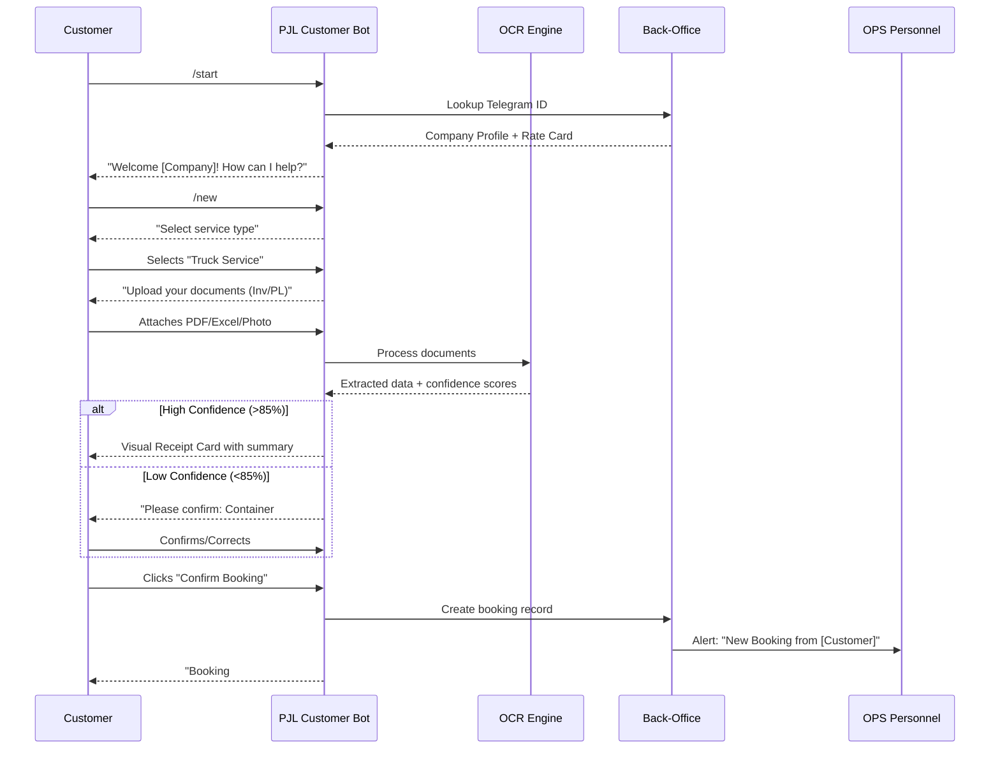
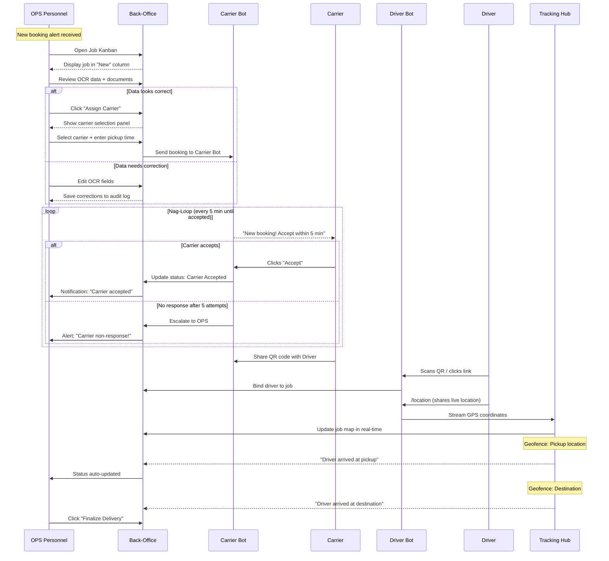
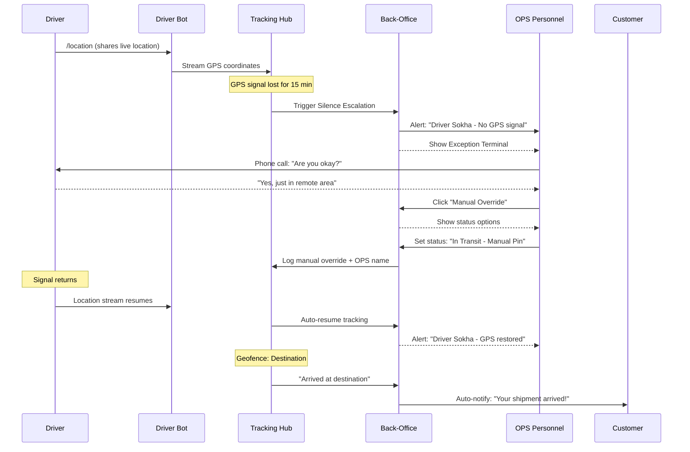
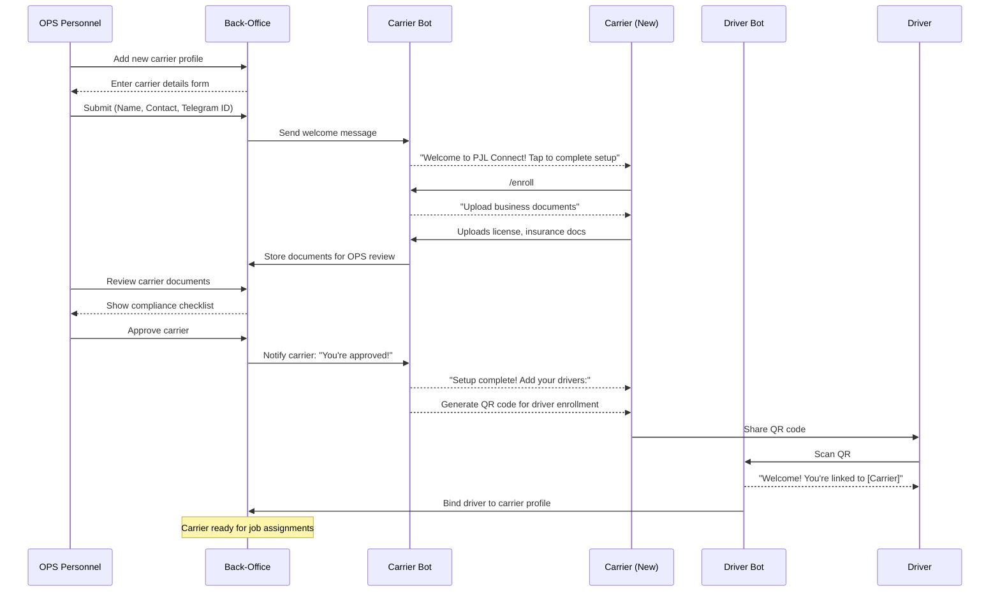
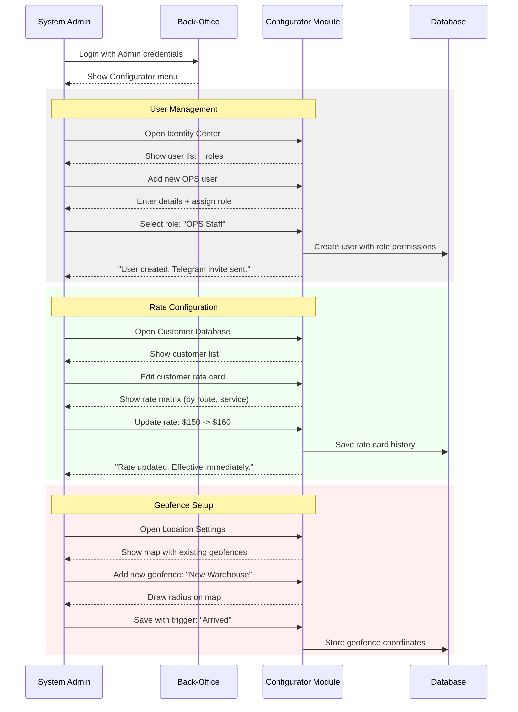
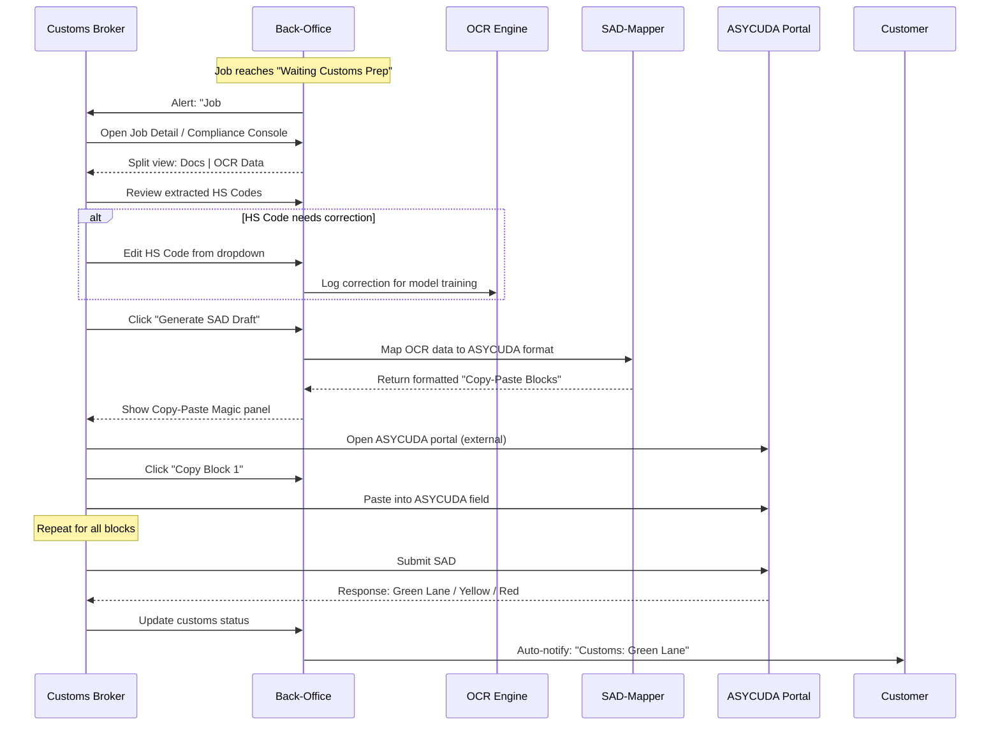
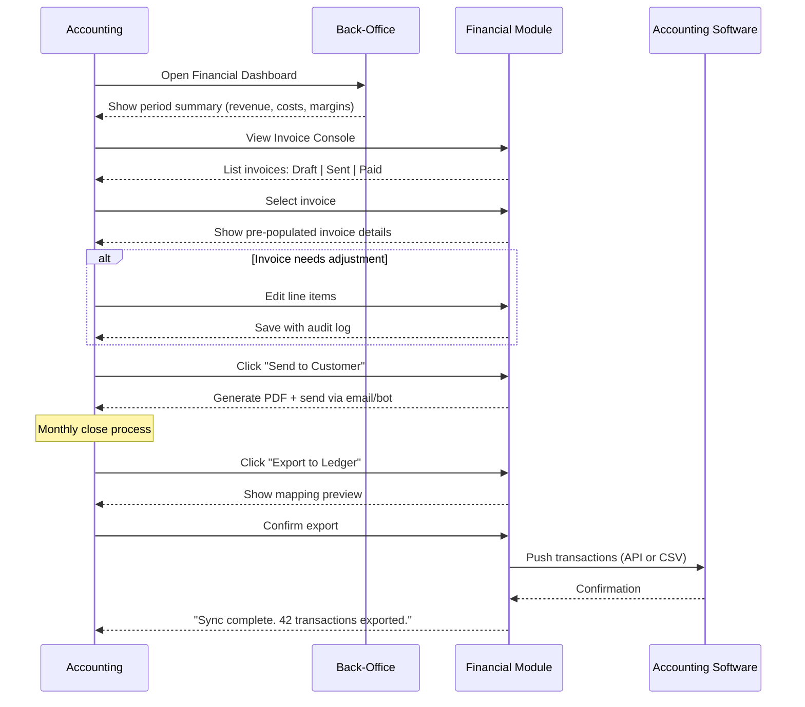

# Product Requirements Document - PJL Connect

**Author:** Antigravity  
**Date:** 2026-01-31  
**Version:** 1.0

---

## Executive Mindmap Summary (Mindomo-Compatible)

```
PJL Connect - Multi-Modal Logistics Operating System
	Problem Statements
		Manual Chaos in Operations
			Fragmented Telegram chats with critical data in personal histories
			OPS spending 4+ hours/day on manual Excel data entry
			40% of OPS time answering "Where is my truck?" calls
			No single source of truth for shipment status
		Document Processing Pain
			Inaccurate SAD drafting causing "Red Lane" customs inspections
			Delayed document collection missing ETD deadlines
			Manual typing into ASYCUDA government portal
		Financial Visibility Gap
			Delayed invoicing causing revenue leakage
			Untracked expenses per shipment
			Management waiting for monthly reports instead of real-time data
		Scalability Barrier
			Current process cannot scale beyond current volume
			Carrier/driver management is ad-hoc
			No system to sell to other logistics companies
	Goal
		Primary Goal
			Automate 99% of "Happy Path" logistics operations
			Human-in-the-loop only for 1% exceptions
			Transform manual chaos into structured, trackable workflow
		MVP Goal (Month 1-3)
			First customer fully operational on new system
			All internal teams using PJL Connect
			Core booking-to-delivery cycle automated
		Growth Goal (Month 4-12)
			100% of PJL bookings processed through new workflow
			Full feature set deployed
			6-month adoption curve respected
		Vision Goal (Month 12-24)
			Multi-tenant SaaS platform ready
			Sell system to other Cambodia logistics companies
			Position as "Invisible App" logistics pioneer
	Feasibility Study
		Technical Feasibility
			Laravel 11 on dedicated VPS (proven stack)
			Telegram Bot API (stable, well-documented)
			Google Cloud Vision OCR (high accuracy, reasonable cost)
			No complex integrations for MVP (Copy-Paste Magic for ASYCUDA)
		Operational Feasibility
			OPS team receptive to reducing manual work
			Telegram already used by all stakeholders
			6-month hybrid period to ease transition
			OPS controls migration pace (not forced on customers)
		Financial Feasibility
			Cloud Vision: ~$1.50 per 1000 pages (minimal OCR cost)
			VPS hosting: existing infrastructure
			ROI: 4 hours/day OPS time saved = significant labor savings
	Stakeholder Personas
		Customer (Industrial/Logistics Managers)
			Pain: Multiple calls/messages to track shipments
			Goal: Zero-friction booking, "Quiet Bot" that only pings when needed
			Success: Book via Telegram, get Visual Receipt, track without calling OPS
		OPS Personnel (Back-Office Command Center)
			Pain: 4+ hours daily on manual data entry, constant status calls
			Goal: Kanban dashboard, 90% automation, focus on exceptions
			Success: System handles routine, human handles edge cases
		Driver (External/Gig-Economy Executors)
			Pain: App fatigue, complex tracking requirements
			Goal: Passive location sharing, no new app installs
			Success: Share location via Telegram, tap buttons for status
		Customs Broker (Compliance Guards)
			Pain: Manual ASYCUDA data entry, "Red Lane" inspections
			Goal: One-click SAD review, formatted data ready for paste
			Success: Copy-Paste Magic reduces typing by 80%
		Carrier (Fleet Owners/Dispatchers)
			Pain: Missed booking opportunities, inconsistent communication
			Goal: High truck utilization, consistent booking volume
			Success: Receive jobs via Telegram, accept with one tap
		Accounting (Corporate Finance)
			Pain: Manual invoice creation, delayed financial data
			Goal: 100% data consistency, one-click ledger sync
			Success: Export to QuickBooks with complete shipment data
		Management (CEO/Strategic Owner)
			Pain: Monthly reports, no real-time visibility
			Goal: Live profit-per-booking dashboard, "Lane Velocity" metrics
			Success: Dashboard with booking volume, revenue, margins
	Current Business Process
		Booking
			Customer sends request via personal Telegram/Line chat
			OPS manually extracts data from various document formats
			Data entered into Excel spreadsheet
			Confirmation sent back via chat
		Carrier Assignment
			OPS calls/messages carriers individually
			Waits for confirmation via chat
			No systematic tracking of carrier availability
			Manual follow-up if no response
		Shipment Tracking
			OPS calls driver for status updates
			Customer calls OPS asking "Where is my truck?"
			No real-time GPS visibility
			Manual status updates in Excel
		Customs Clearance
			Broker manually types SAD data into ASYCUDA
			High error rate causing "Red Lane" inspections
			Deadline tracking via memory/calendar
		Invoicing
			OPS creates invoices manually after delivery
			Data copied from Excel to accounting software
			Delays in invoicing cause cash flow issues
	Proposed Business Process
		Booking
			Customer sends /new via PJL Customer Bot
			System OCR extracts data from any document format
			Customer confirms/corrects via inline buttons
			Visual Receipt Card sent as confirmation
			Booking auto-assigned to available OPS
		Carrier Assignment
			System sends job to carrier via PJL Carrier Bot
			Nag-Bot repeats every 5 minutes until response
			OPS alerted if no response within threshold
			Driver bound to job, location sharing activated
		Shipment Tracking
			Driver shares live location via Telegram
			Customer tracks via /track command with live map
			Geofence triggers auto "Arrived/Departed" status
			Silence Escalation alerts OPS if GPS goes dark
			ETA calculated and updated in real-time
		Customs Clearance
			System generates Copy-Paste Magic data blocks
			Broker reviews and pastes into ASYCUDA
			ETD-based deadline engine sends automatic reminders
			Document status tracked in system
		Invoicing
			System generates invoice on job completion
			One-click export to QuickBooks format
			Profit per booking calculated automatically
			Real-time financial dashboard available
	Research & Best Practices
		Market Inspirations
			WhatsApp Business API logistics patterns
			Project44 real-time visibility platform
			Flexport digital freight forwarding
			Uber Freight driver-side simplicity
		Technology Best Practices
			Telegram Bot API for "Invisible App" approach
			Google Cloud Vision for form-agnostic OCR
			Geofencing for automatic status triggers
			Confidence scoring for OCR validation
		Logistics Industry Standards
			ASYCUDA customs declaration format (Cambodia)
			Container number validation patterns
			Bill of Lading / AWB tracking standards
			Multi-modal shipment handling
	5W Analysis
		What
			Multi-Modal Logistics Operating System
			Telegram-native bots for all stakeholders
			Web-based Back-Office for OPS
			Intelligence Hub for automation
		Who
			Primary: OPS Personnel (daily users)
			Secondary: Customers, Drivers, Carriers
			Tertiary: Broker, Accounting, Management
			Future: Other Cambodia logistics companies (SaaS)
		When
			MVP: Month 1-3 (core booking/tracking)
			Growth: Month 4-12 (full feature set)
			SaaS: Month 12-24 (multi-tenant)
		Where
			Cambodia cross-border logistics
			Land (trucking), Sea (freight), Air (cargo)
			Vietnam, Thailand route corridors
		Why
			Eliminate manual chaos (4 hours/day saved)
			Reduce "Red Lane" customs inspections
			Enable real-time visibility for all stakeholders
			Create SaaS revenue stream
	Functional Requirements (52 FRs)
		Customer Management (FR1-FR3)
			FR1: Customer registration via /start
			FR2: Telegram ID binding (passwordless)
			FR3: OPS manages customer profiles
		Booking & Shipment (FR4-FR12)
			FR4-FR9: Booking creation, OCR, confirmation
			FR10-FR12: OPS booking management
		Job Management (FR13-FR24)
			FR13-FR18: Job creation, Kanban, assignment
			FR19-FR20: Auto-assign and manager override
			FR21-FR24: Document printing, viewing, annotation
		Carrier & Driver (FR25-FR31)
			FR25-FR28: Carrier notifications, Nag-Bot
			FR29-FR31: Driver location tracking
		Tracking & Monitoring (FR32-FR37)
			FR32-FR34: Customer tracking, Silence Escalation
			FR35-FR37: ETA, geofencing
		Document & Compliance (FR38-FR42)
			FR38-FR40: Document management, Copy-Paste Magic
			FR41-FR42: Deadline tracking, reminders
		Financial & Reporting (FR43-FR47)
			FR43-FR44: Invoice generation, QuickBooks export
			FR45-FR47: Dashboard, profit calculation, audit trail
		Administration (FR48-FR52)
			FR48-FR49: User management, RBAC
			FR50-FR52: Rate cards, carriers, settings
	Non-Functional Requirements (14 NFRs)
		Performance
			NFR1: Dashboard loads in 3 seconds
			NFR2: Bot responds in 2 seconds
			NFR3: Location updates in 10 seconds
			NFR4: OCR completes in 30 seconds
		Reliability
			NFR5: 99% uptime
			NFR6: 24/7 bot availability
			NFR7: Transaction-safe operations
		Security
			NFR8: HTTPS/TLS encryption in transit
			NFR9: RBAC enforcement
			NFR10: Audit trail for changes
			NFR11: Passwordless Telegram auth
		Integration
			NFR12: Telegram rate limit handling
			NFR13: Valid QuickBooks export format
			NFR14: OCR fallback to manual
	Use Cases Outline
		UC1: Customer Books Shipment
			Actor: Customer via Telegram
			Flow: /new → Upload → OCR → Confirm → Receipt
			Success: Booking created with unique reference
		UC2: OPS Manages Jobs
			Actor: OPS via Back-Office
			Flow: View Kanban → Assign Carrier → Monitor → Close
			Success: Job completed with full audit trail
		UC3: Driver Shares Location
			Actor: Driver via Telegram
			Flow: Accept job → Share location → Arrive → Complete
			Success: Real-time tracking visible to OPS/Customer
		UC4: Broker Prepares SAD
			Actor: Broker via Back-Office
			Flow: Review data → Copy-Paste Magic → Paste to ASYCUDA
			Success: SAD submitted without "Red Lane"
		UC5: Accounting Exports Data
			Actor: Accounting via Back-Office
			Flow: Select period → Export → Import to QuickBooks
			Success: Financial data synced accurately
	Out of Scope (MVP)
		Technical
			Multi-tenant architecture
			Direct ASYCUDA API integration
			Shipping line/airline API tracking
			Data encryption at rest
		Features
			Carrier onboarding self-service
			System admin self-configuration
			Automated customs document generation
			Multi-currency support (USD only)
		Integrations
			Direct vessel tracking APIs
			Direct airline tracking APIs
			Payment gateway integration
	User Journey Outline
		J1: Customer Booking (Happy Path)
			/start → /new → Upload → OCR → Confirm → Receipt
		J2: OPS Command Center (28 Steps)
			Dashboard → Assignment → Tracking → Escalation → Close
		J3: Driver Recovery (GPS Failure)
			GPS blackout → Silence Escalation → OPS alert → Manual override
		J4: Carrier Onboarding
			QR enrollment → Driver binding → Compliance checklist
		J5: System Admin Configuration
			User management → RBAC → Rate cards → Geofences
		J6: Broker Compliance (SAD)
			Review data → Copy-Paste Magic → ASYCUDA paste
		J7: Accounting Financial Close
			Invoice generation → QuickBooks export → Period summary
	Risk
		Technical Risks
			Risk: OCR accuracy for varied document formats
				Mitigation: Confidence scoring + Verification Loop + OPS fallback
			Risk: Telegram API rate limits or changes
				Mitigation: Graceful degradation, OPS notification
			Risk: GPS blackouts from driver phones
				Mitigation: Silence Escalation protocol
		Market Risks
			Risk: User adoption resistance
				Mitigation: 6-month hybrid period, OPS controls pace
			Risk: Customer preference for existing workflow
				Mitigation: "Quiet Bot" philosophy, minimal change
		Resource Risks
			Risk: Small development team
				Mitigation: Single-tenant MVP reduces complexity
			Risk: Scope creep
				Mitigation: Strict MVP boundaries, deferred backlog
	Pre-Solution
		Manual Process Analysis
			Observed OPS workflow for 2 weeks
			Documented all Telegram chat patterns
			Identified 4-hour daily manual work
		Stakeholder Interviews
			Customer pain points identified
			Driver friction points documented
			Broker ASYCUDA workflow mapped
		Technology Evaluation
			Telegram Bot API validated for requirements
			OCR services benchmarked (Cloud Vision selected)
			Laravel stack confirmed as suitable
	System Overview
		PJL Connect Back-Office (Web App)
			Dashboard with Pulse Snapshot and Trends
			Booking List and Multi-Leg Builder
			Job Kanban and Detail Console
			Financial Console with Invoice Generation
			Admin Configurator for Rules and Users
		PJL Customer Bot (Telegram)
			/start - Registration with Telegram ID binding
			/new - Booking with OCR and Visual Receipt
			/track - Live journey map and status
			/help - Escalation to human OPS
		PJL Carrier & Driver Bot (Telegram)
			/enroll - QR-based driver binding
			/accept - Job acknowledgment with Nag-Bot
			/location - Native Telegram live sharing
		PJL OPS Internal Bot (Telegram Group)
			Real-time job alerts
			Exception pings for escalations
			Deep-links to Back-Office
		PJL Intelligence Hub (Core Engine)
			OCR Engine with confidence scoring
			Multi-Modal Rule Engine for leg dependencies
			SAD-Mapper for ASYCUDA formatting
			Tracking Aggregator for GPS streams
			Geofencing Logic for auto-triggers
			Silence Escalation for blackout detection
	Milestones
		MVP (Month 1-3)
			Sprint 1-2: Core database, user auth, basic bot
			Sprint 3-4: Booking flow, OCR integration
			Sprint 5-6: Job management, Kanban
			Sprint 7-8: Tracking, Silence Escalation
			Sprint 9-10: Testing, first customer live
		Growth (Month 4-12)
			Full document management
			Copy-Paste Magic for ASYCUDA
			QuickBooks export
			Advanced reporting dashboard
			100% PJL bookings on system
		SaaS (Month 12-24)
			Multi-tenant architecture
			Subscription billing
			White-label options
			Cambodia market launch
	Sequence Diagrams
		Customer Booking Flow
			Customer → Bot → OCR → Confidence Check → Customer Confirm → OPS
		Carrier Assignment Flow
			OPS → System → Carrier Bot → Nag Loop → Driver Bind → Location Start
		Tracking Flow
			Driver Location → System → Geofence Check → Status Update → Customer Notify
		Silence Escalation Flow
			GPS Blackout → Timer → OPS Alert → Manual Override → Resume
		SAD Preparation Flow
			Job Data → SAD Mapper → Copy-Paste Block → Broker Review → ASYCUDA Paste
```


## Project Classification

| Attribute | Value |
|-----------|-------|
| **Project Type** | SaaS B2B / Hybrid Platform (Web + Telegram) |
| **Domain** | Logistics & Supply Chain |
| **Complexity** | High |
| **Project Context** | Greenfield (New Build) |
| **Tech Stack** | Laravel 11+ on Dedicated VM (VPS) |

---

## Success Criteria

### User Success

| Stakeholder | Success Definition | Measurement | Failure Threshold |
|-------------|-------------------|-------------|-------------------|
| **Customer** | Seamless experience in familiar Telegram channel; feels "the bot keeps me posted" | Post-interaction survey; bot engagement rate | Customer doesn't understand bot workflow at all; abandons to phone calls only |
| **Customer (Transition)** | Hybrid model respected—can still chat to OPS during 6-month adoption curve | % of interactions via bot vs. direct OPS chat | No bot adoption after 6 months |
| **OPS** | Full manual override control; system serves OPS, not the other way around | All booking states manually editable; override audit trail | OPS feels trapped by automation; cannot correct system errors |
| **Driver** | Zero new app installations; passive location sharing | Telegram-only execution; no app store downloads | Forced to install external tracking app |
| **Broker** | 80% reduction in manual SAD typing via "Copy-Paste Magic" | Time-to-submission comparison vs. baseline | System-generated data causes Red Lane inspections |
| **Accounting** | One-click ledger sync; no manual data entry | Keystroke/input tracking comparison | Data inconsistency between OPS and Finance systems |
| **Management** | Real-time visibility into profit and lane velocity | Dashboard adoption; query response time | Still waiting for monthly reports to make decisions |

> **Key Insight:** The 6-month adoption curve is respected. OPS controls the pace of customer migration to bot workflow—not the system.

### Business Success

| Milestone | Timeline | Success Definition | Key Indicators |
|-----------|----------|-------------------|----------------|
| **Proof of Concept** | 3 Months | First customer fully on new workflow; all teams (OPS, Customs, Accounting, Management) actively using system and happy | 1 customer live; positive feedback from all team leads; measurable reduction in manual work |
| **Full Migration** | 12 Months | All PJL bookings processed through new workflow | 100% booking volume on system; legacy Excel/Telegram-only workflows deprecated |
| **SaaS Launch** | 24 Months | System sold to other logistics companies in Cambodia as subscription product | First external paying customer; SaaS pricing model validated |

**Revenue Model Vision (Year 2):** Subscription-based SaaS for Cambodia logistics operators.

### Technical Success

| Metric | MVP Target (3 Months) | Growth Target (12 Months) | Failure Threshold |
|--------|----------------------|---------------------------|-------------------|
| **OPS Workflow Automation** | ≥60% of OPS actions automated | ≥85% automation | <50% = MVP failure |
| **System Uptime** | 99% | 99.5% | <98% triggers incident |
| **Location Tracking Availability** | 90% of in-transit time | 95% | Silence Escalation beyond 30min |
| **OCR Extraction Accuracy** | 80% first-pass | 90% | <70% triggers mandatory manual review |
| **ASYCUDA Data Quality** | 90% acceptance rate | 98% | Red Lane due to system error = critical bug |

**Priority Order:** OPS workflow automation → Customer bot → Broker tools → Accounting sync → Management dashboards

### Measurable Outcomes

| Outcome | Baseline (Current) | 3-Month Target | 12-Month Target |
|---------|-------------------|----------------|-----------------|
| OPS "Where is my truck?" calls | ~40% of daily time | -50% reduction | -80% reduction |
| OPS manual data entry time | ~4 hours/day | -40% reduction | -80% reduction |
| Customer booking confirmation | Manual acknowledgement | Automated + OPS-controlled | Fully automated with bot |
| Invoice generation time | End-of-month batch | Same-day pre-population | Real-time upon job finalization |
| Profit visibility | Monthly reports | Weekly dashboard | Real-time per-booking |

---

## Product Scope (Milestone Plan)

### Milestone 1: MVP (Month 1-3)

**Target:** First customer fully operational; ALL teams using the system

#### Functional Delivery

| Stakeholder | What They Can Do |
|-------------|------------------|
| **Customer** | Upload booking documents via Telegram bot; receive automated confirmations and status updates; escalate to OPS when needed |
| **OPS** | Manage all jobs via Kanban dashboard; assign carriers with auto-escalation; manually override any booking state; view audit trail |
| **Driver** | Accept jobs via Telegram; share live location; trigger manual status updates |
| **Carrier** | Receive booking alerts via Telegram; accept/decline with one tap; onboard drivers via QR code |
| **Broker** | View job details and uploaded documents; access customer docs for manual SAD preparation |
| **Accounting** | View finalized job costs and revenue; export financial data; basic invoice tracking |
| **Management** | View operational dashboard; monitor volume trends; track team workload |

#### Features

**1. Module: PJL Connect Back-Office (Web App)**

- **1.1 Dashboard**
  - Pulse Snapshot: Today's active jobs, pending assignments, exception alerts
  - Volume Counter: Daily/weekly shipment counts
  - Team Workload View: Jobs per OPS member
  - Management Summary Panel: Active volume, completed this week, revenue snapshot

- **1.2 Job Management**
  - Job Kanban board (drag-and-drop status columns)
  - Job Detail view with document viewer
  - Manual status override with audit logging
  - Carrier assignment interface
  - Nag-Monitor: Carrier acceptance tracking & escalation logs
  - Exception Terminal: Silence Escalations and Manual Overrides
  - History Pane: Chronological audit trail per job
  - Job Financials Tab: Cost entries, customer rate, margin preview

- **1.3 Booking**
  - Smart Booking List with status filters
  - Basic search (by booking ID, customer, container)

- **1.4 Financial (Basic)**
  - Financial Overview Dashboard: Total revenue, costs, margins this period
  - Job Cost Entry: OPS records vendor costs per job
  - Invoice List: View all invoices with status (Draft/Sent/Paid)
  - Basic Invoice Generator: Pre-populate invoice from job data
  - Export to CSV/Excel: Financial data export for manual accounting sync

- **1.5 Reports (Basic)**
  - Volume Report: Shipments by customer, period, destination
  - Revenue Report: Revenue by customer, service type
  - OPS Workload Report: Jobs handled per team member
  - Export All: CSV/Excel download for all reports

- **1.6 Configurator**
  - Customer Database: Profile management, Telegram ID binding, rate cards
  - Carrier Database: Contact profiles, driver roster, negotiated rates
  - Identity Center: Telegram ID → Company mapping, RBAC basics

**2. Module: PJL Customer Bot (Telegram)**

- **2.1 `/start`** - Welcome + Telegram ID binding to company profile
- **2.2 `/new`** - Document upload → OCR extraction → Interactive Summary Card → Confirm/Edit
- **2.3 `/track`** - View current booking status (list of active jobs, tap for details)
- **2.4 `/help`** - Escalation to human OPS (message relay)

**3. Module: PJL Carrier & Driver Bot (Telegram)**

- **3.1 `/enroll`** - Carrier registration + QR-based driver binding
- **3.2 `/accept`** - Booking dispatch with Nag-Loop (5-min repeat until acceptance)
- **3.3 `/location`** - Native Telegram live location sharing toggle
- **3.4 `/status`** - Manual "Arrived/Departed" override

**4. Module: PJL OPS Internal Bot (Telegram Group)**

- **4.1 Real-time Alerts** - "New Booking," "Carrier Accepted," "Driver Assigned"
- **4.2 Exception Pings** - Silence Escalations, Carrier Non-Response
- **4.3 Deep-Links** - One-tap navigation to Back-Office job detail

**5. Module: PJL Intelligence Hub (Core Engine)**

- **5.1 OCR Engine** - Document extraction (Inv/PL) with confidence scoring
- **5.2 Verification Loop** - Low-confidence field → Customer confirmation prompt
- **5.3 Tracking Aggregator** - Driver GPS stream ingestion from Telegram
- **5.4 Geofencing Logic** - Auto-trigger "Arrived/Departed" at defined coordinates
- **5.5 Silence Escalation** - Location blackout detection → OPS alert

---

### Milestone 2: Growth (Month 4-12)

**Target:** All PJL bookings on new workflow; all teams fully operational

#### Functional Delivery (New Capabilities)

| Stakeholder | What They Can Do (New) |
|-------------|------------------------|
| **Customer** | Upload documents against deadline reminders; track multi-leg shipments; view customs status |
| **OPS** | Build multi-leg shipments; trigger one-click invoice generation; view performance analytics |
| **Broker** | Review AI-generated SAD drafts; use "Copy-Paste Magic" for ASYCUDA; trigger missing doc requests |
| **Accounting** | One-click ledger sync; review pre-populated invoices; reconcile reimbursements |
| **Management** | View profit-per-booking; analyze lane velocity; track customer trends |

#### Features

**1. Module: PJL Connect Back-Office (Enhancements)**

- **1.1 Dashboard (Enhanced)**
  - Strategic Trends: Volume charts by customer, period, trade-lane
  - Performance Cards: Carrier reliability ranking, OPS workload analysis

- **1.2 Booking (Enhanced)**
  - Multi-Leg Builder: Define journey legs (Truck → Port → Sea → Destination)
  - CRM: Customer rate cards, service agreements, relationship history

- **1.3 Job (Enhanced)**
  - Job Detail / Compliance Console: Side-by-side doc review + OCR extraction
  - "Copy-Paste Magic" blocks for ASYCUDA
  - Digital Doc-Verify: Inv vs. PL vs. B/L cross-check

- **1.4 Financial (Enhanced)**
  - Invoice Console: OPS-pre-populated invoices for accounting sign-off
  - Ledger Sync Logs: One-click push to accounting software
  - Reimbursement Intake: Receipt scanning via OPS Wallet Bot

- **1.5 Configurator (Enhanced)**
  - Service Rules: Document requirements matrix by service/destination
  - Template Mapper: Dynamic PDF field mapping

**2. Module: PJL Customer Bot (Enhancements)**

- **2.1 `/docs`** - Deadline-aware document upload; decoupled from booking
- **2.2 `/track` (Enhanced)** - Multi-leg journey view; customs lane status (Red/Yellow/Green/Blue)

**3. Module: PJL Intelligence Hub (Enhancements)**

- **3.1 Multi-Modal Rule Engine** - Leg dependency logic
- **3.2 SAD-Mapper** - OCR data → ASYCUDA JSON/XML format
- **3.3 ETD-based Deadline Engine** - Auto-calculated doc deadlines + customer nags
- **3.4 Document Generator** - Dynamic PDF/Excel output with job data injection
- **3.5 Tracking Aggregator (Enhanced)** - Vessel/Flight API integration
- **3.6 Financial Settlement Engine** - Auto-generate Inv/Reimb/CN/DN

---

### Milestone 3: Vision / SaaS (Month 12-24)

**Target:** System sold to other logistics companies in Cambodia as subscription product

#### Functional Delivery (New Capabilities)

| Stakeholder | What They Can Do (New) |
|-------------|------------------------|
| **External Logistics Company** | Subscribe to PJL Connect as SaaS; self-onboard; brand with own identity |
| **PJL (as Vendor)** | Manage multiple tenants; bill by subscription; view cross-tenant analytics |

#### Features

**1. Module: Multi-Tenant Platform Architecture**

- **1.1 Tenant Management** - Create/manage external company accounts
- **1.2 White-Label Branding** - Custom logo, colors, bot names per tenant
- **1.3 Data Isolation** - Strict tenant data separation
- **1.4 Subscription Billing** - Per-shipment or tier-based pricing

**2. Module: Self-Service Onboarding**

- **2.1 Signup Flow** - External company registration
- **2.2 Configuration Wizard** - Service rules, user roles, bot setup
- **2.3 Documentation Portal** - Guides, API docs, support tickets

**3. Module: PJL Intelligence Hub (Advanced AI)**

- **3.1 Seasonal Demand Forecasting** - Historical pattern analysis; pre-alerts
- **3.2 Precision Delay Detection ("Watchdog")** - Anomaly detection; proactive alerts
- **3.3 Expansion Scout** - Identify developing route clusters
- **3.4 Predictive Carrier Scoring** - Reliability ranking based on historical data

**4. Module: Ecosystem Products (Spinoffs)**

- **4.1 Zero-Device Tracking SaaS** - Standalone Telegram-based tracking
- **4.2 Cross-Industry OCR Utility** - Document extraction as micro-service
- **4.3 Modular Dispatcher Licensing** - OPS workload balancing as white-label module

---

## User Journeys

This section contains user journeys in 3 formats:
1. **Sequence Diagrams** - Visual Mermaid diagrams
2. **Rich Narrative** - Story-based with emotional arc
3. **AI-Agent Spec** - Machine-readable for development

---

### Journey 1: Customer Booking (Happy Path)

#### 1.1 Sequence Diagram



#### 1.2 Rich Narrative

**Persona:** Sokheng, Logistics Manager at a garment factory in Phnom Penh

**Opening Scene:**
It's 8:30 AM. Sokheng just received shipping documents from their Chinese supplier via email. In the old days, she would forward these to PJL via Telegram, wait for OPS to manually acknowledge, then spend the next hour answering "Did you receive my docs?" calls.

**Rising Action:**
She opens the PJL Bot on Telegram—the same app she uses daily for personal chats. She taps `/new`, selects "Truck Service," and forwards the supplier's PDF directly to the bot. Within seconds, a beautiful summary card appears: "5 containers, 20ft each, pickup at Sihanoukville Port, destination: Factory Zone B."

**Climax:**
She spots a typo—the container number is wrong. She taps "Edit," fixes it with a single tap (the system shows a dropdown of similar numbers), and hits "Confirm." The bot responds: "Booking #PJL-2026-0001 created. Your OPS contact: Dara. We'll ping you when carrier is assigned."

**Resolution:**
Sokheng returns to her morning coffee. No phone calls. No waiting. The bot pinged her 20 minutes later: "Carrier assigned: ABC Transport. Driver will pick up at 2:00 PM." She smiles—this is how it should work.

**Emotional Arc:** Anxiety → Relief → Trust → Delight

#### 1.3 AI-Agent Spec

```yaml
journey_id: J001_CUSTOMER_BOOKING
stakeholder: customer
trigger: customer_needs_to_ship_goods
preconditions:
  - customer_telegram_id_bound_to_company_profile
  - company_rate_card_configured

steps:
  - step: 1
    actor: customer
    action: send_command
    input: "/start"
    system_response: lookup_company_profile
    output: welcome_message_with_company_name

  - step: 2
    actor: customer
    action: send_command
    input: "/new"
    system_response: display_service_menu
    output: inline_keyboard_service_types

  - step: 3
    actor: customer
    action: select_option
    input: "truck_service | sea_freight | customs_brokerage | air_freight"
    system_response: prompt_document_upload
    output: "Please upload your documents (Invoice, Packing List)"

  - step: 4
    actor: customer
    action: upload_file
    input: file_attachment (pdf | excel | image)
    system_response: 
      - send_to_ocr_engine
      - extract_booking_data
      - calculate_confidence_scores
    output: visual_receipt_card

  - step: 5
    actor: customer
    action: review_and_confirm
    input: "confirm | edit"
    branch:
      confirm:
        - create_booking_record
        - assign_to_ops_queue
        - notify_ops_internal_bot
        - send_confirmation_to_customer
      edit:
        - display_editable_fields
        - loop_to_step_5

success_criteria:
  - booking_created_in_database
  - ops_notified_within_5_seconds
  - customer_receives_booking_id

failure_modes:
  - ocr_extraction_fails: trigger_manual_ops_review
  - customer_abandons: log_incomplete_booking
```

---

### Journey 2: OPS Command Center (28-Step Flow)

#### 2.1 Sequence Diagram



#### 2.2 Rich Narrative

**Persona:** Dara, OPS Supervisor at PJL Connect

**Opening Scene:**
Monday 8:00 AM. Dara opens the Back-Office on his laptop. The Kanban board shows 3 new bookings from overnight. In the old system, this meant 3 hours of Telegram chats, carrier phone calls, and Excel updates.

**Rising Action:**
He clicks the first booking—Sokheng's garment shipment. The system shows the OCR-extracted data side-by-side with the original PDF. Everything looks correct. He clicks "Assign Carrier" and selects ABC Transport (their best rate for this route). The system immediately pings ABC's dispatcher on Telegram.

ABC doesn't respond for 5 minutes. The Nag-Bot sends another ping. On the third ping, ABC accepts. Their dispatcher shares a QR code with driver Sokha, who scans it to bind himself to the job.

**Climax:**
15 minutes later, Dara sees Sokha's blue dot moving on the map toward Sihanoukville Port. When Sokha enters the port geofence, the system auto-updates: "Arrived at Pickup." No phone call needed.

**Resolution:**
By 10:00 AM, Dara has processed all 3 bookings. Total phone calls made: 0. He opens the Exception Terminal—no silence escalations, no carrier non-responses. Today is a good day.

**Emotional Arc:** Alertness → Confidence → Control → Satisfaction

#### 2.3 AI-Agent Spec

```yaml
journey_id: J002_OPS_COMMAND_CENTER
stakeholder: ops_personnel
trigger: new_booking_created
preconditions:
  - ops_authenticated_to_back_office
  - booking_in_new_status

steps:
  - step: 1
    actor: system
    action: push_notification
    target: ops_internal_bot
    output: "New Booking #XXX from [Customer]"

  - step: 2
    actor: ops
    action: open_job_detail
    system_response: display_ocr_data_and_documents

  - step: 3
    actor: ops
    action: review_ocr_accuracy
    branch:
      correct:
        next_step: 4
      needs_edit:
        action: edit_ocr_fields
        system_response: log_to_audit_trail
        next_step: 4

  - step: 4
    actor: ops
    action: assign_carrier
    input: carrier_id, pickup_datetime
    system_response:
      - send_telegram_to_carrier
      - start_nag_loop_timer

  - step: 5
    actor: system
    action: nag_loop
    config:
      interval_minutes: 5
      max_attempts: 5
    branch:
      carrier_accepts:
        - update_job_status: carrier_assigned
        - notify_ops: carrier_accepted
      carrier_timeout:
        - escalate_to_ops
        - display_in_exception_terminal

  - step: 6
    actor: carrier
    action: onboard_driver
    method: share_qr_code
    system_response:
      - bind_driver_telegram_to_job
      - request_location_sharing

  - step: 7
    actor: driver
    action: share_location
    system_response:
      - ingest_gps_stream
      - update_job_map_realtime

  - step: 8
    actor: system
    action: geofence_trigger
    location: pickup_coordinates
    output: auto_update_status_arrived_pickup

  - step: 9
    actor: system
    action: geofence_trigger
    location: destination_coordinates
    output: auto_update_status_arrived_destination

  - step: 10
    actor: ops
    action: finalize_delivery
    system_response:
      - update_job_status: delivered
      - trigger_invoice_generation
      - notify_customer

success_criteria:
  - job_progresses_through_all_statuses
  - geofence_triggers_fire_correctly
  - no_manual_status_updates_required

failure_modes:
  - carrier_non_response: display_exception_terminal
  - gps_blackout: trigger_silence_escalation
```

---

### Journey 3: Driver Recovery (GPS Failure)

*Based on industry best practices: contingency planning, manual override, human-in-the-loop*

#### 3.1 Sequence Diagram



#### 3.2 Rich Narrative

**Persona:** Sokha, Truck Driver for ABC Transport

**Opening Scene:**
Sokha is driving through the mountains between Sihanoukville and Phnom Penh. His phone shows 1 bar of signal—then nothing. The Telegram location sharing stops. In the old system, this meant OPS calling him every 30 minutes asking "Where are you?"

**Rising Action:**
At PJL HQ, the Tracking Hub detects 15 minutes of silence. It triggers a Silence Escalation, pinging the OPS Internal Bot: "Driver Sokha - No GPS signal for 15 min." Dara opens the Exception Terminal and sees Sokha's last known position—right in the mountain pass known for signal blackouts.

**Climax:**
Dara calls Sokha. "Everything okay?" Sokha confirms he's fine, just no signal. Dara clicks "Manual Override" in the Back-Office, setting status to "In Transit - Manual Pin." The History Pane logs: "Manual override by Dara at 10:45 AM."

**Resolution:**
30 minutes later, Sokha emerges from the mountains. His GPS resumes automatically. The system shows "GPS Restored" and Dara's workload returns to normal. Sokha never had to do anything—the system handled the chaos.

**Emotional Arc:** Concern (OPS) → Relief → Trust in fallback

**Best Practice Applied:**
- Silence Escalation (not driver harassment)
- OPS as source of truth during chaos
- All overrides logged for audit

#### 3.3 AI-Agent Spec

```yaml
journey_id: J003_DRIVER_RECOVERY_GPS_FAILURE
stakeholder: driver
trigger: gps_signal_lost
preconditions:
  - driver_bound_to_active_job
  - location_sharing_was_active

escalation_config:
  silence_threshold_minutes: 15
  escalation_target: ops_internal_bot
  message_template: "Driver {driver_name} - No GPS signal for {minutes} min"

steps:
  - step: 1
    actor: system
    action: detect_gps_blackout
    condition: no_location_update_for_15_minutes
    output: trigger_silence_escalation

  - step: 2
    actor: system
    action: notify_ops
    channel: ops_internal_bot
    output: exception_alert_with_last_known_position

  - step: 3
    actor: system
    action: display_exception_terminal
    data:
      - driver_name
      - last_known_coordinates
      - time_since_last_ping
      - job_details

  - step: 4
    actor: ops
    action: investigate
    method: phone_call_to_driver
    outcome: confirm_driver_status

  - step: 5
    actor: ops
    action: manual_override
    input: new_status, notes
    system_response:
      - update_job_status
      - log_to_history_pane:
          override_by: ops_name
          timestamp: now
          reason: notes

  - step: 6
    actor: system
    action: monitor_gps_restoration
    condition: location_updates_resume
    output:
      - alert_ops: gps_restored
      - resume_normal_tracking

success_criteria:
  - ops_notified_within_1_minute_of_threshold
  - manual_override_logged_with_attribution
  - tracking_resumes_automatically_when_signal_returns

failure_modes:
  - ops_misses_escalation: secondary_alert_after_5_min
  - driver_unreachable: escalate_to_carrier
```

---

### Journey 4: Carrier Onboarding

*Based on industry best practices: digital vetting, QR enrollment, compliance verification*

#### 4.1 Sequence Diagram



#### 4.2 Rich Narrative

**Persona:** Mr. Vin, Owner of VinTrans trucking company

**Opening Scene:**
Mr. Vin runs a small trucking company with 5 trucks. He heard about PJL Connect from a fellow carrier and wants to join their network. In the old days, this meant driving to PJL's office, signing paper contracts, and waiting days for "approval."

**Rising Action:**
Dara at PJL adds VinTrans to the Back-Office and enters Mr. Vin's Telegram ID. Within seconds, Mr. Vin receives a welcome message: "Welcome to PJL Connect! Tap /enroll to complete your setup."

Mr. Vin taps `/enroll` and uploads photos of his business license and insurance certificate. The documents go straight to Dara's review queue. Dara checks the compliance checklist—license valid, insurance current—and clicks "Approve."

**Climax:**
Mr. Vin receives: "Congratulations! VinTrans is now approved. Add your drivers using this QR code." He shares the QR with his drivers via a group chat. Each driver scans it, instantly binding their Telegram ID to VinTrans.

**Resolution:**
Within 30 minutes, VinTrans is fully onboarded with 5 drivers in the system. No paper signed. No office visit. Mr. Vin's first booking arrives that afternoon.

**Emotional Arc:** Curiosity → Ease → Approval → Readiness

**Best Practice Applied:**
- Digital document collection
- Compliance verification before activation
- QR-based driver binding (no app downloads)

#### 4.3 AI-Agent Spec

```yaml
journey_id: J004_CARRIER_ONBOARDING
stakeholder: carrier
trigger: ops_initiates_new_carrier
preconditions:
  - ops_has_carrier_contact_info
  - carrier_business_is_legitimate

steps:
  - step: 1
    actor: ops
    action: create_carrier_profile
    input:
      - carrier_name
      - contact_name
      - telegram_id
      - phone_number
    system_response: send_welcome_to_carrier_bot

  - step: 2
    actor: carrier
    action: receive_welcome
    channel: carrier_bot
    output: inline_button_to_enroll

  - step: 3
    actor: carrier
    action: send_command
    input: "/enroll"
    system_response: prompt_document_upload

  - step: 4
    actor: carrier
    action: upload_documents
    input:
      - business_license
      - insurance_certificate
      - optional: fleet_list
    system_response:
      - store_documents
      - add_to_ops_review_queue

  - step: 5
    actor: ops
    action: review_compliance
    system_response: display_compliance_checklist
    branch:
      approved:
        - update_carrier_status: approved
        - notify_carrier: approval_message
        - generate_driver_enrollment_qr
      rejected:
        - update_carrier_status: rejected
        - notify_carrier: rejection_reason

  - step: 6
    actor: carrier
    action: share_qr_with_drivers
    method: telegram_forward

  - step: 7
    actor: driver
    action: scan_qr
    system_response:
      - bind_driver_telegram_to_carrier
      - notify_carrier: driver_added

success_criteria:
  - carrier_documents_stored_and_verified
  - carrier_status_active_after_approval
  - drivers_bindable_via_qr_code

failure_modes:
  - documents_unreadable: request_reupload
  - compliance_failure: reject_with_reason
```

---

### Journey 5: System Admin Configuration

*Based on industry best practices: RBAC, least privilege, role-based groups*

#### 5.1 Sequence Diagram



#### 5.2 Rich Narrative

**Persona:** Thy, IT/Admin Manager at PJL Connect

**Opening Scene:**
The company just hired two new OPS staff members, and a key customer requested a rate adjustment. Thy needs to configure the system without involving developers.

**Rising Action:**
Thy logs into the Back-Office with admin credentials. The Configurator menu shows three sections: Identity Center, Customer Database, and Location Settings.

First, she opens Identity Center. She adds the two new OPS staff by entering their names, emails, and Telegram IDs. She assigns them the "OPS Staff" role—which grants access to Job Kanban and Booking but NOT to Financial or Reports. The system sends Telegram invites automatically.

Next, she opens Customer Database and finds the customer requesting the rate change. The rate card shows a matrix by route and service type. She updates the Sihanoukville→Phnom Penh rate from $150 to $160. The History Pane logs: "Rate updated by Thy at 2:30 PM. Previous: $150."

**Climax:**
Finally, the company is opening a new warehouse. Thy opens Location Settings, sees a map with existing geofences, and draws a new circle around the warehouse address. She sets the trigger to "Arrived" so the system auto-detects when drivers enter this zone.

**Resolution:**
All configurations done in 15 minutes. No developer tickets. When the new OPS staff log in tomorrow, they'll have exactly the access they need—nothing more, nothing less.

**Emotional Arc:** Task → Efficiency → Confidence → Control

**Best Practice Applied:**
- Principle of Least Privilege (role-based)
- Audit logging for all changes
- Self-service configuration (no developer dependency)

#### 5.3 AI-Agent Spec

```yaml
journey_id: J005_SYSTEM_ADMIN_CONFIG
stakeholder: system_admin
trigger: configuration_change_needed
preconditions:
  - admin_has_admin_role
  - admin_authenticated_to_back_office

rbac_model:
  roles:
    - name: admin
      permissions: [all]
    - name: ops_manager
      permissions: [jobs, booking, reports, financial_readonly]
    - name: ops_staff
      permissions: [jobs, booking]
    - name: broker
      permissions: [jobs_readonly, compliance]
    - name: accounting
      permissions: [financial, reports]
    - name: viewer
      permissions: [dashboard_readonly]

configuration_domains:
  - domain: user_management
    location: identity_center
    actions:
      - add_user:
          input: name, email, telegram_id, role
          output: user_created, invite_sent
      - edit_user:
          input: user_id, new_role
          output: permissions_updated
      - deactivate_user:
          input: user_id
          output: access_revoked_immediately

  - domain: customer_rates
    location: customer_database
    actions:
      - view_rate_card:
          output: matrix_by_route_and_service
      - edit_rate:
          input: customer_id, route, service, new_rate
          output: rate_updated, history_logged
      - export_rates:
          output: csv_download

  - domain: carrier_management
    location: carrier_database
    actions:
      - add_carrier: see_journey_4
      - edit_carrier_rates:
          input: carrier_id, route, new_cost
          output: cost_updated
      - view_carrier_performance:
          output: reliability_metrics

  - domain: location_settings
    location: configurator
    actions:
      - add_geofence:
          input: coordinates, radius_meters, trigger_type
          output: geofence_active
      - edit_geofence:
          input: geofence_id, new_params
          output: geofence_updated
      - delete_geofence:
          input: geofence_id
          output: geofence_removed

audit_requirements:
  - all_config_changes_logged_with_user_and_timestamp
  - sensitive_changes_require_confirmation
  - rate_changes_show_before_after_values

success_criteria:
  - config_changes_effective_immediately
  - no_developer_involvement_required
  - all_changes_auditable

failure_modes:
  - unauthorized_access: deny_with_audit_log
  - invalid_input: validation_error_with_guidance
```

---

### Journey 6: Broker Compliance (SAD Preparation) - Growth Phase

#### 6.1 Sequence Diagram



#### 6.2 Rich Narrative

**Persona:** Mony, Customs Broker at PJL Connect

**Opening Scene:**
Mony receives an alert: "Job #PJL-2026-0042 ready for customs preparation." In the old system, she would open the customer's PDF, manually type every field into ASYCUDA, and pray the container numbers were legible.

**Rising Action:**
She opens the Job Detail in the Back-Office. The Compliance Console shows a split view: original customer documents on the left, OCR-extracted data on the right. She scans the HS Codes—most look correct, but one needs adjustment. She clicks the dropdown and selects the correct code.

**Climax:**
She clicks "Generate SAD Draft." The SAD-Mapper transforms the data into formatted "Copy-Paste Blocks"—each block matches exactly one ASYCUDA field. She opens ASYCUDA in another browser tab, clicks "Copy Block 1," pastes it into the Consignee field. Copy. Paste. Copy. Paste. The entire SAD is populated in 3 minutes.

**Resolution:**
She submits to ASYCUDA. The response comes back: "Green Lane." She updates the status in Back-Office, and the customer receives an automatic notification: "Your shipment has cleared customs!" Mony used to dread Red Lanes from typos. Now, with Copy-Paste Magic, her error rate has dropped to near zero.

**Emotional Arc:** Vigilance → Efficiency → Accuracy → Pride

#### 6.3 AI-Agent Spec

```yaml
journey_id: J006_BROKER_COMPLIANCE
stakeholder: broker
trigger: job_status_waiting_customs_prep
preconditions:
  - all_required_documents_uploaded
  - ocr_extraction_complete

steps:
  - step: 1
    actor: system
    action: notify_broker
    condition: job_reaches_customs_prep_status
    output: alert_with_job_link

  - step: 2
    actor: broker
    action: open_compliance_console
    system_response: display_split_view_docs_and_ocr

  - step: 3
    actor: broker
    action: review_ocr_data
    focus_areas:
      - hs_codes
      - container_numbers
      - weights_and_values
      - consignee_details
    branch:
      corrections_needed:
        action: edit_field_from_dropdown
        system_response: log_correction_for_training

  - step: 4
    actor: broker
    action: generate_sad_draft
    system_response:
      - invoke_sad_mapper
      - transform_data_to_asycuda_format
      - return_copy_paste_blocks

  - step: 5
    actor: broker
    action: copy_paste_to_asycuda
    method: manual_copy_paste_per_block
    target: asycuda_portal_external

  - step: 6
    actor: broker
    action: submit_sad
    target: asycuda_portal
    response: green_lane | yellow_lane | red_lane

  - step: 7
    actor: broker
    action: update_customs_status
    input: lane_result
    system_response:
      - update_job_status
      - notify_customer: customs_result

success_criteria:
  - sad_submission_successful
  - zero_red_lanes_from_system_errors
  - customer_notified_of_result

failure_modes:
  - missing_documents: prompt_customer_for_upload
  - asycuda_rejection: log_error_for_investigation
```

---

### Journey 7: Accounting Financial Close

#### 7.1 Sequence Diagram



#### 7.2 Rich Narrative

**Persona:** Chanthy, Senior Accountant at PJL Connect

**Opening Scene:**
It's the last day of the month. Chanthy used to spend 3 days reconciling Excel sheets from OPS, manually entering each invoice into the accounting system, and tracking down missing receipts.

**Rising Action:**
She opens the Financial Dashboard in Back-Office. The period summary shows: 142 completed jobs, $28,400 revenue, $19,600 costs, 31% margin. All calculated automatically from job data.

She opens the Invoice Console. 138 invoices are in "Sent" status, 4 are still "Draft." She clicks the first draft—it's pre-populated with job details, rate card prices, and itemized costs. She makes one adjustment (adding a port fee the OPS forgot), saves it, and hits "Send to Customer."

**Climax:**
With all invoices sent, she initiates the monthly sync. She clicks "Export to Ledger" and sees a preview: 42 journal entries mapping to the correct accounts. She confirms, and the system pushes to their accounting software via API.

**Resolution:**
Total time: 2 hours instead of 3 days. Data consistency: 100%—every number in Finance matches OPS. Chanthy finally has time to analyze the numbers instead of just entering them.

**Emotional Arc:** Dread (old system) → Ease → Accuracy → Strategic focus

#### 7.3 AI-Agent Spec

```yaml
journey_id: J007_ACCOUNTING_CLOSE
stakeholder: accounting
trigger: end_of_period

steps:
  - step: 1
    actor: accounting
    action: open_financial_dashboard
    system_response: display_period_summary
    data:
      - total_jobs_completed
      - total_revenue
      - total_costs
      - margin_percentage

  - step: 2
    actor: accounting
    action: review_invoice_console
    system_response: list_invoices_by_status

  - step: 3
    actor: accounting
    action: review_draft_invoices
    per_invoice:
      - display_pre_populated_details
      - allow_edit_with_audit_log
      - action: send_to_customer
        method: email | bot

  - step: 4
    actor: accounting
    action: initiate_ledger_sync
    system_response: show_mapping_preview
    data:
      - journal_entry_count
      - account_mappings

  - step: 5
    actor: accounting
    action: confirm_export
    system_response:
      - push_to_accounting_software
      - log_sync_result
      - display_confirmation

success_criteria:
  - all_invoices_sent_before_close
  - ledger_sync_successful
  - zero_manual_data_entry

failure_modes:
  - sync_failure: retry_with_error_log
  - mapping_error: alert_for_manual_review
```

---

### Journey Requirements Summary

| Journey | Key System Capabilities Required |
|---------|----------------------------------|
| **J1: Customer Booking** | Telegram Bot API, OCR Engine, Profile Binding, Visual Receipt Cards |
| **J2: OPS Command Center** | Job Kanban, Carrier Assignment, Nag-Bot, Geofencing, Real-time Tracking |
| **J3: Driver Recovery** | Silence Escalation, Manual Override, Exception Terminal, Audit Logging |
| **J4: Carrier Onboarding** | QR Code Generation, Document Upload, Compliance Checklist, Driver Binding |
| **J5: System Admin** | RBAC, User Management, Rate Card Editor, Geofence Manager, Audit Trail |
| **J6: Broker Compliance** | SAD-Mapper, Copy-Paste Magic, HS Code Lookup, ASYCUDA Status Tracking |
| **J7: Accounting Close** | Invoice Generator, Ledger Sync API, Period Summary, Export Functions |

---

## Domain-Specific Requirements

### Compliance & Regulatory

| Requirement | Scope | MVP Approach |
|-------------|-------|--------------|
| **Customs Documentation** | CO, Invoice, Packing List, Loading Plan | Collected from customer; OPS attaches to booking |
| **Import Customs Preparation** | SAD and supporting docs | Manual handling by Broker team (document generator deferred) |
| **ASYCUDA Submission** | Government customs portal | "Copy-Paste Magic" bridge with modular format mapping |

### Technical Constraints

| Constraint | Decision |
|------------|----------|
| **Primary Interface** | Telegram-first (no app installations) |
| **Location Sharing Limit** | Telegram 8-hour limit; system re-prompts when needed |
| **Data Residency** | Deferred—no immediate requirements |
| **Driver Connectivity** | Deferred—assume adequate mobile coverage |

### Integration Requirements

| System | Integration Strategy |
|--------|---------------------|
| **Accounting (QuickBooks)** | "Export to QuickBooks" function for financial data |
| **Customs (ASYCUDA)** | Manual copy-paste via formatted data blocks |
| **Vessel Tracking** | Manual entry by OPS in Back-Office (no API) |
| **Flight Tracking** | Manual entry by OPS in Back-Office (no API) |

### Domain-Specific Risks & Mitigations

| Risk | Mitigation |
|------|------------|
| **ASYCUDA Format Changes** | Modular SAD mapping logic; update format mappings as needed |
| **Multi-Currency Complexity** | USD-only for MVP; no rate conversion required |
| **GPS Blackouts** | Silence Escalation protocol + OPS manual override |
| **Carrier Non-Response** | Nag-Bot with escalation + OPS fallback |

---

## Innovation & Novel Patterns

### Detected Innovation Areas

#### 1. The "Invisible App" Philosophy

**Innovation:** No new app installations for drivers or customers. Leverage existing Telegram behavior for enterprise-grade logistics operations.

**Novelty:** Transforming a consumer chat app into a full-scale corporate ERP terminal. Users stay in their comfort zone while the system gains structure.

**Validation:** User adoption metrics; comparison of onboarding time vs. traditional app-based solutions.

---

#### 2. Zero-Device GPS Tracking

**Innovation:** Native Telegram live location sharing for truck tracking. No hardware GPS devices required.

**Novelty:** Software-based tracking using existing smartphone capabilities. Potential to commercialize as standalone SaaS product.

**SaaS Potential:** Spin-off as "Zero-Device Tracking SaaS" for Cambodia logistics market.

---

#### 3. "Copy-Paste Magic" for ASYCUDA

**Innovation:** OCR extraction → formatted data blocks → manual paste into government customs portal.

**Novelty:** 80% reduction in manual typing without requiring complex system-to-system API integration with government systems.

**Risk Mitigation:** Modular format mapping; when ASYCUDA changes, update mapping logic only.

---

#### 4. Silence Escalation Protocol

**Innovation:** Shift from "harass the driver" to "alert the OPS." System notifies humans when automation fails, not vice versa.

**Pattern:** Human-in-the-loop only for exceptions (1% of cases). 99% automation rate with graceful degradation.

---

#### 5. Form-Agnostic OCR Intake

**Innovation:** Accept ANY customer document format (PDF, Excel, photo) and extract booking data automatically.

**Novelty:** Treats document variety as a feature, not a problem. Eliminates "use our template" friction.

##### Technical Implementation

**Architecture Flow:**

```
Customer Bot → Document Queue → OCR Engine → Field Mapper → Confidence Router
    (Any format)   (File storage)  (Cloud AI)   (Service-aware)     ↓
                                                           ┌────────┼────────┐
                                                           ▼        ▼        ▼
                                                       >85%     70-85%    <70%
                                                       Auto    Suggest   Manual
```

**Document Ingestion:**

| Input Type | Processing |
|------------|------------|
| **PDF** | Extract as images OR parse native text if available |
| **Excel** | Parse directly using library (PhpSpreadsheet) |
| **Images** | Pass directly to OCR engine |

**OCR Engine Options:**

| Service | Strength | Approx. Cost |
|---------|----------|--------------|
| **Google Cloud Vision** | Excellent at handwritten + printed text | ~$1.50 per 1000 pages |
| **AWS Textract** | Best for forms/tables extraction | ~$1.50 per page (forms) |

**Recommendation:** Start with Google Cloud Vision for MVP; evaluate AWS Textract for structured forms in Growth phase.

**Field Extraction (Service-Aware Context):**

When customer selects service type BEFORE uploading, system loads specialized extraction rules:

- **Truck Service:** Container Number, Weight, CBM, Pickup/Delivery addresses
- **Sea Freight:** Bill of Lading, Vessel Name, ETD, Port of Loading/Discharge
- **Air Freight:** AWB Number, Flight Number, Commodity Description

**Confidence Scoring:**

| Confidence | Action |
|------------|--------|
| **>85%** | Auto-accept; display in Visual Receipt Card |
| **70-85%** | Show with "Suggested" tag; prompt for confirmation |
| **<70%** | Highlight as "Needs Review"; customer must correct |

**Verification Loop:**

Low-confidence fields trigger customer confirmation via Telegram inline buttons:
- Customer confirms or edits incorrect values
- Corrections logged for potential model improvement

**MVP Simplification:**

1. **Phase 1:** Start with Excel parsing (most common format, no OCR needed)
2. **Phase 2:** Add PDF/Image OCR via Cloud Vision API
3. **Fallback:** OPS manual correction for all edge cases

---

### Validation Built Into Design

| Innovation | Validation Approach |
|------------|---------------------|
| **Invisible App** | User adoption rate; onboarding time comparison |
| **Zero-Device GPS** | Tracking availability %; comparison to hardware GPS |
| **Copy-Paste Magic** | Time-to-submission; ASYCUDA acceptance rate |
| **Silence Escalation** | OPS workload reduction; false positive rate |
| **Form-Agnostic OCR** | First-pass accuracy %; customer correction rate |

---

## SaaS B2B Platform Requirements

### Tenant Model

| Phase | Approach |
|-------|----------|
| **MVP (Month 1-3)** | Single-tenant: PJL Connect only |
| **SaaS (Month 12-24)** | Multi-tenant architecture with data isolation |

**MVP Simplification:** No tenant switching, no white-labeling. Single company configuration.

**Future:** Tenant isolation, per-tenant branding, separate data stores.

---

### RBAC Permission Matrix

| Role | Jobs | Booking | Reports | Financial | Compliance | Admin |
|------|------|---------|---------|-----------|------------|-------|
| **Admin** | ✅ Full | ✅ Full | ✅ Full | ✅ Full | ✅ Full | ✅ Full |
| **OPS Manager** | ✅ Full | ✅ Full | ✅ Full | 👁️ Read | ❌ | ❌ |
| **OPS Staff** | ✅ Full | ✅ Full | ❌ | ❌ | ❌ | ❌ |
| **Broker** | 👁️ Read | ❌ | ❌ | ❌ | ✅ Full | ❌ |
| **Accounting** | ❌ | ❌ | ✅ Full | ✅ Full | ❌ | ❌ |
| **Viewer** | 👁️ Read | 👁️ Read | 👁️ Read | ❌ | ❌ | ❌ |

---

### Integration Summary

| System | MVP Integration | Notes |
|--------|----------------|-------|
| **Telegram Bot API** | ✅ Primary interface | Customer, Carrier, Driver, OPS bots |
| **QuickBooks** | ✅ Export function | "Export to QuickBooks" for financial data |
| **ASYCUDA** | ✅ Copy-Paste Magic | Manual bridge via formatted data blocks |
| **Vessel/Flight Tracking** | ❌ Manual entry | OPS enters tracking info in Back-Office |
| **Third-party APIs** | ❌ Deferred | No external API integrations for MVP |

---

### Subscription Tiers (Backlog - SaaS Phase)

> **Deferred to Year 2 SaaS Launch**

Future options to evaluate:
- Per-shipment pricing
- Tier-based (volume caps)
- Flat monthly subscription

**Tracking:** Added to product backlog for SaaS phase planning.

---

## Project Scoping & Phased Development

### MVP Strategy & Philosophy

**MVP Type:** Problem-Solving MVP  
**Focus:** Solve PJL's immediate operational pain points before expanding to SaaS

**Core Value Proposition:** OPS can process bookings and track shipments without manual chaos.

---

### Phase Development Roadmap

| Phase | Timeline | Key Deliverables |
|-------|----------|------------------|
| **MVP** | Month 1-3 | Single-tenant; core booking, tracking, OPS dashboard |
| **Growth** | Month 4-12 | 100% PJL bookings on system; full feature set |
| **SaaS** | Month 12-24 | Multi-tenant; commercialize to Cambodia market |

---

### MVP Must-Have Journeys (Phase 1)

| Journey | MVP Status | Rationale |
|---------|------------|-----------|
| **J1: Customer Booking** | ✅ Required | Core booking flow via Telegram |
| **J2: OPS Command Center** | ✅ Required | Central dashboard for job management |
| **J3: Driver Recovery** | ✅ Required | Tracking + Silence Escalation |
| **J4: Carrier Onboarding** | ⏳ Deferred | Use manual process initially |
| **J5: System Admin** | ⏳ Deferred | Hardcode initial configuration |
| **J6: Broker Compliance** | ⏳ Deferred | Copy-Paste Magic after tracking works |
| **J7: Accounting Close** | ⏳ Deferred | Manual export to QuickBooks initially |

---

### MVP Technical Scope

| Component | MVP Scope |
|-----------|-----------|
| **OCR Engine** | ✅ Full: PDF, Image, Excel, Word via Google Cloud Vision |
| **Telegram Bots** | ✅ Customer Bot, Driver Bot, OPS Bot |
| **Back-Office** | ✅ Dashboard, Booking List, Job Kanban |
| **Vessel/Flight Tracking** | ❌ Manual entry by OPS |
| **Multi-tenant** | ❌ Single company only |
| **Subscription Billing** | ❌ N/A for MVP |

---

### Risk Mitigation Strategy

| Risk Type | Risk | Mitigation |
|-----------|------|------------|
| **Technical** | OCR accuracy for varied documents | Confidence scoring + Verification Loop + OPS fallback |
| **Market** | User adoption resistance | 6-month hybrid period; OPS controls migration pace |
| **Resource** | Small development team | Single-tenant MVP reduces architectural complexity |

---

## Functional Requirements

> **Capability Contract:** UX, Architecture, and Epics will only implement what's listed here.

### Customer Management

| FR# | Requirement |
|-----|-------------|
| FR1 | Customer can register via Telegram using `/start` command |
| FR2 | System can bind Telegram ID to customer profile (passwordless auth) |
| FR3 | OPS can create and manage customer profiles in Back-Office |

### Booking & Shipment

| FR# | Requirement |
|-----|-------------|
| FR4 | Customer can create a new booking via `/new` command |
| FR5 | Customer can select service type (Truck, Sea, Air, Multi-leg) |
| FR6 | Customer can upload booking documents in any format (PDF, Excel, Word, Image) |
| FR7 | System can extract booking data from uploaded documents via OCR |
| FR8 | Customer can confirm or correct OCR-extracted data |
| FR9 | Customer can receive Visual Receipt Card confirming booking details |
| FR10 | OPS can view all bookings in a filterable list |
| FR11 | OPS can manually create bookings on behalf of customers |
| FR12 | OPS can attach shipping documents to any booking/job |

### Job Management

| FR# | Requirement |
|-----|-------------|
| FR13 | System can convert confirmed bookings into jobs |
| FR14 | OPS can view jobs in Kanban format (by status) |
| FR15 | OPS can assign carriers to jobs |
| FR16 | OPS can manually override job status |
| FR17 | OPS can add comments/notes to jobs |
| FR18 | System can generate unique job reference numbers |
| FR19 | System can auto-assign bookings to available OPS based on current workload |
| FR20 | OPS Manager can manually assign bookings to specific OPS staff |
| FR21 | OPS can print all documents attached to a job directly from the system |
| FR22 | OPS can view all document formats directly within the system (in-browser preview) |
| FR23 | OPS can annotate PDF documents with remarks (red text, circles, rectangles) |
| FR24 | OPS can print booking summary cover page (booking number, container qty, weight, origin, destination) |


### Carrier & Driver Management

| FR# | Requirement |
|-----|-------------|
| FR25 | Carrier can receive job notifications via Telegram |
| FR26 | Carrier can accept or decline jobs |
| FR27 | System can send repeated notifications until carrier responds (Nag-Bot) |
| FR28 | OPS can receive escalation if carrier doesn't respond within threshold |
| FR29 | Driver can share live location via Telegram |
| FR30 | System can track driver location in real-time |
| FR31 | OPS can view driver location on map |

### Tracking & Monitoring

| FR# | Requirement |
|-----|-------------|
| FR32 | Customer can track shipment status via `/track` command |
| FR33 | System can detect location sharing blackouts |
| FR34 | System can alert OPS when driver location goes silent (Silence Escalation) |
| FR35 | OPS can manually enter vessel/flight tracking information |
| FR36 | System can calculate ETA based on route and current location |
| FR37 | System can detect geofence entry/exit events (Arrived/Departed) |

### Document & Compliance

| FR# | Requirement |
|-----|-------------|
| FR38 | OPS can view all documents attached to a job |
| FR39 | System can generate formatted data blocks for ASYCUDA (Copy-Paste Magic) |
| FR40 | Broker can review SAD data before submission |
| FR41 | System can track document submission deadlines based on ETD |
| FR42 | Customer can receive reminders for pending documents |

### Financial & Reporting

| FR# | Requirement |
|-----|-------------|
| FR43 | OPS can generate invoices for completed jobs |
| FR44 | Accounting can export financial data to QuickBooks format |
| FR45 | Management can view dashboard with key metrics (booking volume, revenue) |
| FR46 | System can calculate profit per booking |
| FR47 | OPS can view job history and audit trail |

### Administration

| FR# | Requirement |
|-----|-------------|
| FR48 | Admin can create and manage user accounts |
| FR49 | Admin can assign roles and permissions (RBAC) |
| FR50 | Admin can configure rate cards and pricing |
| FR51 | Admin can manage carrier database |
| FR52 | Admin can configure system settings |

---

## Non-Functional Requirements

### Performance

| NFR# | Requirement |
|------|-------------|
| NFR1 | Back-Office dashboard loads within 3 seconds |
| NFR2 | Telegram bot responds within 2 seconds for standard commands |
| NFR3 | Location tracking updates reflect within 10 seconds |
| NFR4 | OCR document processing completes within 30 seconds |

### Reliability

| NFR# | Requirement |
|------|-------------|
| NFR5 | System uptime ≥99% (allows ~7 hours downtime/month) |
| NFR6 | Telegram bot available 24/7 (customers book anytime) |
| NFR7 | No data loss on system failure (transaction-safe operations) |

### Security

| NFR# | Requirement |
|------|-------------|
| NFR8 | All data encrypted in transit (HTTPS/TLS) |
| NFR9 | Role-based access control enforced for all Back-Office actions |
| NFR10 | Audit trail for all financial and job status changes |
| NFR11 | Passwordless auth via Telegram ID (no passwords to steal) |

### Scalability

> **Deferred to SaaS Phase:** Single-tenant MVP for PJL only.

### Accessibility

> **Not Applicable:** B2B internal tool; no public accessibility requirements for MVP.

### Integration

| NFR# | Requirement |
|------|-------------|
| NFR12 | Telegram Bot API integration must handle rate limits gracefully |
| NFR13 | QuickBooks export generates valid import format |
| NFR14 | OCR engine fallback to manual entry on API failure |

