# PJL Connect - System Flowcharts (Mermaid)

## Option B: Visual Flow Diagrams

---

## Core Concept: Booking vs. Job

> **Critical Distinction for AI Agents and Developers**

### Booking (Customer-Facing Order Record)
- **Purpose:** The shipment order that customer and OPS reference
- **Visibility:** Customer sees in `/track`, OPS sees in Bookings menu
- **Contains:** Container numbers, documents, route, customer info, overall status
- **Booking ID:** Customer reference number (e.g., `#PJL-2026-0001`)
- **Location:** Bookings Menu (list/table view)

### Job (Internal OPS Task)
- **Purpose:** The operational work item for OPS to execute
- **Visibility:** OPS only (Kanban board)
- **Contains:** Same shipment but as a drag-drop task with stages
- **Location:** Jobs Menu (Kanban view)

### Relationship: 1:1


**Rule:** When OPS drags a Job card to a new Kanban column, the linked Booking status updates automatically. Customer sees the status change in `/track`.

---

## Module 1: Back-Office Navigation & Workflows

### 1.1 Main Navigation Structure

```mermaid
flowchart LR
    subgraph Back-Office
        A[🏠 Dashboard] --> B[📦 Jobs]
        A --> C[📝 Bookings]
        A --> D[💰 Financial]
        A --> E[⚙️ Settings]
    end
    
    B --> B1[Kanban Board]
    B --> B2[Exception Terminal]
    B --> B3[Nag Monitor]
    
    C --> C1[Booking List]
    C --> C2[Multi-Leg Builder]
    
    D --> D1[Invoice List]
    D --> D2[Cost Entry]
    D --> D3[Export]
    
    E --> E1[Customers]
    E --> E2[Carriers]
    E --> E3[Users/RBAC]
```



### 1.2 Dashboard Widget Flow

```mermaid
flowchart TD
    subgraph Dashboard["📊 Dashboard (Modern Logistics Style)"]
        PS[Pulse Snapshot] --> |Click Active| KB[Kanban Board]
        PS --> |Click Exception| ET[Exception Terminal]
        
        VC[Volume Counter] --> |Drill Down| VR[Volume Report]
        
        TW[Team Workload] --> |Click OPS| FK[Filter Kanban by OPS]
        
        MS[Management Summary] --> |Expand| FR[Financial Reports]
    end
```



### 1.3 Job Kanban Workflow


### 1.4 Job Detail Panel Flow

```mermaid
flowchart TD
    JC[Job Card Click] --> |"Slide-over"| JD[Job Detail Panel]
    
    JD --> T1[📄 Documents Tab]
    JD --> T2[📍 Tracking Tab]
    JD --> T3[📋 Compliance Tab]
    JD --> T4[💰 Financials Tab]
    JD --> T5[📜 History Tab]
    
    T1 --> |"View"| PDV[PDF Viewer]
    T1 --> |"Request"| RMD[Request Missing Doc → Customer Bot]
    
    T2 --> |"Live"| MAP[GPS Map + ETA]
    
    T3 --> |"Copy"| CPM[Copy-Paste Magic Blocks]
    
    T4 --> |"Add"| CE[Cost Entry]
    T4 --> |"Generate"| INV[Invoice Generator]
    
    T5 --> AT[Audit Trail Timeline]
```



### 1.5 Exception Handling Flow


### 1.6 Booking Management Workflow


### 1.7 Booking + Job Creation Flow (1:1 Sync)

```mermaid
flowchart TD
    subgraph EntryPoints["📥 Entry Points"]
        E1[Customer Telegram Bot] --> |"OCR + Confirm"| PRE[Bot Booking Request]
        E2[OPS Manual Entry] --> |"New Booking Form"| MAN[Manual Booking Request]
    end
    
    PRE --> REVIEW[OPS Reviews Request]
    MAN --> REVIEW
    
    REVIEW --> |"Data Complete?"| CHK{Validation}
    CHK --> |"Missing Info"| REQ[Request More → Customer Bot]
    REQ --> |"Customer Replies"| REVIEW
    
    CHK --> |"Complete"| APPROVE[OPS Clicks 'Approve']
    
    APPROVE --> |"Creates Both"| BOTH{Simultaneous Creation}
    BOTH --> BOOK[Booking Record Created]
    BOTH --> JOBC[Job Card Created]
    
    BOOK --> |"ID: #PJL-0001"| CUST[Customer Can Track via /track]
    JOBC --> |"Appears in"| KB[Kanban 'New' Column]
    
    KB --> |"Drag to Assigned"| SYNC2[Booking Status → Assigned]
    SYNC2 --> |"Customer Sees"| CUST
```



**Key Point:** Booking and Job are created **together** when OPS approves. They stay in sync throughout the lifecycle.

### 1.8 Financial Console Workflow


### 1.9 Invoice Generation Workflow

```mermaid
flowchart TD
    subgraph InvoiceGen["🧾 Invoice Generator"]
        JOB[Job Completed] --> |"Click Generate"| IG[Invoice Generator]
        
        IG --> PRE[Pre-populated from Job]
        PRE --> CUST[Customer Info]
        PRE --> ITEMS[Line Items from Costs]
        PRE --> CALC[Auto-Calculate Totals]
        
        CALC --> |"Add Tax"| TAX[Tax Calculation]
        TAX --> TOTAL[Final Total]
        
        TOTAL --> |"Preview"| PDF[Live PDF Preview]
        PDF --> |"Edit"| EDIT[Adjust Line Items]
        EDIT --> PDF
        PDF --> |"Confirm"| SAVE[Save Invoice]
        
        SAVE --> |"Draft"| DRAFT[Save as Draft]
        SAVE --> |"Send"| SEND[Save + Send to Customer]
    end
```



### 1.10 Cost Entry & Reimbursement Flow


### 1.11 Configurator Workflow

```mermaid
flowchart TD
    subgraph Configurator["⚙️ Configurator"]
        CFG[Settings Menu] --> CUST[Customer Database]
        CFG --> CARR[Carrier Database]
        CFG --> IDEN[Identity Center]
        CFG --> SRVC[Service Rules]
        CFG --> GEO[Geofence Manager]
    end
    
    CUST --> CL[Customer List]
    CL --> |"Click"| CP[Customer Profile]
    CP --> INFO[Company Info + Contact]
    CP --> TG[Telegram ID Binding]
    CP --> RC[Rate Card]
    RC --> |"Edit"| RCE[Pricing Matrix Editor]
    
    CARR --> CAL[Carrier List]
    CAL --> |"Click"| CAP[Carrier Profile]
    CAP --> CINFO[Company + Contact]
    CAP --> RATES[Negotiated Rates]
    CAP --> REL[Reliability Score]
    CAP --> DRV[Driver Roster]
    DRV --> |"QR"| QR[Generate QR for Enrollment]
```



### 1.12 User & RBAC Management Flow


### 1.13 Geofence & Service Rules (Growth)


---

## Module 2: Customer Bot Flows

### 2.1 Complete Customer Bot Flow

```mermaid
flowchart TD
    subgraph CustomerBot["🤖 PJL Customer Bot"]
        START[/start] --> |"First Time"| REG[Registration Flow]
        START --> |"Returning"| MENU[Main Menu]
        
        REG --> |"Enter Code"| BIND[Telegram ID Binding]
        BIND --> MENU
        
        MENU --> NEW[/new]
        MENU --> TRACK[/track]
        MENU --> DOCS[/docs]
        MENU --> HELP[/help]
    end
    
    NEW --> SS[Service Selection]
    SS --> |"Truck/Sea/Air"| UPLOAD[Document Upload]
    UPLOAD --> |"Photo/PDF"| OCR[OCR Processing]
    OCR --> |"≥85%"| VRC[Visual Receipt Card]
    OCR --> |"<85%"| CONF[Confirm Low-Confidence Fields]
    CONF --> VRC
    VRC --> |"Confirm"| CREATED[Booking Created]
    VRC --> |"Edit"| EDIT[Edit Fields]
    EDIT --> VRC
    CREATED --> |"Notify"| OPS[OPS Internal Bot Alert]
    
    TRACK --> |"Query"| JOBS[Active Jobs List]
    JOBS --> |"Tap"| DETAIL[Job Status + Location + ETA]
    
    DOCS --> |"Select Booking"| DU[Document Upload]
    DU --> |"Attach"| DOK[Document Linked ✅]
    
    HELP --> |"Forward"| HU[Human OPS Takeover]
```

### 2.2 Booking OCR Flow Detail

```mermaid
flowchart TD
    DOC[Document Uploaded] --> |"Queue"| OCR[OCR Engine]
    OCR --> |"Extract"| DATA[Parsed Data]
    
    DATA --> |"Calculate"| SCORE[Confidence Scores]
    
    SCORE --> |"All ≥85%"| HIGH[High Confidence Path]
    SCORE --> |"Any <85%"| LOW[Low Confidence Path]
    
    HIGH --> VRC[Visual Receipt Card]
    
    LOW --> VL[Verification Loop]
    VL --> |"Field 1"| Q1["Container# XXXX?"]
    Q1 --> |"✅ Yes"| NEXT[Next Low Field]
    Q1 --> |"✏️ Edit"| CORRECT[Customer Corrects]
    CORRECT --> NEXT
    NEXT --> |"All Done"| VRC
    
    VRC --> |"✅ Confirm"| BOOKING[Create Booking Record]
    BOOKING --> NOTIFY[Notify OPS + Customer]
```



---

## Module 3: Carrier & Driver Bot Flows

### 3.1 Complete Carrier/Driver Bot Flow

```mermaid
flowchart TD
    subgraph CarrierBot["🚚 PJL Carrier Bot"]
        START[/enroll] --> |"Carrier"| CREG[Carrier Registration]
        START --> |"Driver QR"| DREG[Driver Binding]
        
        CREG --> |"Code Valid"| CBOUND[Carrier Bound]
        DREG --> |"QR Scanned"| DBOUND[Driver Bound to Carrier]
    end
    
    JOB[Job Assigned] --> |"Push"| OFFER[Job Offer Card]
    OFFER --> |"✅ Accept"| ACC[Carrier Accepts]
    OFFER --> |"❌ Decline"| DEC[Decline + Log]
    OFFER --> |"No Response"| NAG[Nag Loop]
    
    NAG --> |"5 min"| R1[Reminder 1]
    R1 --> |"10 min"| R2[Reminder 2]
    R2 --> |"15 min"| R3[Final Warning]
    R3 --> |"20 min"| ESC[Escalate to OPS]
    
    ACC --> |"1 Driver"| AUTO[Auto-Assign Driver]
    ACC --> |"Multiple"| SELECT[Select Driver]
    SELECT --> AUTO
    AUTO --> |"Driver Bound"| LOC[/location]
    
    LOC --> |"Start Share"| GPS[GPS Stream Active]
    GPS --> |"Trigger"| GEO[Geofence Events]
    GEO --> |"Auto Status"| STATUS[Status Updated]
    
    LOC --> |"GPS Failure"| MANUAL[/status Manual Override]
    MANUAL --> STATUS
    
    STATUS --> |"Customer"| CUST[Customer Bot Notified]
    STATUS --> |"OPS"| DASH[Dashboard Updated]
```

### 3.2 Driver Location Tracking Flow


---

## Module 4: OPS Internal Bot Flows

### 4.1 Complete OPS Bot Notification Flow

```mermaid
flowchart TD
    subgraph OPSBot["📢 OPS Internal Bot (Telegram Group)"]
        direction TB
        
        subgraph Alerts["Real-time Alerts"]
            A1[📦 New Booking] --> |"Deep Link"| L1[/bookings/id]
            A2[✅ Carrier Accepted] --> |"Deep Link"| L2[/jobs/id]
            A3[🚚 Driver Assigned] --> |"Deep Link"| L3[/jobs/id/tracking]
            A4[📍 Status Changed] --> |"Info"| L4[Status Update]
        end
        
        subgraph Exceptions["⚠️ Exception Pings"]
            E1[🔕 Silence Escalation] --> |"Action"| L5[Call Driver / Exception Terminal]
            E2[⏰ Carrier Non-Response] --> |"Action"| L6[Reassign / Open Job]
            E3[🔍 OCR Low Confidence] --> |"Action"| L7[Review Booking]
        end
    end
    
    L1 & L2 & L3 --> BO[Back-Office]
    L5 & L6 & L7 --> ET[Exception Terminal]
```

### 4.2 Event-Driven Notification Architecture


---

## Cross-Module Integration Flow

### Complete System Integration

```mermaid
flowchart TB
    subgraph Customers["👤 Customer Layer"]
        CB[Customer Bot]
    end
    
    subgraph Operations["🏢 Operations Layer"]
        BO[Back-Office Web App]
        OB[OPS Internal Bot]
    end
    
    subgraph Execution["🚚 Execution Layer"]
        CAR[Carrier Bot]
        DRV[Driver Bot]
    end
    
    subgraph Core["⚙️ Intelligence Hub"]
        OCR[OCR Engine]
        GEO[Geofence Logic]
        TRK[Tracking Aggregator]
        ESC[Escalation Engine]
    end
    
    subgraph Data["💾 Data Layer"]
        DB[(PostgreSQL)]
        S3[(S3 Documents)]
        REDIS[(Redis Cache)]
    end
    
    CB --> |"Booking"| OCR
    OCR --> |"Store"| DB
    DB --> |"Notify"| OB
    OB --> |"Link"| BO
    
    BO --> |"Assign"| CAR
    CAR --> |"Accept"| DRV
    DRV --> |"GPS"| TRK
    TRK --> |"Check"| GEO
    GEO --> |"Update"| DB
    
    TRK --> |"Blackout"| ESC
    ESC --> |"Alert"| OB
    
    DB --> |"Notify"| CB
    
    S3 --> |"Read"| OCR
    REDIS --> |"Cache"| BO
```
